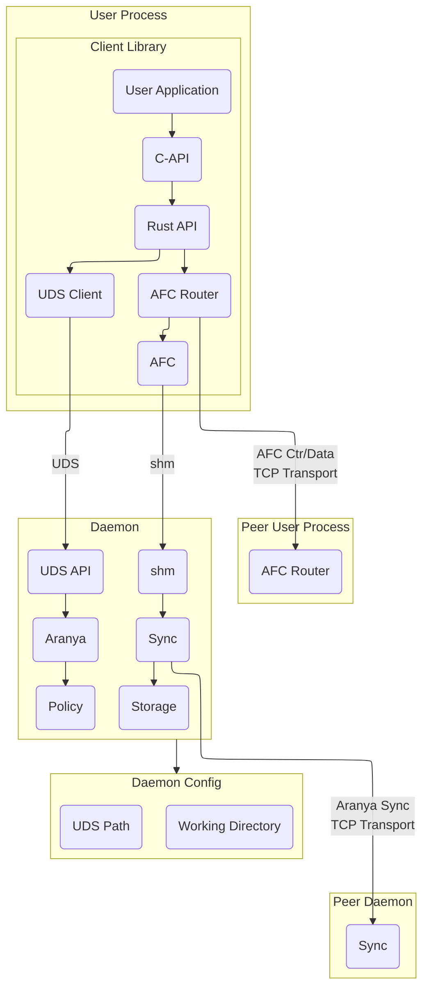

# Aranya Architecture

```mermaid
flowchart-elk TB
 subgraph ClientLibrary["Client Library"]
        a1("User Application")
        a2("C-API")
        a3("Rust API")
        a4("UDS Client")
        a5("AFC Router")
        a6("AFC")
  end
 subgraph UserProcess["User Process"]
        ClientLibrary
  end
 subgraph PeerUserProcess["Peer User Process"]
        b1("AFC Router")
  end
 subgraph Daemon["Daemon"]
        c1("UDS API")
        c2("Aranya")
        c3("Policy")
        c4("shm")
        c5("Sync")
        c6("Storage")
  end
 subgraph PeerDaemon["Peer Daemon"]
        e1("Sync")
  end
 subgraph DaemonConfig["Daemon Config"]
        d1("UDS Path")
        d2("Working Directory")
  end
    a1 --> a2
    a2 --> a3
    a3 --> a4 & a5
    a5 --> a6
    a4 -- UDS --> c1
    c1 --> c2
    c2 --> c3
    a6 -- shm --> c4
    c4 --> c5
    c5 --> c6
    Daemon --> DaemonConfig
    a5 -- AFC Ctr/Data <br> TCP Transport --> b1
    c5 -- Aranya Sync <br> TCP Transport --> e1
```
