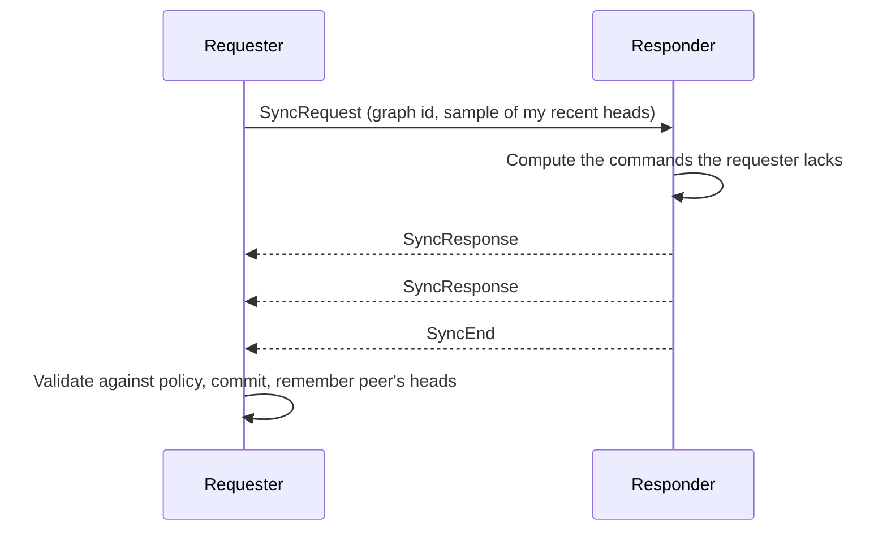
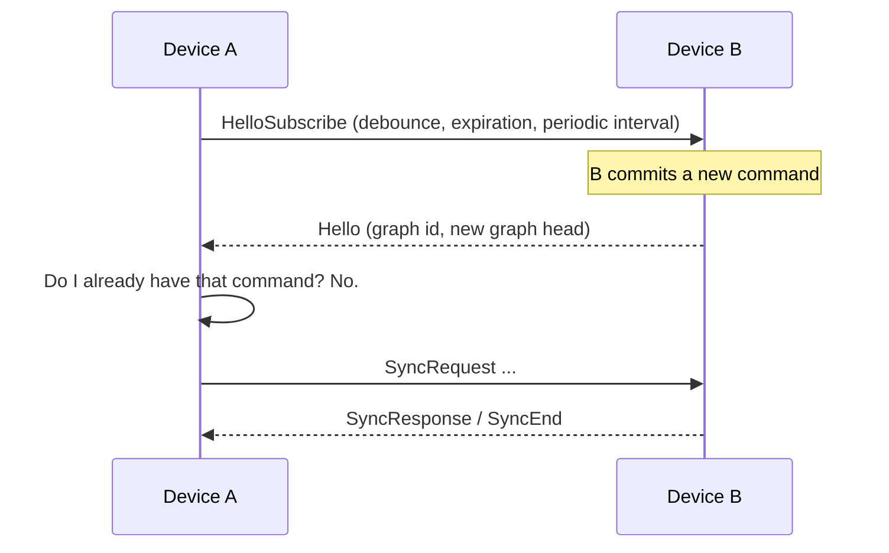

# How Aranya Peers Sync

Aranya has no central server. Every device that belongs to a team holds its own copy of that team's *graph*: an append-only DAG of signed commands that records every membership change, role grant, label assignment, and policy action ever taken. A device acts on the graph it has locally, so the job of **sync** is to make sure that what one device learns eventually reaches every other device.

This page explains how a single sync exchange works, the two ways a device decides *when* to sync (polling and hello notifications), how to shape the peer-to-peer topology so information spreads quickly without flooding the network, what the transport underneath must and must not provide, and how to set all of that up in both the `aranya-core` runtime and the Aranya daemon and client libraries.

The one idea to take away: **each device should sync from a small, fixed handful of peers, not from everyone.** With even a modest fan-out, new information crosses the whole team in roughly `log(N)` hops, while the per-device cost stays constant as the team grows.

## 1. What a sync exchange does

Sync in Aranya is a **pull**. One peer, the *requester*, asks another, the *responder*, "send me the commands I don't have yet." The requester's storage is updated; the responder's is not. If two devices need each other's commands, each one pulls from the other.



A single exchange has three parts.

**The requester advertises what it has.** It sends a bounded *sample* of the commands it holds: the heads of its graph, anything it already knows the responder has, and a backward walk from the heads through recent history. It does not send its whole graph.

**The responder computes the difference.** Starting from its own heads, the responder walks backward through its graph until it reaches the commands in the requester's sample, collecting every command on the way. Shared history is skipped rather than re-examined command by command, so the cost of an exchange tracks the size of the difference, not the size of the graph. The result is sorted so that a command's parents are always sent before the command itself; the requester never has to buffer an orphan.

**The requester applies and remembers.** Incoming commands are evaluated against the team's policy inside a transaction. Anything the policy rejects is dropped; the rest is committed. Then the requester records the heads of what this responder delivered in a small per-peer **peer cache**. On the next request to the same peer, those heads go into the sample, telling the responder "I received these; don't send them or anything before them again." For a large difference that takes several rounds to transfer, this speeds up convergence.

Two properties of the graph make this cheap to reason about. First, every command is identified by a hash of its contents and names its parents, so a device can always tell whether a command it hears about is one it already has. Second, when two devices commit concurrently and the graph forks, the eventual merge is *deterministic*: every peer that sees the same set of heads computes the same merge command. That is what lets a single head stand in for "the state of my graph" in a hello notification, described next.

## 2. When to sync: polling and hello

The sync protocol says nothing about *when* an exchange happens. That decision is a scheduling policy layered on top, and Aranya supports two.

### Polling

The simplest strategy: every `interval`, the requester opens a session with each of its configured peers and pulls. Polling is robust and needs no state on the responder, but it has an inherent tradeoff. A short interval means low propagation latency and a constant stream of mostly empty exchanges. A long interval saves bandwidth but adds delay at *every hop* the information has to cross: half an interval on average, up to a full interval in the worst case.

### Hello notifications

Hello sync turns the schedule inside out. Instead of asking "anything new?" on a timer, a device **subscribes** to a peer, and that peer sends a tiny **hello** whenever its graph head changes. The hello carries the peer's current graph head and nothing else, no commands. The receiver checks whether it already has that head. If it does, nothing happens. If it doesn't, the receiver runs an ordinary pull sync against the peer that sent the hello.



Hello is a *hint*, not a transfer. It is fire-and-forget: no acknowledgement, no retry, and if a hello is lost the graph is still correct, just not yet up to date on that device. Three parameters shape a subscription:

- **Graph-change debounce.** The minimum spacing between hellos to the same subscriber when the graph is changing rapidly. A burst of ten commits produces one hello, not ten, and the subscriber's single pull picks up all ten.
- **Periodic interval.** The publisher sends a hello every so often *regardless* of changes. This is the safety net for lost hellos and for a subscriber that was briefly unreachable; it turns hello mode into "poll, but at a relaxed rate, with immediate notification on top."
- **Expiration.** How long the subscription lasts before the publisher forgets it. Subscribers re-subscribe to stay current.

Because hellos are cheap and pulls happen only when there is something to fetch, hello sync gives you near-immediate propagation with idle-network cost close to zero. It is the recommended default, with polling as the fallback for transports or deployments where a subscribing peer cannot be reached unsolicited.

## 3. Topology: sync from a few peers, not from everyone

Who syncs from whom is the single biggest lever you have over both latency and load. Think of the team as a directed graph where an edge `A → B` means "A pulls from B." New information committed on one device spreads along the edges, one hop per sync exchange.

### How information spreads

Suppose one device commits a command. It sends a hello to each device that subscribes to it. Every subscriber that doesn't yet have the command pulls it, commits it, and in turn sends a hello to *its* subscribers. The command spreads outward one hop per exchange until every device has it. Three numbers describe how well a topology does this, all measured per graph change:

- **Average hops** between the committing device and everyone else. This sets propagation latency: total time is roughly `hops × per-hop delay`, where the per-hop delay is the debounce window plus one round trip under hello sync, or half the poll interval on average under polling.
- **Total hellos sent** across the whole team. Every device that receives the command hellos each of its subscribers, so this is the number of subscription edges in the topology.
- **Average hellos sent per device**, which is just the number of subscribers a device has. This is the per-device cost, and it should stay constant as the team grows.

Note what is *not* in this list: the number of pull sessions. In every topology a device pulls the new command exactly once; extra hellos for a command it already has are ignored. Topology changes how fast the command arrives and how many hellos are spent announcing it, not how many times it is transferred.

For a team of 1,000 devices with hellos flowing in both directions along every link:

| Topology | Subscribers per device | Average hops | Total hellos per change |
|---|---|---|---|
| Full clique (everyone subscribes to everyone) | 999 | 1 | ~999,000 |
| Ring (each device subscribes to both neighbours) | 2 | ~250 | ~2,000 |
| Star (every device links to one hub) | 1 for spokes, 999 for the hub | 1 from the hub, 2 between two spokes | ~2,000 |
| Fixed fan-out hierarchy (tree, 3 children per node) | ~2 | ~5.5 from the root, ~10 between two arbitrary devices | ~2,000 |
| Random graph (3 links per device) | 3 | ~8 | ~3,000 |
| Random graph (4 links per device) | 4 | ~5.6 | ~4,000 |
| Small world (ring neighbours plus one long link each) | 4 | ~5.5 | ~4,000 |

(Hop counts are averages over all device pairs, measured by simulation on 1,000-node graphs of each shape; the ring and clique values are exact.)

The clique achieves one hop by spending a thousand hellos per device per change, and a peer list that has to change on every device whenever one is added. The star gets almost the same latency for a total hello count as low as the ring's, but only by concentrating the entire cost on one device: the hub sends a thousand hellos and answers a thousand pulls per change, and if it is down nothing moves. The ring spends almost nothing and takes a quarter of the way round the team on average to deliver a command. Everything in between is the interesting region, and the gap between the ring and the other sparse shapes is the point: **the same two to four subscribers per device can give you either `N/4` hops or `log(N)` hops, depending on how the links are arranged.**

Why `log(N)`? If a command is on `d` devices after one hop, it can be on about `d²` after two and `dᵏ` after `k`, so it reaches all `N` devices when `dᵏ ≈ N`, that is after about `log(N) / log(d)` hops. That bound is approached whenever the links are "well mixed": each hop reaches devices that mostly haven't been reached yet. (In practice it runs a little high, because one of each device's links leads back toward where the command came from, but the shape of the curve is what matters.) A random graph does this by construction. A small-world graph does it by adding a few long links to an otherwise local structure, so that any two regions of the team are a short path apart while most links stay short and local. A hierarchy does it going *down* from the root, but two leaves in different branches are twice as far apart, and the root is a cut vertex. A ring fails at it completely, because every hop reaches exactly one new device on each side.

Measured average hops on random graphs with a fixed number of links per device:

| Team size N | 3 links | 4 links | 6 links | 8 links |
|---|---|---|---|---|
| 10 | ~2.0 hops | ~1.6 | ~1.3 | ~1.1 |
| 100 | ~4.8 | ~3.5 | ~2.8 | ~2.4 |
| 1,000 | ~8.1 | ~5.6 | ~4.2 | ~3.6 |
| 10,000 | ~11.4 | ~7.7 | ~5.6 | ~4.8 |

Going from 100 devices to 10,000 roughly doubles the hop count while per-device cost stays flat. A 1,000-device team with four well-mixed links per device and a 100 ms debounce converges in about a second; the same team polling at 10 s takes closer to half a minute.

### Comparing shapes

| | |
|---|---|
|  | **Full clique.** Every device subscribes to and pulls from every other. One hop, but `N(N−1)` hellos per change and a peer list on every device that grows with the team. Fine for a handful of devices. It does not scale. |
|  | **Star.** Every device links to a single hub and to nothing else. Two hops at most and trivially easy to configure: a new device needs one peer, and only the hub's list changes. The price is that the hub does all the work — `N` hellos and `N` pulls per change — and is a single point of failure for the whole team. A star is reasonable when there is a natural always-on gateway and the team is small enough for one device to serve it, and it is the shape to grow *out of* first, by adding a second hub or cross-links between spokes. |
|  | **Hierarchy.** Devices are arranged in a tree, often mirroring roles: owner, admins, operators, members. Latency from the top is `log(N)` and the shape is easy to reason about, but two devices in different branches are up to `2 log(N)` apart, and every interior node is a cut vertex whose absence isolates its whole subtree. A good starting point when there is a natural gateway at each level, provided you add cross-links between siblings or a second parent for resilience. |
|  | **Ring.** Each device subscribes to its two neighbours. Constant cost, no single point of failure, and a two-device partition is survivable, but information crawls: `N/4` hops on average, `N/2` worst case. Rings are a useful *component* (the convergence tests in the Aranya repository use rings of up to 100 nodes) but a poor topology on their own for anything large. |
|  | **Random graph.** Each device subscribes to a few peers chosen at random. Near-optimal hops with no coordination, and no device matters more than any other. The cost is that nothing about the shape reflects the physical network; a "neighbour" may be on the far side of a slow link. |
|  | **Small world.** Ring neighbours for locality and a fault-tolerant backbone, plus one or two long links per device to collapse the diameter. `log(N)` hops, constant per-device cost, no cut vertices, and the long links are where you encode knowledge of the real network (a link between sites, a link to an always-on device). This is the shape to aim for. |

### Practical guidance

Sync topology is an operational decision, not a protocol one. Nothing in the graph, the policy, or the daemon depends on it. It is simply the set of peers each device is told to sync from, and it can be changed at runtime, per team. The right shape depends on the deployment: how many devices there are, which of them are always on, how the network is segmented, and which devices are constrained. Treat it the way you would treat routing or monitoring configuration, and expect to revisit it as the deployment changes.

For most deployments, a **random graph** is the most robust choice and the easiest to construct. Each device subscribes to three or four peers chosen at random from the team; no coordination is needed, no device is special, there is no cut vertex, and information crosses the team in `log(N)` hops. Growing the team means the new device picks its peers and a few existing devices add it to theirs. If the physical network has structure worth respecting, such as sites joined by a slow link or a few always-on devices, keep the random links and add a couple of deliberate ones alongside them; that is all a small-world topology is.

Avoid a **clique** for anything but the smallest teams. Every device pulling from every other is fine for a handful of devices, but hellos and peer-list maintenance both grow with the square of the team size, and it buys only one hop over a well-mixed sparse graph.

If the lowest possible latency matters more than anything else, a **star** delivers it: two hops between any pair of devices. The condition is that the hub can be made reliable, because it carries the whole team's sync load and its absence stops all propagation. Where that condition holds, a star (or two hubs, each linked to every device) is a good design. Where it does not, a random graph with three or four links per device is the safer bet.

Whichever shape you choose, use **hello sync rather than polling** as the trigger, and keep a slow poll or the periodic hello as the backstop for anything a lost notification or a partition missed. Remember that sync is a pull, so a link only carries commands one way: configure each peer relationship on both sides, or make sure every device's commits have some path back to the rest of the team. And when a device is first onboarded, sync it once immediately against the device that added it before relying on the schedule.

## 4. Transport and security

Sync messages travel over some transport: the daemon's QUIC connections, or whatever an `aranya-core` integrator supplies. **The general recommendation is QUIC with mutual TLS**, which is what the daemon ships with; it answers all three of the questions below in the right way by default. If you are building your own transport, the rest of this section explains what it needs to get right and why.

### What the transport must protect, and what it need not

Every command in the graph is signed by the device that created it and names its parents by hash. A peer that receives commands verifies them against the team's policy before committing anything, so a transport that corrupts, reorders, forges, or selectively drops commands cannot corrupt the graph; at worst it delays convergence. **The transport does not need to provide integrity.** The graph provides it.

Confidentiality is different. Unless a field is explicitly encrypted by the policy, the contents of a command travel in the clear inside the sync message: who was added to the team, which labels were assigned, which roles changed. If that metadata is considered private, **the transport must provide confidentiality.** The daemon's QUIC transport encrypts everything; an integrator building their own should assume the same is required unless the deployment says otherwise.

### Authenticating the connection

It is tempting to use the graph itself to decide who may connect: a device is a team member, so let it sync. In general this does not work, because of a bootstrapping problem. When device A connects to device B, each may hold local state that authorizes the other to sync the graph, but neither can prove it to the other without the very commands they are trying to exchange. A newly onboarded device has an empty graph and nothing to show. **Authenticate sync connections with a mechanism external to the graph**, such as the mutual TLS the daemon uses, where each device presents a certificate issued by an authority both sides already trust.

The graph still has a role. It is a fine place to record *negative* decisions, such as a device that has been removed from the team, and a syncer can consult that record to refuse a connection from a revoked device. What the graph cannot do is grant positive permission to connect in the first place.

### Who connects versus who syncs

A sync exchange has a requester and a responder. A connection has an initiator and an acceptor. **These two pairs are independent.** Device A can open a connection to device B, and then B can be the one to pull from A over that same connection. Any transport that allows messages in both directions over an established connection can carry sync in either direction, regardless of who opened it.

This matters for real networks. If A is behind a NAT or a firewall that blocks inbound connections and B needs A's commands, A opens the connection outward to B, and B pulls from A across it. The topology in section 3 is about who pulls from whom; connection initiation is a separate, lower-level decision made to fit the network, and the two need not line up. The daemon's QUIC transport keeps connections open and reuses them in both directions, so a spoke that reaches out to a hub can be synced *from* by that hub without the hub ever connecting inward.

## 5. Using aranya-core directly

If you are integrating the `aranya-runtime` crate into your own system, the runtime gives you the **protocol** and the **delta computation** and nothing else. Transport, authentication, scheduling, peer selection, and subscription bookkeeping are yours. That is deliberate: the runtime is `no_std`-friendly and has no opinion about whether your peers talk over the internet, a serial link, or a message bus.

### Division of responsibilities

The split is simple to state. **The runtime decides what to send; you decide when, to whom, and over what.**

| The runtime does | You do |
|---|---|
| Works out which commands a peer is missing, given what it has advertised | Choose which peers this device syncs from (the topology) |
| Produces the request and response messages, into buffers you own | Move those bytes between devices, over whatever transport you like |
| Turns replies back into commands and applies them to the graph through policy | Authenticate and encrypt the channel |
| Tracks, per peer, what has already been exchanged so later pulls stay small | Decide when to pull: on a timer, on a hello, or both |
| Tells you the graph head to advertise when your graph changes, and whether a hello you received is worth acting on | Keep the list of who has subscribed to your hellos, honour their debounce and expiry, and send the hellos |
| | Retry a failed exchange (start it again), and serialise access to the client state |

Everything in the left column is reached through a handful of types in the `aranya_runtime::sync` module: a requester and a responder that you drive one message at a time, a per-peer cache you hand to both, a decoder for inbound bytes, and two helpers on the client for hello. The crate's API documentation covers their signatures and buffer requirements; this page covers how they fit together. Buffer sizes are fixed at compile time, so a syncer can allocate once and run without a heap.

### What you provide

A pull, end to end, looks like this. The reference implementation is `aranya-tcp-syncer` in the `aranya-core` repository, about four hundred lines and worth reading in full; note that it deliberately omits encryption and authentication.

```rust
// Requester side: one exchange with one peer.
let cache = peer_caches.entry((peer_addr, graph_id)).or_default();
let mut requester = SyncRequester::new(graph_id, &mut rng);

let (len, _) = requester.poll(
    &mut buf, &mut provider, &cache.session_heads(), &mut traversal,
)?;
transport.send(peer_addr, &buf[..len])?;

let reply = transport.recv(peer_addr)?;
if let Some(commands) = requester.receive(&reply)? {
    let mut trx = client.transaction(graph_id);
    client.add_commands(&mut trx, &mut sink, &commands, &mut buffers, make_spill)?;
    client.commit(&mut trx, &mut sink, &mut buffers, make_spill)?;
    client.update_heads(
        graph_id, commands.iter().map(|c| c.address()), cache, &mut traversal,
    )?;
}
```

```rust
// Responder side: answer whatever arrives.
match SyncIncoming::decode(&inbound)? {
    SyncIncoming::Poll(poll) => {
        let cache = peer_caches.entry((from, poll.graph_id())).or_default();
        let mut responder = SyncResponder::new();
        responder.receive(poll)?;
        while responder.ready() {
            let len = responder.poll(&mut buf, &mut provider, cache, &mut buffers)?;
            transport.send(from, &buf[..len])?;
        }
    }
    SyncIncoming::Hello(SyncHello::Hello(h)) => {
        if client.should_sync_on_hello(h.graph_id(), h.head(), &mut traversal)? {
            schedule_pull_from(from, h.graph_id());
        }
    }
    // Subscription bookkeeping is yours.
    SyncIncoming::Hello(SyncHello::Subscribe(s)) => subscriptions.insert(from, s),
    SyncIncoming::Hello(SyncHello::Unsubscribe(u)) => subscriptions.remove(from),
    _ => {}
}
```

Two of your responsibilities deserve a closer look. **Peer selection and scheduling** is where the topology from section 3 lives: the set of peers your syncer pulls from is the topology, a timer per peer gives you polling, and a hello-driven `schedule_pull_from` gives you notification sync. **Hello publishing** is the other half of hello sync: after each local commit, ask the client for the head to advertise, and if it differs from the last one you sent, notify each live subscriber, respecting the debounce it asked for; send a hello on each subscriber's periodic interval regardless; and drop subscriptions once they expire.

You will also see `Subscribe`/`Unsubscribe`/`Push` in `SyncIncoming`. That is a second, data-carrying notification style in which the responder pushes actual `SyncResponse` messages to subscribers without being asked. It is fully supported by the runtime and used by the TCP example syncer, but the Aranya daemon does not use it; hello-triggered pulls achieve the same effect with less responder-side state.

## 6. Using the Aranya daemon and client libraries

In the Aranya product (the `aranya` repository), one **daemon** runs per device and owns everything in section 5: QUIC transport with mutual TLS, scheduling, peer caches, hello subscriptions, and the pull loop. Your application talks to the daemon through the Rust client library (`aranya-client`) or the C API (`aranya-client-capi`), and the only sync decision it makes is the one that matters: **which peers this device syncs from, and how.**

### Daemon configuration

The daemon's TOML file configures the sync *server* — the endpoint other devices pull from — and the certificates that authenticate it:

```toml
[sync.quic]
enable = true
# Address this daemon listens on for inbound sync requests.
addr = "0.0.0.0:4321"
# Mutual TLS material (see the aranya-certgen crate to generate these).
root_certs_dir = "/etc/aranya/certs/ca"
device_cert    = "/etc/aranya/certs/device.crt"
device_key     = "/etc/aranya/certs/device.key"
```

That is the entire sync-related configuration. There are no interval, fan-out, or hello settings in the daemon file. Everything topological is per team and per peer, and is set at runtime through the client API so that an application can adapt the topology as devices join and leave.

### Adding sync peers (polling)

A *sync peer* is a network address this device will pull from for a given team. Adding one with an interval makes the daemon pull on that cadence; the interval is measured from the end of one exchange to the start of the next.

```rust
use aranya_client::SyncPeerConfig;
use std::time::Duration;

let team = client.team(team_id);

let cfg = SyncPeerConfig::builder()
    .interval(Duration::from_secs(5))   // pull every 5 s
    .sync_now(true)                     // and once immediately
    .build()?;

team.add_sync_peer(peer_addr, cfg).await?;
```

Other useful calls:

```rust
team.sync_now(peer_addr, None).await?;   // one-shot pull, e.g. right after onboarding
team.remove_sync_peer(peer_addr).await?; // stop pulling from this peer
```

Adding a peer with `sync_now(true)` and no interval performs exactly one pull. Adding a peer with neither registers it without scheduling anything, which is the right shape when hello notifications will drive the syncing.

### Hello sync

Hello sync involves two independent switches on the *subscribing* device, and both are needed:

1. **Subscribe** to the peer's hellos, so the peer will notify this device when its head changes.
2. **Mark the peer `sync_on_hello`**, so that when a hello arrives the daemon pulls from it.

```rust
use aranya_client::{HelloSubscriptionConfig, SyncPeerConfig};

// 1. Register the peer, and allow hellos from it to trigger a pull.
let cfg = SyncPeerConfig::builder()
    .sync_on_hello(true)
    .sync_now(true)                     // catch up once now; no polling interval
    .build()?;
team.add_sync_peer(peer_addr, cfg).await?;

// 2. Ask the peer to send us hellos.
let hello = HelloSubscriptionConfig::builder()
    .graph_change_debounce(Duration::from_millis(100))
    .periodic_interval(Duration::from_secs(10))
    .expiration(Duration::from_secs(600))
    .build()?;
team.sync_hello_subscribe(peer_addr, hello).await?;
```

On the publishing side nothing needs configuring: whenever a daemon's graph head changes, it sends a hello to every current subscriber, subject to each subscriber's debounce, and it sends periodic hellos on each subscriber's `periodic_interval`. When a hello arrives at a subscriber, the daemon first checks whether it already has the advertised command; only if it doesn't, and only if the sender is a registered peer with `sync_on_hello` set, does it pull.

Combining a `sync_on_hello` peer with a long `interval` (say, 60 s) gives you notification-driven sync with a polling backstop. Call `team.sync_hello_unsubscribe(peer_addr)` to stop receiving hellos.

### The same calls from C

```c
AranyaSyncPeerConfigBuilder b;
AranyaSyncPeerConfig cfg;
aranya_sync_peer_config_builder_init(&b);
aranya_sync_peer_config_builder_set_interval(&b, ARANYA_DURATION_SECONDS * 60);
aranya_sync_peer_config_builder_set_sync_on_hello(&b, 1);
aranya_sync_peer_config_builder_set_sync_now(&b);
aranya_sync_peer_config_build(&b, &cfg);

aranya_add_sync_peer(client, &team_id, peer_addr, &cfg);
/* NULL = default hello subscription config */
aranya_sync_hello_subscribe(client, &team_id, peer_addr, NULL);

/* later */
aranya_sync_now(client, &team_id, peer_addr, NULL);
aranya_sync_hello_unsubscribe(client, &team_id, peer_addr);
aranya_remove_sync_peer(client, &team_id, peer_addr);
```

Every function also has an `_ext` variant that returns extended error information.

### Worked example: a sparse topology for six devices

Give each device two ring neighbours plus one long link, and configure every link in both directions. Device *i* pulls from *i−1*, *i+1*, and *i+3* (mod 6). Each device makes three `add_sync_peer` calls and three `sync_hello_subscribe` calls, and every device is reachable from every other in at most two hops with two disjoint paths.

```rust
async fn wire_peers(team: &Team, my_index: usize, addrs: &[Addr]) -> Result<()> {
    let n = addrs.len();
    let neighbours = [(my_index + n - 1) % n, (my_index + 1) % n, (my_index + n / 2) % n];

    for &j in &neighbours {
        let cfg = SyncPeerConfig::builder()
            .sync_on_hello(true)
            .interval(Duration::from_secs(60))   // slow backstop
            .sync_now(true)
            .build()?;
        team.add_sync_peer(addrs[j], cfg).await?;
        team.sync_hello_subscribe(addrs[j], HelloSubscriptionConfig::default()).await?;
    }
    Ok(())
}
```

Run `wire_peers` on every device and the topology is symmetric by construction. Growing the team means running it on the new device and adding the new device to three existing devices' peer lists; nothing else changes.

### Onboarding note

A device that has just been added to a team has an empty graph. Its first pull from any existing member fetches the whole history, and until that pull completes the device cannot evaluate policy for the team. The examples in the repository therefore call `sync_now` against the device that added them immediately after onboarding, before relying on the periodic or hello-driven schedule. Do the same.

## 7. Summary

- Sync is a pull. A requester advertises a small sample of what it has; the responder computes and streams the difference, parents first; the requester validates, commits, and remembers the peer's heads.
- Polling asks on a timer. Hello sync notifies on change by sending the new graph head and pulls only when there is something new. Prefer hello sync with a slow periodic or polling backstop.
- Topology is the lever. Give every device a small, constant fan-out of 2 to 4 peers, make links bidirectional, and avoid single points of failure. Information then crosses the team in about `log(N)/log(d)` hops while per-device cost stays flat.
- The graph authenticates its own contents, so the transport need not provide integrity; it must provide confidentiality if graph metadata is private, and connections should be authenticated by a mechanism outside the graph. Who opens a connection and who pulls over it are independent choices.
- With `aranya-core`, you implement transport and scheduling around `SyncRequester`, `SyncResponder`, `PeerCache`, and `SyncHello`; the topology is your scheduler's peer list.
- With the Aranya daemon, the TOML file configures only the listening endpoint and certificates; the topology is the set of `add_sync_peer` and `sync_hello_subscribe` calls your application makes per team.
