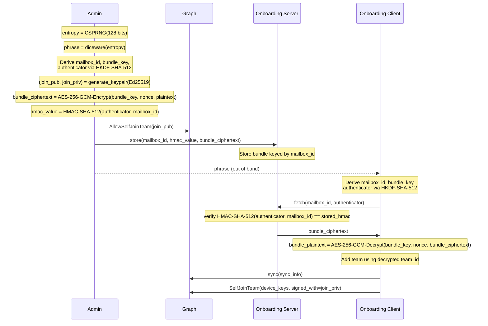

# Async Onboarding

Aranya currently requires synchronous exchange of information to onboard a new device. This specification provides a mechanism for devices to onboard themselves with a single exchange of information with a privileged device.

The system uses an 11 word phrase to exchange entropy used to derive cryptographic material. The privileged device uses the derived key to encrypt an onboarding bundle. The encrypted onboarding bundle is then dropped in the onboarding server, and a one time key is added to the graph by the privileged device. The new device uses the 11 words (exchanged out of band) to derive the keys and information reiquired to fetch the onboarding bundle and decrypt it. The new device then uses the single-use onboarding key posted to graph to self join the team.


## Architecture

async-onboarding uses a standalone server to mediate asynchronous onboarding operations. This server is not a participant in the aranya team, but instead receives and distributes onboarding information according to a process that protects sensitive join information from the onboarding server. 

The server provides two endpoints: `store` and `fetch`. These endpoints correspond to the privileged device dropping an encrypted onboarding bundle, and the new device fetching the onboarding bundle. 

### `store`

The `store` endpoint is authenticated by validating that the certificate presented matches a list of expected certificates, and that it is signed by a specific root authority. Requests against this endpoint require authentication via PKI. Drop takes three arguments:

1. The mailbox ID
2. The HMAC of the authenticator and mailbox
3. The ciphertext of the onboarding bundle

The onboarding server then stores this data for use with the `fetch` endpoint.


### `fetch`

The `fetch` endpoint is used by new devices to fetch the encrypted onboarding bundle. This endpoint does not require authentication via PKI, and instead authenticates requests based on the provided authenticator. Fetch takes two arguments:

1. The mailbox ID
2. The authenticator


## Onboarding Sequence

Actors:
- Admin - the privileged device capable and authorized to initiate the asynchronous onboarding procedure.
- Onboarding Server - the server that stores the onboarding bundle and validates the credentials provided for requests.
- Onboarding Client - a standalone client used to load a temporary keystore containing the self join key for the initial SelfJoinTeam action/command.
- New Device - the device that is being onboarded to the team.

### Cryptographic Protocol

```
// Constants
salt = "aranya-onboarding-v1"

// --- Admin: Prepare onboarding bundle ---

Admin: entropy = CSPRNG(128 bits)
Admin: phrase = diceware(entropy)                            // 11 words
Admin: mailbox_id = HKDF-SHA-512(entropy, salt, "mailbox-id", 16)
Admin: bundle_key = HKDF-SHA-512(entropy, salt, "bundle-key", 32)
Admin: authenticator = HKDF-SHA-512(entropy, salt, "authenticator", 32)

Admin: (join_pub, join_priv) = generate_keypair(Ed25519)
Admin: cert = create_device_certificate(...)
Admin: bundle_plaintext = serialize(cert, private_key, join_pub, join_priv, sync_info, team_id)
Admin: bundle_ciphertext = AES-256-GCM-Encrypt(bundle_key, nonce, bundle_plaintext)
Admin: hmac_value = HMAC-SHA-512(authenticator, mailbox_id)

Admin -> Graph: AllowSelfJoinTeam(join_pub)
Admin -> Server: store(mailbox_id, hmac_value, bundle_ciphertext)
Admin -> Client: phrase                                      // out of band

// --- Client: Fetch and decrypt onboarding bundle ---

Client: entropy = diceware_decode(phrase)
Client: mailbox_id = HKDF-SHA-512(entropy, salt, "mailbox-id", 16)
Client: bundle_key = HKDF-SHA-512(entropy, salt, "bundle-key", 32)
Client: authenticator = HKDF-SHA-512(entropy, salt, "authenticator", 32)

Client -> Server: fetch(mailbox_id, authenticator)

Server: verify HMAC-SHA-512(authenticator, mailbox_id) == stored_hmac
Server -> Client: bundle_ciphertext

Client: bundle_plaintext = AES-256-GCM-Decrypt(bundle_key, nonce, bundle_ciphertext)
Client: (cert, private_key, join_pub, join_priv, sync_info, team_id) = deserialize(bundle_plaintext)

// --- Client: Join team ---

Client -> Graph: sync(sync_info)
Client -> Graph: SelfJoinTeam(device_keys, signed_with=join_priv)
```



### Requirements

**Admin**

- Admin MUST send 11 word phrase to new device out of band.

**Onboarding Client**

- Onboarding Client MUST be able to complete both the store and fetch procedures.

**Store requirements**

- Onboarding Client MUST generate `entropy` using a CSPRNG (128 bits).
- Onboarding Client MUST generate `phrase` from `entropy` using diceware (EFF Large wordlist).
- Onboarding Client MUST generate a one-time join keypair: `(join_pub, join_priv) = generate_keypair(Ed25519)`.
- Onboarding Client MUST create a signed device certificate for the new device.
- Onboarding Client MUST derive `mailbox_id = HKDF-SHA-512(entropy, salt, "mailbox-id", 16)`.
- Onboarding Client MUST derive `bundle_key = HKDF-SHA-512(entropy, salt, "bundle-key", 32)`.
- Onboarding Client MUST derive `authenticator = HKDF-SHA-512(entropy, salt, "authenticator", 32)`.
- Onboarding Client MUST encrypt the onboarding bundle: `bundle_ciphertext = AES-256-GCM-Encrypt(bundle_key, nonce, bundle_plaintext)` where `bundle_plaintext = serialize(cert, private_key, join_pub, join_priv, sync_info, team_id)`.
- Onboarding Client MUST compute `hmac_value = HMAC-SHA-512(authenticator, mailbox_id)`.
- Onboarding Client MUST publish `AllowSelfJoinTeam(join_pub)` on the graph.
- Onboarding Client MUST send `store(mailbox_id, hmac_value, bundle_ciphertext)` to the onboarding server.

**Fetch requirements**

- Onboarding Client MUST take `phrase` (11 words) and the new device's key bundle as input.
- Onboarding Client MUST derive `entropy = diceware_decode(phrase)`.
- Onboarding Client MUST derive `mailbox_id`, `bundle_key`, and `authenticator` using the same HKDF-SHA-512 derivations as the store side.
- Onboarding Client MUST send `fetch(mailbox_id, authenticator)` to the onboarding server.
- Onboarding Client MUST decrypt the bundle: `bundle_plaintext = AES-256-GCM-Decrypt(bundle_key, nonce, bundle_ciphertext)`.
- Onboarding Client MUST deserialize `(cert, private_key, join_pub, join_priv, sync_info, team_id)` from `bundle_plaintext`.
- Onboarding Client MUST publish `SelfJoinTeam(device_keys)` using `join_priv` to sign the command.

**Onboarding Server**

- Onboarding Server MUST authenticate `store` requests via PKI (certificate validation).
- Onboarding Server MUST store `(mailbox_id, hmac_value, bundle_ciphertext)`.
- Onboarding Server MUST validate `fetch` requests by verifying `HMAC-SHA-512(authenticator, mailbox_id) == stored_hmac`.
- Onboarding Server MUST expose a `store` endpoint accepting `(mailbox_id, hmac_value, bundle_ciphertext)`.
- Onboarding Server MUST expose a `fetch` endpoint accepting `(mailbox_id, authenticator)`.


## Algorithms used

- HKDF-SHA-512 for KDF
- HMAC-SHA-512 for HMAC
- AES-256-GCM for symmetric encryption
- Ed25519 for signing

## Aranya changes

In order to support this onboarding process, changes must be made to the policy and an additional rust tool written to utilize the one-time-use join key. Two policy commands need to be added: AllowSelfJoinTeam and SelfJoinTeam.

The extra rust code will be needed to work around a policy limitation. In order to utilize the join key, the device must start an Aranya ClientState with a different keystore that contains the self join key in place of the device ID. This is required to allow the one-time-use key to be used as the device identity and expose the key ID to the seal and open blocks. With this workaround, the seal and open functions for the SelfJoinTeam command can use the author ID to properly identify the key to use from the DeviceSelfJoinPubKey fact.


```policy

// holds the self join keys,
fact DeviceSelfJoinPubKey[key_id id]=>{key bytes, used bool, created_by id, rank int}

command AllowSelfJoinTeam {
	fields {
		// the public key bytes of the key used to open
		pubkey bytes,
		// the rank to set for the new device
		rank int,
	}

	seal { return seal_command(serialize(this)) }
	open { return deserialize(open_envelope(envelope)) }

	policy {
		// get author ID
		// check permissions
		// check rank
		// derive key ID
		// create fact
		create DeviceSelfJoinPubKey[keyid]=>{key: this.pubkey, used: false, created_by: author_id, rank: this.rank}
	}
}

command SelfJoinTeam {
	fields {
		// The new device's public Device Keys.
		device_keys struct PublicKeyBundle,

	}

	seal { return seal_command_selfjoin(serialize(this)) }
	open { return deserialize(open_envelope_selfjoin(envelope)) }


	policy {
		// mark the key used, fail if already used
		// normal device setup
	}
}

// Signs the payload using the single use self join key,
// then packages the data and signature into an `Envelope`.
function seal_command_selfjoin(payload bytes) struct Envelope {
    let parent_id = perspective::head_id()
    // the author_id here is actually (should be) the ID of the single-use join key because
    // we injected a different keystore into the ClientState
    let author_id = device::current_device_id()
    let author_sign_pk = check_unwrap query DeviceSelfJoinPubKey[key_id: author_id]
    let author_sign_key_id = idam::derive_sign_key_id(author_sign_pk.key)

    let signed = crypto::sign(author_sign_key_id, payload)
    return envelope::new(
        parent_id,
        author_id,
        signed.command_id,
        signed.signature,
        payload,
    )
}

// Opens an envelope using the single time use self join key.
//
// If verification succeeds, it returns the serialized basic
// command data. Otherwise, if verification fails, it raises
// a check error.
function open_envelope_selfjoin(sealed_envelope struct Envelope) bytes {
    // the author_id here is actually (should be) the ID of the single-use join key because
    // we injected a different keystore into the ClientState
    let author_id = envelope::author_id(sealed_envelope)
    let author_sign_pk = check_unwrap query DeviceSelfJoinPubKey[key_id: author_id]

    let verified_command = crypto::verify(
        author_sign_pk.key,
        envelope::parent_id(sealed_envelope),
        envelope::payload(sealed_envelope),
        envelope::command_id(sealed_envelope),
        envelope::signature(sealed_envelope),
    )
    return verified_command
}


```


## Diceware

Diceware is used to generate a secure passphrase using a wordlist. The wordlist SHOULD be the EEF Large wordlist. Generating 11 words should provide 128 bits.

https://www.eff.org/files/2016/07/18/eff_large_wordlist.txt


