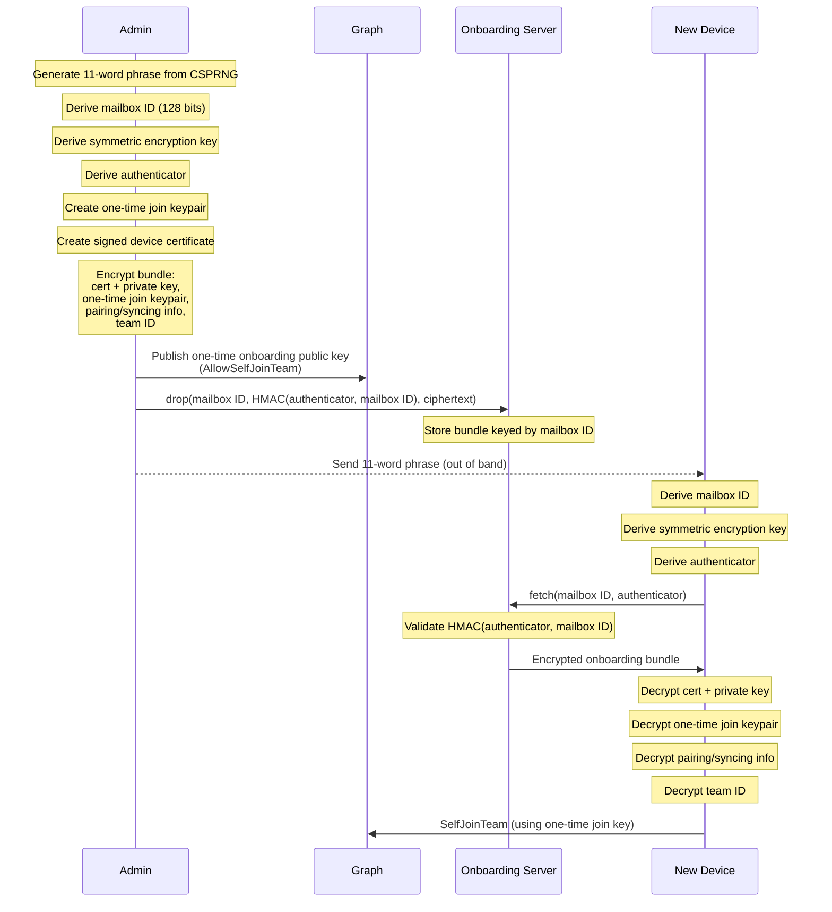

# Async Onboarding

Aranya currently requires synchronous exchange of information to onboard a new device. This specification provides a machanism for devices to onboard themselves with a single exchange of information with a privileged device.

The system uses an 11 word phrase to exchange entropy used to derive cryptographic material. The privileged device uses the derived key to encrypt an onboarding bundle. The encrypted onboarding bundle is then dropped in the onboarding server, and a one time key is added to the graph by the privileged device. The new device uses the 11words (exchanged out of band) to derive the keys and information reiquired to fetch the onboarding bundle and decrypt it. The new device then uses the single-use onboarding key posted to graph to self join the team.

## Architecture

async-onboarding uses a standalone server to mediate asynchronous onboarding operations. This server is not a participant in the aranya team, but instead receives and distributed onboarding information according to a process that protects sensitive join information from the onboarding server. 

The server provides two endpoints: `drop` and `fetch`. These endpoints correspond to the privileged device dropping an encrypted onboarding bundle, and the new device fetching the onboarding bundle. 

### `drop`

The `drop` endpoint is authenticated by validating that the certificate presented matches a list of expected certificates, and that it is signed by a specific root authority. Requests against this endpoint require authentication via PKI. Drop takes three arguments:

1. The mailbox ID
2. The HMAC of the authenticator and mailbox
3. The ciphertext of the onboarding bundle

The onboarding server then stores this data for use with the `fetch` endpoint.

### `fetch`

The `fetch` endpoint is used by new devices to fetch the encrypted onboarding bundle. This endpoint does not require authentication via PKI, and instead authenticates requests based on the provided authenticator. Fetch takes two arguments:

1. The mailbox ID
2. The authenticator

## Onboarding Sequence

Actors:
- Admin - the privileged device capable and authorized to initiate the asynchronous onboarding proceedure. 
- Onboarding Server - the server that stores the onboarding bundle and validates the credentials provided for requests.
- New Device - the device that is being onboarded to the team.

1. Admin prepares onboarding process
    1. Admin create one time join key (asymmetric key)
    2. Admin create signed device certificate
    3. Admin create onboarding bundle
        1. Admin creates 11 word phrase from CSPRNG
        2. Admin derives mailbox ID (128bits) using HKDF-SHA-512
        3. Admin derives symmetric encryption key for onboarding bundle using HKDF-SHA-512
        4. Admin derives authenticator that the new user will use to authenticate to the onboarding server using HKDF-SHA-512
        5. Admin encrypts certificate + private key using the bundle key
        6. Admin encrypts one time join keypair using the bundle key
        7. Admin encrypts pairing/syncing info using the bundle key
        8. Admin encrypts team ID using the bundle key
    4. Admin publishes one-time onboarding public key to graph (AllowSelfJoinTeam)
    5. Admin sends onboarding bundle to onboarding server, with mailbox ID, encrypted payload, and HMAC of authenticator against mailbox ID
    6. send 11words to new user
2. Admin sends 11 words to new device:
    1. New device derives mailbox ID using HKDF-SHA-512
    2. New device derives symmetric encryption key for onboarding bundle using HKDF-SHA-512
3. New device fetches encrypted onboarding bundle using mailbox ID and authenticator (sends authenticator and mailbox ID, server computes HMAC(auth, mailbox ID)) from onboarding server
    1. New device decrypts certificate + private key
    2. New device decrypts one time join keypair
    3. New device decrypts pairing/syncing info
    4. New device decrypts team ID
4. New device publishes SelfJoinTeam command

Admin MUST create a one time symmetric join key
Admin MUST create a signed device certificate
Admin MUST use a CSPRNG to create the 11 word phrase
Admin MUST use diceware to generate the entropy for the 11 word phrase.
Admin MUST derive a mailbox ID using HKDF-SHA-512 from the 11words
Admin MUST derive a symmetric encryption key (the bundle key) for encrypting the onboarding bundle using HKDF-SHA-512 from the 11words
Admin MUST derive an authenticator using HKDF-SHA-512 from the 11words
Admin MUST encrypt the new device certificate and private key using the bundle key
Admin MUST encrypt the one-time-use join keypair using the bundle key
Admin MUST encrypt the pairing/syncing information using the bundle key 
Admin MUST encrypt the team ID using the bundle key
Admin MUST publish an AllowSelfJoin command on the graph with the public key portion of the one-time-use self join key
Admin MUST calculate the HMAC-SHA-512(key=authenticator, value=mailbox ID)
Admin MUST send the onboarding bundle, mailbox ID, and HMAC value to the onboarding server
Admin MUST send 11word phrase to new device out of band

New device MUST derive the mailbox ID using HKDF-SHA-512 from the 11 words
New device MUST derive the bundle key using HKDF-SHA-512 from the 11 words
New device MUST fetch the encrypted bundle from the onboarding server using the mailbox ID and the authenticator.
New Device MUST decrypt the new device certificate and private key using the bundle key
New Device MUST decrypt the one-time-use join keypair using the bundle key
New Device MUST decrypt the pairing/syncing information using the bundle key 
New Device MUST decrypt the team ID using the bundle key
New Device MUST publish the SelfJoinTeam command using the one-time join key.

Onboarding Server MUST authenticate users using a certificate when handling requests on the `drop` endpoint
Onboarding Server MUST validate the authenticator by calculating HMAC-SHA-512(authenticator, mailboxID) and comparing it to the value received from Admin when handing requests on the `fetch` endpoint
Onboarding Server MUST store the mailbox ID, HMAC of authenticator, and ciphertext.
Onboarding Server MUST expose a `drop` endpoint that accepts a mailbox ID, the authenticator hash, and ciphertext
Onboarding Server MUST expose a `fetch` endpoint that accepts a mailbox ID and the authenticator.

## Algorithms used

- HKDF-SHA-512 for KDF
- HMAC-SHA-512 for HMAC
- AES-256-GCM for symmetric encryption
- Ed25519 for asymmetric encryption
