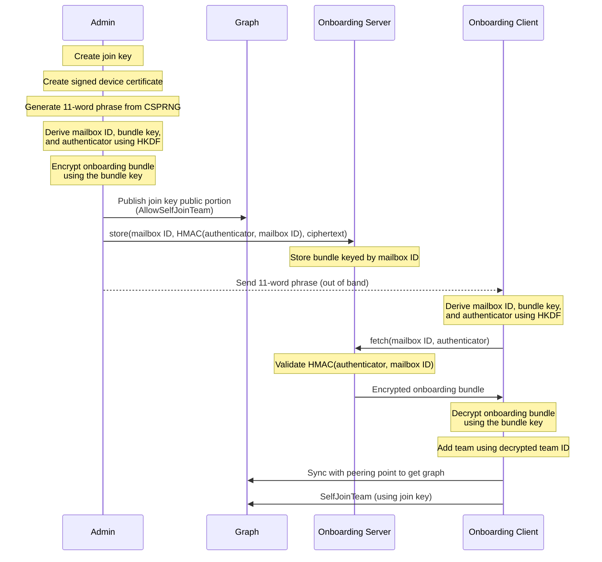

# Async Onboarding

Aranya currently requires synchronous exchange of information to onboard a new device. This specification provides a mechanism for devices to onboard themselves with a single exchange of information with a privileged device.

The system uses an 11 word phrase to exchange entropy used to derive cryptographic material. The privileged device uses the derived key to encrypt an onboarding bundle. The encrypted onboarding bundle is then stored in the onboarding server, and a one time key is added to the graph by the privileged device. The new device uses the 11 words (exchanged out of band) to derive the keys and information required to fetch the onboarding bundle and decrypt it. The new device then uses the single-use onboarding key posted to graph to self join the team.


## Architecture

async-onboarding uses a standalone server to mediate asynchronous onboarding operations and provide greater availability during the onboarding process. This server is not a participant in the aranya team, but instead receives and distributes onboarding information according to a process that protects sensitive join information from the onboarding server. 

The server provides two endpoints: `store` and `fetch`. These endpoints correspond to the privileged device storing an encrypted onboarding bundle, and the new device fetching the onboarding bundle. 

### `store`

The `store` endpoint is authenticated by validating that the certificate presented matches a list of expected certificates provided at startup, and that it is signed by a specific root authority. Requests against this endpoint require authentication via PKI. Store takes the following arguments:

1. The mailbox ID
2. The HMAC of the authenticator and mailbox
3. The ciphertext of the onboarding bundle

The onboarding server then stores this data for use with the `fetch` endpoint.


### `fetch`

The `fetch` endpoint is used by new devices to fetch the encrypted onboarding bundle. This endpoint does not require authentication via PKI, and instead authenticates requests based on the provided authenticator. Fetch takes two arguments:

1. The mailbox ID
2. The authenticator


## Onboarding Sequence

Actors:
- Admin - the privileged device capable and authorized to initiate the asynchronous onboarding procedure. 
- Onboarding Server - the server that stores the onboarding bundle and validates the credentials provided for requests.
- Onboarding Client - a standalone client used to load a temporary keystore containing the self join key for the initial SelfJoinTeam action/command.
- New Device - the device that is being onboarded to the team.

All cryptographic operations listed here use a CipherSuite that is configurable at compile time. The onboarding client and onboarding server MUST use the same CipherSuite.

### Definitions

**Onboarding Bundle** — the encrypted payload stored on the onboarding server, containing:
- Device certificate + private key (signed by root CA)
- Join key (one-time-use asymmetric keypair)
- Pairing/syncing information
- Team ID

**Derived Keys** — all derived from the 11-word phrase using HKDF with distinct static info fields:
- **Mailbox ID** (128 bits) — identifies the bundle on the onboarding server
- **Bundle Key** — symmetric encryption key used to encrypt/decrypt the onboarding bundle
- **Authenticator** — used by the new device to authenticate to the onboarding server via HMAC



1. Admin prepares onboarding process
    1. Admin creates the one time use "join key" (asymmetric key)
    2. Admin creates the certificate for the new device and signs it with the root CA if external PKI was not selected
    3. Admin creates the "onboarding bundle" ciphertext
        1. Admin creates 11 word phrase by encoding 128bits from CSPRNG using diceware
        2. Admin derives mailbox ID (128bits) using HKDF over the entropy and static info field
        3. Admin derives symmetric encryption key for onboarding bundle using HKDF over the entropy and a different static info field. This is the "bundle key"
        4. Admin derives authenticator that the new user will use to authenticate to the onboarding server using HKDF over the entropy and a static info field
	5. Admin encrypts the onboarding bundle containing
		1. Certificate + private key
		2. One time join keypair 
		3. Pairing/syncing info 
		4. Team ID 
    4. Admin publishes the public portion of the join key to the graph (AllowSelfJoinTeam) along with the values that will be associated with the new device like rank, role, etc.
    5. Admin sends onboarding bundle ciphertext to onboarding server, with mailbox ID, encrypted payload, and HMAC of authenticator against mailbox ID
2. Admin sends 11 words to new device:
    1. New device derives mailbox ID using HKDF
    2. New device derives the bundle key using HKDF
3. New device fetches onboarding bundle ciphertext using mailbox ID and authenticator (sends authenticator and mailbox ID, server computes HMAC(auth, mailbox ID)) from onboarding server and decrypts using the bundle key:
    1. Certificate + private key
    2. One time join keypair
    3. Pairing/syncing info
    4. Team ID
4. New device adds team using decrypted team ID
5. New device syncs with the peering point to get the graph
6. New device publishes SelfJoinTeam command


**Admin Requirements**

- Admin MUST send 11 word phrase to new device out of band

**Onboarding Client**

- Onboarding Client MUST be able to complete both the store and fetch procedure

**Onboarding Client store requirements**

- Onboarding Client MUST be able to generate the 11 words for the admin
- Onboarding Client MUST create a one time symmetric join key
- Onboarding Client MUST create a device certificate signed by the root CA
- Onboarding Client MUST use a CSPRNG to create the 11 word phrase
- Onboarding Client MUST use at least 128 bits of entropy to generate the phrase
- Onboarding Client MUST validate 11 words exist in the phrase
- Onboarding Client MUST use the EFF large wordlist
- Onboarding Client MUST use diceware to generate the entropy for the 11 word phrase.
- Onboarding Client MUST derive a mailbox ID using HKDF from the 11 words
- Onboarding Client MUST derive a symmetric encryption key (the bundle key) for encrypting the onboarding bundle using HKDF from the 11 words
- Onboarding Client MUST derive an authenticator using HKDF from the 11 words
- Onboarding Client MUST encrypt the new device certificate and private key using the bundle key
- Onboarding Client MUST encrypt the one-time-use join keypair using the bundle key
- Onboarding Client MUST encrypt the pairing/syncing information using the bundle key 
- Onboarding Client MUST encrypt the team ID using the bundle key
- Onboarding Client MUST publish an AllowSelfJoin command on the graph with the public key portion of the one-time-use self join key
- Onboarding Client MUST calculate the HMAC-SHA-512(key=authenticator, value=mailbox ID)
- Onboarding Client MUST send the onboarding bundle, mailbox ID, and HMAC value to the onboarding server

**Onboarding Client fetch requirements**

- Onboarding Client MUST take the 11 words as input 
- Onboarding Client MUST take the new device keybundle as input
- Onboarding Client MUST derive the mailbox ID using HKDF from the 11 words
- Onboarding Client MUST derive the bundle key using HKDF from the 11 words
- Onboarding Client MUST fetch the encrypted bundle from the onboarding server using the mailbox ID and the authenticator.
- Onboarding Client MUST decrypt the new device certificate and private key using the bundle key
- Onboarding Client MUST decrypt the one-time-use join keypair using the bundle key
- Onboarding Client MUST decrypt the pairing/syncing information using the bundle key 
- Onboarding Client MUST decrypt the team ID using the bundle key
- Onboarding Client MUST publish the SelfJoinTeam command using the one-time join key.

**Onboarding Server requirements**

- Onboarding Server MUST authenticate users using a certificate when handling requests on the `store` endpoint
- Onboarding Server MUST validate the authenticator by calculating HMAC-SHA-512(authenticator, mailboxID) and comparing it to the value received from Admin when handing requests on the `fetch` endpoint
- Onboarding Server MUST store the mailbox ID, HMAC of authenticator, and ciphertext.
- Onboarding Server MUST expose a `store` endpoint that accepts a mailbox ID, the authenticator hash, and ciphertext
- Onboarding Server MUST expose a `fetch` endpoint that accepts a mailbox ID and the authenticator.


## Algorithms used

The CipherSuite is configurable at compile time and is provided by aranya-core. The DefaultCipherSuite uses the following algorithms:

- AEAD: AES-256-GCM
- Hash: SHA-512
- KDF: HKDF-SHA-512
- KEM: DH-KEM(P-256, HKDF-SHA-256)
- MAC: HMAC-SHA-512
- Signatures: Ed25519


## Aranya changes

In order to support this onboarding process, changes must be made to the policy and an additional rust tool written to utilize the one-time-use join key. Two policy commands need to be added: AllowSelfJoinTeam and SelfJoinTeam.

The extra rust code will be needed to work around a policy limitation. In order to utilize the join key, the device must start an Aranya ClientState with a different keystore that contains the self join key in place of the device ID. This is required to allow the one-time-use key to be used as the device identity and expose the key ID to the seal and open blocks. With this workaround, the seal and open functions for the SelfJoinTeam command can use the author ID to properly identify the key to use from the DeviceSelfJoinPubKey fact.


```policy

// holds the self join keys,
fact DeviceSelfJoinPubKey[key_id id]=>{key bytes, used bool, created_by id, rank int}

command AllowSelfJoinTeam {
	fields {
		// the public key bytes of the key used to open
		pubkey bytes,
		// the rank to set for the new device
		rank int,
	}

	seal { return seal_command(serialize(this)) }
	open { return deserialize(open_envelope(envelope)) }

	policy {
		// get author ID
		// check permissions
		// check rank
		// derive key ID
		// create fact
		create DeviceSelfJoinPubKey[keyid]=>{key: this.pubkey, used: false, created_by: author_id, rank: this.rank}
	}
}

command SelfJoinTeam {
	fields {
		// The new device's public Device Keys.
		device_keys struct PublicKeyBundle,

	}

	seal { return seal_command_selfjoin(serialize(this)) }
	open { return deserialize(open_envelope_selfjoin(envelope)) }


	policy {
		// check if key already used
		// if already used, invalidate all devices added using this key
		// mark the key used
		// normal device setup
	}
}

// Signs the payload using the single use self join key,
// then packages the data and signature into an `Envelope`.
function seal_command_selfjoin(payload bytes) struct Envelope {
    let parent_id = perspective::head_id()
    // the author_id here is actually (should be) the ID of the single-use join key because
    // we injected a different keystore into the ClientState
    let author_id = device::current_device_id()
    let author_sign_pk = check_unwrap query DeviceSelfJoinPubKey[key_id: author_id]
    let author_sign_key_id = idam::derive_sign_key_id(author_sign_pk.key)

    let signed = crypto::sign(author_sign_key_id, payload)
    return envelope::new(
        parent_id,
        author_id,
        signed.command_id,
        signed.signature,
        payload,
    )
}

// Opens an envelope using the single time use self join key.
//
// If verification succeeds, it returns the serialized basic
// command data. Otherwise, if verification fails, it raises
// a check error.
function open_envelope_selfjoin(sealed_envelope struct Envelope) bytes {
    // the author_id here is actually (should be) the ID of the single-use join key because
    // we injected a different keystore into the ClientState
    let author_id = envelope::author_id(sealed_envelope)
    let author_sign_pk = check_unwrap query DeviceSelfJoinPubKey[key_id: author_id]

    let verified_command = crypto::verify(
        author_sign_pk.key,
        envelope::parent_id(sealed_envelope),
        envelope::payload(sealed_envelope),
        envelope::command_id(sealed_envelope),
        envelope::signature(sealed_envelope),
    )
    return verified_command
}


```


## Diceware

Diceware is used to generate a secure passphrase using a wordlist. The wordlist SHOULD be the EEF Large wordlist. The diceware encoding will use 11 words to encode 128bits of information.

https://www.eff.org/files/2016/07/18/eff_large_wordlist.txt


