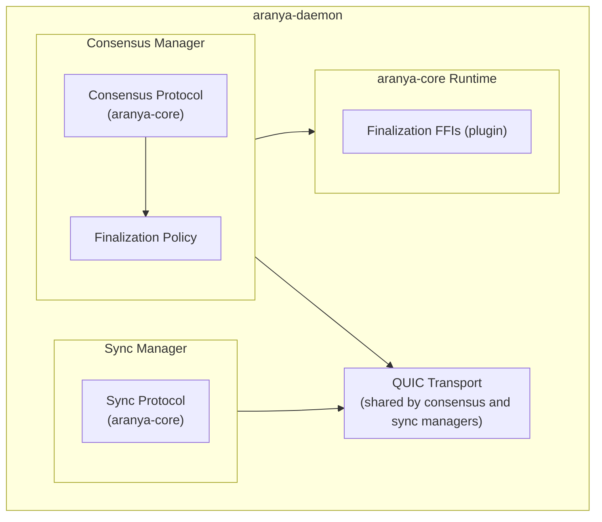

# Finalization

This specification uses [RFC 2119](https://www.rfc-editor.org/rfc/rfc2119) keywords (MUST, MUST NOT, SHOULD, SHOULD NOT, MAY) for normative requirements.

## Overview

Finalization is the process by which commands become permanent. All ancestors of a Finalize command MUST become permanent once the command is committed to the graph. **[FIN-001]** Only commands in the ancestry of the Finalize command are considered finalized; commands on unmerged branches MUST NOT be finalized, and branches MUST NOT finalize in parallel. **[FIN-005, FIN-006]** Once finalized, commands MUST NOT be recallable by future merges. **[FIN-002]** Commands on unmerged branches are not affected by finalization — when merged, they are evaluated against the current FactDB state using normal recall semantics. This bounds the impact of long partitions and adversarial branching by guaranteeing that accepted commands remain accepted.

Finalization has two components:

1. **Finalization policy** -- The on-graph commands, facts, and policy rules that enforce finalization invariants. Any device can verify a Finalize command independently.
2. **BFT consensus protocol** -- The off-graph protocol that drives agreement among finalizers on what to finalize. The consensus protocol produces the inputs (agreed-upon parent of the Finalize command, FactDB Merkle root, and collected signatures) that the policy consumes.

## Terminology

| Term | Definition |
|---|---|
| Finalizer set (`n` members) | The group of devices authorized to participate in finalization consensus. The size of the set is `n` (1 to 7 for the initial implementation). |
| Finalizer | A device in the finalizer set |
| Finalize command | A certified (multi-signature) graph command whose ancestors all become permanent. Contains the parent command ID (the finalization point in the graph) and the FactDB Merkle root at that parent. Certified commands have no author; each signature is a certifier. |
| Finalization round | The full process of producing a Finalize command for a specific sequence number. May contain multiple consensus rounds if proposals fail. |
| Consensus round | One or more consensus rounds occur within each finalization round. Each consensus round is a single propose-prevote-precommit cycle. If the proposal fails or times out, the round number increments and a new consensus round begins with the next proposer. |
| Parent of the Finalize command | The graph command that the Finalize command is appended to. All ancestors of the Finalize command become permanent. Consensus decides this. |
| FactDB Merkle root | A hash over the entire FactDB state at a given point in the graph, represented in policy as a `FactRoot` struct (see [Policy Definitions](#policy-definitions)). The FactDB state is deterministic for a given parent command ID — agreement on the parent implies agreement on the FactDB state. The Merkle root provides a compact, verifiable proof of that state. Note that different graphs (different parent command IDs) can produce the same FactDB state and therefore the same Merkle root. The Merkle root alone cannot uniquely identify a finalization point — the parent command ID is required to anchor finalization to a specific position in the graph. |
| Initiator | The finalizer whose daemon triggers a finalization round (e.g., due to a scheduled delay expiring, a daemon restart, or an on-demand request). The initiator is not necessarily the proposer — the proposer is selected by the BFT algorithm's deterministic rotation. Multiple finalizers may initiate concurrently; finalization may also be triggered by a schedule without any single finalizer explicitly initiating it. |
| Proposer | The finalizer selected by the BFT protocol's deterministic round-robin to propose a parent for the Finalize command for a given consensus round. The proposer may or may not be the initiator. |
| Prevote | First-stage vote indicating a finalizer considers the proposal valid |
| Precommit | Second-stage vote indicating a finalizer is ready to commit the proposal |
| Byzantine finalizer | A finalizer that is malicious or arbitrarily faulty — it may crash, withhold messages, send conflicting votes, or otherwise deviate from the protocol. The BFT consensus protocol guarantees safety as long as the number of Byzantine finalizers does not exceed `f`. |
| Fault tolerance (`f`) | The maximum number of Byzantine finalizers the protocol can tolerate (see [Formulas](#formulas)). |
| Quorum (`q`) | The minimum number of finalizers required for a consensus decision. Ensures safety as long as at most `f` finalizers are Byzantine. |
| Sequence number (seq) | Identifies a finalization round; increments with each successful Finalize command |

### Formulas

| Variable | Formula | Description |
|---|---|---|
| `n` | | Finalizer set size (1 to 7) |
| `f` | `⌊(n - 1) / 3⌋` | Maximum number of Byzantine (malicious or faulty) finalizers the protocol can tolerate |
| `q` | `⌊(n * 2) / 3⌋ + 1` | Quorum size -- the minimum number of finalizers required for a consensus decision. Ensures safety as long as at most `f` finalizers are Byzantine. |

## Scope

Finalization MUST apply only to persistent control plane commands on the DAG -- the commands that manage team membership, roles, labels, and AFC channel configuration. Ephemeral commands and AFC data plane traffic MUST NOT be subject to finalization. **[FIN-003]**

## Design Goals

These goals are enforced by normative requirements throughout the spec. Cross-references are provided for traceability.

1. **Safety** -- A Finalize command requires a quorum of valid signatures from the current finalizer set **[FPOL-003]**. Because any two quorums overlap, no two valid conflicting Finalize commands can exist in the graph **[FIN-004]**. Any device can independently verify a Finalize command by checking the signatures in its envelope **[CERT-001, CERT-002]**.
2. **Availability** -- Finalization tolerates up to `f` Byzantine (malicious, faulty, or offline) finalizers **[FAULT-003]**. Non-finalizer devices continue operating normally (publishing commands, syncing) regardless of whether finalization is active **[FAULT-004]**.
3. **Periodic and on-demand** -- Finalization is triggered periodically (delay-based scheduling) **[TRIG-001, TRIG-002]** or on demand (e.g. daemon restart **[TRIG-004]**, explicit request **[TRIG-006]**). The BFT protocol selects the proposer automatically **[CONS-001]**.

## Architecture

The finalization system spans multiple layers of the Aranya stack. The aranya-core runtime does not depend on or know about the consensus implementation. This separation allows applications to choose their own consensus algorithm if needed -- the finalization policy on the graph is consensus-agnostic and only cares that the Finalize command carries a valid quorum of signatures.



Key architectural boundaries:

- **Consensus manager** and **sync manager** orchestrate their respective protocols and deliver messages via the shared QUIC transport. They are daemon-layer components.
- **Consensus protocol** and **sync protocol** are transport-agnostic crates in the `aranya-core` repository. Both produce and consume messages that the daemon delivers via the transport layer. Neither depends on QUIC directly.
- **QUIC transport** is shared by both managers. The daemon multiplexes consensus and sync streams on the same QUIC connections.
- **Finalization policy** is part of the daemon layer and depends on the aranya-core runtime.
- **Finalization FFIs** are a runtime plugin for operations the policy language cannot express directly (certified envelopes, quorum verification). The plugin is optional for applications that do not use finalization, but MUST be enabled if the finalization policy is included — the policy will not compile without it.

## Finalizer Set

The finalizer set is the group of devices authorized to participate in finalization consensus. Finalizer devices do not need to be members of the team -- they only need a signing key to participate in consensus and can sync graph commands like any other device. This allows dedicated finalization infrastructure that is separate from the team's member devices. The team creator (or owner, for later updates) must know the finalizer's public signing key at the time the finalizer is added to the set. The finalizer set can only be changed by devices with the `UpdateFinalizerSet` permission through a dedicated `UpdateFinalizerSet` command.

In the future, finalizers may not need to be devices at all, since all that matters is a signing key. For MVP, finalizers are assumed to be devices — this simplifies the implementation by leveraging existing device infrastructure including key bundle generation, QUIC transport, and sync peer configuration.

### Initialization

The initial finalizer set MUST be established in the team's `Init` command. **[FSET-001]** The `Init` command MUST support up to 7 optional finalizer fields (`finalizer1` through `finalizer7`), each containing a public signing key. **[FSET-002]** If no finalizers are specified in `Init`, the team owner's public signing key MUST be used as the sole initial finalizer. **[FSET-003]** All specified finalizer keys MUST be unique and well-formed public signing keys. **[FSET-011]**

Public signing keys are stored on-graph because they are required for signature verification during consensus. The finalizer count and quorum are stored explicitly in the `FinalizerSet` fact so that the consensus protocol does not need to derive them implicitly.

### Set Size and Quorum

The maximum set size of 7 is established by [FSET-002] (7 optional finalizer fields). The BFT algorithm supports any size, but the policy language's lack of collection types requires fixed fields (one per finalizer). 7 fields provides up to 2 Byzantine fault tolerance while keeping the policy definitions manageable. (Malachite refers to the finalizer set as the "validator set".)

Quorum size MUST be `⌊(n * 2) / 3⌋ + 1` where `n` is the finalizer set size. **[FSET-005]** The daemon computes this using malachite's `ThresholdParam::min_expected` and passes it as an action field (see [Finalizer Set Validation](#finalizer-set-validation)). The following table shows example values for `n` = 1 through 7; the general formulas (see [Formulas](#formulas)) can be used to compute values for other set sizes:

| `n` | `f` | `q` |
|---|---|---|
| 1 | 0 | 1 |
| 2 | 0 | 2 |
| 3 | 0 | 3 |
| 4 | 1 | 3 |
| 5 | 1 | 4 |
| 6 | 1 | 5 |
| 7 | 2 | 5 |

Sizes following `n = 3f + 1` (`1`, `4`, `7`) give maximum fault tolerance for the fewest nodes.

### Changing the Finalizer Set

The finalizer set is changed through a two-phase process. Only devices with the `UpdateFinalizerSet` permission MUST be allowed to publish an `UpdateFinalizerSet` command. **[FSET-009]**

1. **Request phase.** An `UpdateFinalizerSet` command MUST NOT immediately change the active finalizer set. **[FSET-006]** Instead, it MUST create a `PendingFinalizerSetUpdate` fact that stages the new set. All specified finalizer keys in an `UpdateFinalizerSet` command MUST be unique and well-formed (correct length for the signing algorithm). The policy cannot verify that a device actually holds the corresponding private key — the owner is responsible for obtaining public signing keys from trusted devices out-of-band before adding them to the finalizer set. A finalizer added with an invalid or orphaned key will be unable to participate in consensus, effectively behaving as a dead node. This is detectable through vote logs (the finalizer will never vote) and can be resolved by removing the key via a subsequent `UpdateFinalizerSet`.
2. **Apply phase.** The next `Finalize` command MUST automatically apply any pending finalizer set update by replacing the `FinalizerSet` fact with the values from the pending update and consuming the `PendingFinalizerSetUpdate` fact. **[FSET-007]** Because all finalizers agree on the same parent command during consensus, and the FactDB is deterministic for a given parent, they are guaranteed to agree on whether a pending update exists. If no pending update exists, finalization proceeds without changing the set.

This two-phase approach ensures two properties:

1. **All finalizers MUST agree on the current finalizer set before voting.** **[FSET-012]** Agreement on a common parent during consensus ensures all finalizers share the same `FinalizerSet` fact (and therefore the same quorum threshold) when validating proposals and casting votes. If the `UpdateFinalizerSet` command directly modified the `FinalizerSet` fact, different finalizers could have different views of the set depending on which graph commands they had synced, causing quorum verification to produce inconsistent results across devices.
2. **All finalizers MUST transition to the same updated finalizer set after voting.** **[FSET-013]** Agreement on the common parent also guarantees all finalizers agree on whether a `PendingFinalizerSetUpdate` exists. The `Finalize` command atomically applies the pending update, so all devices that process the same `Finalize` command transition to the same new set.

The set can grow or shrink freely, but once a team has 4 or more finalizers, the set MUST NOT shrink below 4. **[FSET-008]** 4 is the smallest set size with Byzantine fault tolerance (f=1), so this prevents losing BFT safety once established.

The owner determines the initial set in `Init` and controls which devices receive the `UpdateFinalizerSet` permission.

Because set changes are only applied atomically by `Finalize` commands, the finalizer set is always globally consistent -- all devices that have processed the same `Finalize` commands agree on the same set.

If a second `UpdateFinalizerSet` is published before the next finalization, the `PendingFinalizerSetUpdate` fact MUST be replaced with the new values. **[FSET-010]** The next finalization round picks up whatever pending update exists at that point.

**Known limitation:** Because finalizer set changes are applied through the `Finalize` command, a set change cannot proceed if finalization itself is stalled.

## Finalization Policy

This section defines the on-graph commands, facts, and policy rules that enforce finalization. The policy is evaluated independently by every device and does not depend on the off-graph consensus protocol. The policy only enforces that a Finalize command carries a quorum of valid signatures from the current finalizer set — it does not know or care how those signatures were obtained. The BFT consensus protocol is the mechanism the daemon uses to collect signatures, but any process that produces a quorum of valid signatures would satisfy the policy. This separation means the consensus protocol gates adding the Finalize command to the graph at the application/daemon layer, while the policy enforces the cryptographic quorum requirement.

### Certified Commands

Note: A dedicated certified commands spec is being developed in [#190](https://github.com/aranya-project/aranya-docs/issues/190). Once completed, this section should reference that spec for the certified command type definition and focus only on how finalization uses certified commands.

The Finalize command MUST use certified authentication instead of single-author authentication. **[CERT-001]** Each signature represents a certifier -- a finalizer that endorsed the command. Certified commands have no author. This is necessary because finalization represents agreement by a quorum of finalizers, not the action of a single device.

This requires a **new command type** in the `aranya-core` runtime. Existing commands assume a single author with a single signature, and the command ID is computed over the serialized fields, command name, parent ID, author sign ID, and signature. The certified command type differs in two ways: it extends the envelope to carry multiple certifier signatures instead of one, and the command ID MUST be computed from the payload only — excluding signatures and signer identities. This exclusion is critical because different finalizers may independently commit the same Finalize command with different signature subsets, and all must produce the same command ID.

Key properties of certified commands:

- **Signatures MUST be stored in the envelope, not the payload.** **[CERT-002]** The envelope MUST carry up to 7 optional `(signing_key_id, signature)` pairs, matching the maximum finalizer set size. The payload contains only the command fields (factdb_merkle_root). Unlike regular commands (where the command ID includes the author sign ID and signature), the certified command ID MUST be computed from the payload only — excluding all signatures and signer identities. Different valid subsets of certifier signatures MUST produce the same command ID for the same payload. **[CERT-003]**
- **Multiple certifiers.** Instead of a single `get_author()` check, the policy verifies that the envelope contains a quorum of valid signatures from the current finalizer set. Each signature is a certifier endorsing the command.
- **Construction and verification use the standard seal/open pattern.** The `seal` block uses a `seal_certified` FFI to construct the certified envelope from the provided inputs (parent command ID, FactDB Merkle root, signatures). The `open` block uses `open_certified` to verify and deserialize. Quorum verification (`verify_certified_quorum`) runs in the `policy` block because it requires the `FinalizerSet` fact from the FactDB, which is not available in the `open` block. This keeps the daemon decoupled from envelope construction — it only provides inputs to the policy action.

#### Certified Command Implementation

Certified command construction is handled by a dedicated **finalization runtime module** in `aranya-core` that abstracts the certified command lifecycle. The daemon calls this module to construct envelopes and sign commands; the policy VM calls it (via FFIs) to verify them. The module internally uses `aranya-crypto` for digest computation and signing, keeping the daemon decoupled from low-level crypto details.

**Digest and ID computation.** Certified commands use a two-layer hash structure that parallels regular commands but excludes author and signature:

```
certified_digest = H("CertifiedPolicyCommand-v1", command_name, parent_id, payload)
certified_cmd_id = H("CertifiedCommandId-v1", certified_digest)
```

Compare with regular commands: `digest = H("SignPolicyCommand-v1", author_sign_id, command_name, parent_id, payload)` and `cmd_id = H("PolicyCommandId-v1", digest, signature)`. The different domain separators prevent cross-protocol attacks (a regular command signature cannot be reused as a certified command signature, and vice versa). The exclusion of `author_sign_id` and `signature` ensures all certifiers produce the same digest and the same command ID regardless of who signs or which signatures are included.

**`CertifiedEnvelope` struct:**

```rust
/// Certified commands have no author — the quorum of certifier
/// signatures authenticates the command instead of a single author.
struct CertifiedEnvelope {
    parent_id: CmdId,
    command_id: CmdId,
    command_name: String,
    certifier_signatures: Vec<(SigningKeyId, Signature)>,  // Up to 7 pairs
    payload: Vec<u8>,              // Serialized command fields
}
```

Note: The exact structure (whether payload is inside the envelope or separate) should mirror how regular commands structure the envelope/payload boundary in `aranya-core`. The layout above is illustrative — the implementation should follow existing conventions.

**Finalization runtime module (new crate or module in `aranya-core`):**

The finalization runtime module receives the keystore from the daemon at initialization (consistent with how aranya-core handles crypto for sync and policy). The daemon relies on aranya-core runtime crates to sign and verify on its behalf — all signing operations use the keystore internally.

Consensus API (used by the daemon during consensus, not during command commit):
- `certified_command_id(command_name, parent_id, payload)` → `CmdId` -- Computes the certified digest and derives the command ID. Used during consensus to verify the proposal's command ID before signing.
- `sign_certified(command_name, parent_id, payload)` → `(SigningKeyId, Signature)` -- Computes the certified digest and signs it using the keystore. Used by each finalizer during the precommit phase.

Consensus message API (signing and verification):
- `sign_consensus_message(message)` → `SignedMessage` -- Serializes the message, signs it using the keystore, and attaches the sender's signing key ID. Used for all outgoing consensus messages (proposals, prevotes, precommits). The daemon delivers the resulting bytes over QUIC.
- `verify_and_decode_consensus_message(bytes, finalizer_set)` → `Message` -- Verifies the sender's signature against the `FinalizerSet`, checks that the signing key ID belongs to a current finalizer, and deserializes the message. Returns an error if verification fails. Used for all incoming consensus messages.

The module SHOULD provide higher-level finalization-specific wrappers that hard-code the Finalize command name and accept only the finalization-specific parameters (parent command ID, FactDB Merkle root). This reduces the risk of passing incorrect `command_name` or `parent_id` values at call sites.

Policy-facing API (exposed as FFIs):
- `seal_certified(payload, signatures)` → certified envelope -- Constructs the certified envelope from the serialized payload and collected signatures. Computes the command ID internally. Used in the `seal` block of certified commands.
- `open_certified(envelope)` → deserialized command fields -- Verifies the certified command ID matches the payload and deserializes the fields. Does not verify certifier signatures.
- `verify_certified_quorum(envelope, finalizer_set)` -- Verifies a quorum of valid certifier signatures (see [New FFIs](#new-ffis) for detailed behavior including fail-fast optimizations).

**Runtime action API:**
- The runtime action for certified commands accepts the parent command ID, payload fields, and collected signatures. **[CMT-004]** The runtime:
  1. Verifies the specified parent exists in the local graph (action-at-parent).
  2. Runs the command's `seal` block (`seal_certified`) to construct the certified envelope.
  3. Runs the command's `open` block (`open_certified`) to verify the command ID and deserialize the payload.
  4. Runs the command's `policy` block (quorum verification, Merkle root check, sequence check, pending update application).
  5. If all checks pass, commits the command to the graph at the specified parent.

### Finalize Command

The set of commands that happen before a Finalize command is strictly the set of its ancestors. The Finalize command is the only graph command produced by finalization.

Properties:

- **Priority**: The Finalize command MUST carry the `finalize: true` attribute, which is already implemented by the policy language and braid algorithm. **[FPOL-001]** This attribute gives the command the highest possible priority in the braid, ensuring it precedes all siblings regardless of their numeric priority. Combined with the requirement that new commands can only be appended to the Finalize command or its descendants, this guarantees finalized commands can never be preceded by new commands in the braid. **[FIN-007]**
- **Fields**:
  - The Finalize command MUST contain exactly one payload field: `factdb_merkle_root` of type `struct FactRoot`. **[FPOL-002]** All other finalization state (sequence number, finalizer set, pending updates) is derivable from the FactDB at the parent.
- **Envelope**: See [Certified Commands](#certified-commands).
- **Policy checks**:
  - The Finalize command policy MUST verify that the envelope contains a quorum of valid signatures from unique members of the current finalizer set (via `verify_certified_quorum`). **[FPOL-003]**
  - The Finalize command policy MUST verify that the `factdb_merkle_root` matches the FactDB Merkle root at the parent of the Finalize command (obtained via the `verify_factdb_merkle_root` FFI). **[FPOL-004]** Finalizers independently compute this from their local FactDB and verify it matches before voting in consensus (see [Pre-Consensus Validation](#pre-consensus-validation)). The Merkle root also enables FactDB distribution: new members can verify a received FactDB against the Merkle root without replaying the entire graph (see [Future Work](#future-work)).
- **Side effects**:
  - The Finalize command MUST derive the next sequence number as `LatestFinalizeSeq.seq + 1` and update the `LatestFinalizeSeq` singleton fact. **[FPOL-005]** Duplicate sequence numbers are rejected by **[FPOL-007]**.
  - If a `PendingFinalizerSetUpdate` fact exists when the Finalize command is evaluated, the Finalize command MUST apply it atomically (see [Changing the Finalizer Set](#changing-the-finalizer-set)). **[FPOL-006]** Agreement on the parent guarantees all finalizers agree on whether a pending update exists.
  - The Finalize command MUST emit a `FinalizerSetChanged` effect containing the current `FinalizerSet` so the daemon can update its consensus participation state and peer set. **[FPOL-009]**

### Finalize Ordering Guarantee

All Finalize commands in the graph MUST form a chain -- for any two Finalize commands, one MUST be an ancestor of the other. **[FIN-004]** Multiple Finalize commands MAY exist in the graph as part of the finalization chain, but two Finalize commands MUST NOT share the same sequence number. **[FPOL-007]** This is enforced by:

1. The BFT consensus protocol ensures only one Finalize command is produced per finalization round.
2. The sequence number is derived from the FactDB (`LatestFinalizeSeq.seq + 1`), so each Finalize command deterministically advances the sequence. Since the `LatestFinalizeSeq` is updated by the prior Finalize command, the new Finalize MUST be a descendant of it in the graph. Because finalization covers ancestors, and each Finalize is a descendant of the prior one, the finalized set can only grow forward -- it is impossible to finalize an older point after a newer one.
3. Multiple finalizers committing the same Finalize produce the same command ID (see [Certified Commands](#certified-commands)). When synced to other nodes, the graph recognizes them as the same command (standard sync deduplication) — no weaving or policy evaluation occurs.


### Action-at-Parent

The Finalize command MUST be committed at the specific parent that consensus agreed upon, rather than at the current head of the graph. **[CMT-005]** This is necessary because unrelated commands may arrive between consensus completing and the Finalize command being committed. If the Finalize command were always appended to the head, the parent could change from what was agreed upon, invalidating the FactDB Merkle root.

This requires a change to the runtime's action API. Currently, all actions append to the head of the graph. The runtime's action API MUST accept an optional parent parameter: **[CMT-003]**

- **`action(command, parent: None)`** — Current behavior. The command MUST be appended to the head of the graph. **[CMT-006]** All existing commands continue to use this mode.
- **`action(command, parent: Some(command_id))`** — The command MUST be appended to the specified parent instead of the head. **[CMT-007]** The runtime MUST verify the specified parent exists in the local graph before committing; if it does not exist, the action MUST fail. **[CMT-008]**

**FactDB evaluation context.** When using action-at-parent, the runtime MUST evaluate the command's policy against the FactDB state at the specified parent, not the FactDB state at the current head of the graph. **[CMT-010]** This is critical for finalization: the `verify_factdb_merkle_root` check and `FinalizerSet` lookup in the Finalize command's policy must operate on the FactDB at the agreed-upon parent, which may differ from the head if additional commands have been appended since consensus completed. If the runtime maintains a single FactDB reflecting the head, it MUST be able to reconstruct the FactDB state at the specified parent for action-at-parent evaluation. The runtime reconstructs the FactDB at a given point by replaying graph commands from a weave up to that point — snapshotting the FactDB at every command would require too much memory.

The Finalize command is the only command that uses the explicit parent mode. The daemon passes the agreed-upon parent from consensus when committing the Finalize command.

Action-at-parent may create a sibling of the current head (increasing graph width), since other commands may have been appended to the head after the agreed-upon parent. This does not violate graph width assumptions in a meaningful way for finalization, because the `finalize: true` attribute ensures the Finalize command is always ordered first among siblings in the braid. The next command any device appends will be a descendant of the Finalize command (or a descendant of a later head), so graph width returns to normal immediately.

### FactDB Merkle Root Verification

The `verify_factdb_merkle_root` FFI obtains the current FactDB Merkle root and compares it to the expected value. The runtime implements this FFI using the storage API, which computes the Merkle root incrementally and stores it on disk as part of the storage format.

Before consensus, each finalizer validates the proposal using an ephemeral command that verifies the Merkle root without persisting anything to the graph:

```policy
// Verifies that the proposed FactDB Merkle root matches the local
// FactDB state at the specified parent. Emits VerifyFinalizationProposalResult
// on success. If the Merkle root does not match, the check fails and
// no effect is emitted — the daemon interprets the absence of the
// result effect as validation failure.
ephemeral action verify_finalization_proposal(factdb_merkle_root struct FactRoot) {
    publish VerifyFinalizationProposal {
        factdb_merkle_root: factdb_merkle_root,
    }
}

effect VerifyFinalizationProposalResult {
    valid bool,
}

ephemeral command VerifyFinalizationProposal {
    fields {
        factdb_merkle_root struct FactRoot,
    }

    seal { return seal_command(serialize(this)) }
    open { return deserialize(open_envelope(envelope)) }

    policy {
        check team_exists()

        // Verify the proposer's claimed Merkle root matches our local FactDB state.
        check verify_factdb_merkle_root(this.factdb_merkle_root)

        finish {
            emit VerifyFinalizationProposalResult {valid: true}
        }
    }
}
```

The finalizer evaluates this ephemeral command at the proposed parent (not at the current head). This is critical — the FactDB state at the head may differ from the state at the proposed parent if additional commands have been appended since the proposal. The action-at-parent mechanism (see [Action-at-Parent](#action-at-parent)) MUST support ephemeral actions in addition to regular actions so that the ephemeral command is evaluated against the correct FactDB state. **[CMT-009]** If the ephemeral command succeeds, the Merkle roots match and the finalizer proceeds to vote. If it fails, the finalizer prevotes nil.

### Policy Definitions

#### FactRoot Struct

The FactDB Merkle root is wrapped in a policy struct to provide compile-time type safety. This prevents accidental mixing with other `bytes` values and makes the intent explicit without requiring a new built-in type.

```policy
struct FactRoot {
    value bytes,
}
```

#### Facts

The following facts are used by the finalization commands. All are singleton facts (empty key `[]`).

```policy
fact FinalizerSet[]=>{
    num_finalizers int,
    quorum_size int,
    f1_pub_sign_key option[bytes],
    f2_pub_sign_key option[bytes],
    f3_pub_sign_key option[bytes],
    f4_pub_sign_key option[bytes],
    f5_pub_sign_key option[bytes],
    f6_pub_sign_key option[bytes],
    f7_pub_sign_key option[bytes],
}

fact LatestFinalizeSeq[]=>{seq int}

fact PendingFinalizerSetUpdate[]=> {
    num_finalizers int,
    quorum_size int,
    new_finalizer1_pub_sign_key option[bytes],
    new_finalizer2_pub_sign_key option[bytes],
    new_finalizer3_pub_sign_key option[bytes],
    new_finalizer4_pub_sign_key option[bytes],
    new_finalizer5_pub_sign_key option[bytes],
    new_finalizer6_pub_sign_key option[bytes],
    new_finalizer7_pub_sign_key option[bytes],
}
```

- **`FinalizerSet`** -- The current set of finalizers, their count, and the quorum size. Created by `Init`, updated by `Finalize` when a pending update exists.
- **`LatestFinalizeSeq`** -- The last completed finalization sequence number. Created at 0 by `Init`, incremented by each `Finalize` command.
- **`PendingFinalizerSetUpdate`** -- Stages a finalizer set change. Created by `UpdateFinalizerSet`, consumed by the next `Finalize` command.

#### Init Command Changes

The `Init` command is extended with finalizer fields (see [Initialization](#initialization)). The `Init` command MUST create an initial `LatestFinalizeSeq` singleton fact with seq 0 so the first Finalize command's sequential check has no special case. **[FPOL-008]**

See [Finalizer Set Validation](#finalizer-set-validation) for validation details.

```policy
command Init {
    fields {
        // ... existing fields ...
        finalizer1_pub_sign_key option[bytes],
        finalizer2_pub_sign_key option[bytes],
        finalizer3_pub_sign_key option[bytes],
        finalizer4_pub_sign_key option[bytes],
        finalizer5_pub_sign_key option[bytes],
        finalizer6_pub_sign_key option[bytes],
        finalizer7_pub_sign_key option[bytes],
        // Quorum size computed by the daemon from the consensus
        // protocol (malachite ThresholdParam::min_expected).
        quorum_size int,
    }

    // ... existing seal/open ...

    policy {
        // ... existing init logic ...

        // Validate finalizer set (1 to 7 finalizers).
        // Returns the count of provided keys, or an error if
        // no keys are provided or duplicates are found.
        // The runtime defaults to the team owner's signing key
        // before creating this command if none are provided.
        let n = validate_finalizer_keys(
            this.finalizer1_pub_sign_key, this.finalizer2_pub_sign_key,
            this.finalizer3_pub_sign_key, this.finalizer4_pub_sign_key,
            this.finalizer5_pub_sign_key, this.finalizer6_pub_sign_key,
            this.finalizer7_pub_sign_key,
        )

        finish {
            create LatestFinalizeSeq[]=>{seq: 0}
            create FinalizerSet[]=>{
                num_finalizers: n,
                quorum_size: this.quorum_size,
                f1_pub_sign_key: this.finalizer1_pub_sign_key,
                f2_pub_sign_key: this.finalizer2_pub_sign_key,
                f3_pub_sign_key: this.finalizer3_pub_sign_key,
                f4_pub_sign_key: this.finalizer4_pub_sign_key,
                f5_pub_sign_key: this.finalizer5_pub_sign_key,
                f6_pub_sign_key: this.finalizer6_pub_sign_key,
                f7_pub_sign_key: this.finalizer7_pub_sign_key,
            }
            // Schedule the first finalization round after the configured delay. [TRIG-001]
            emit ScheduleFinalization {delay: configured_finalization_delay}
        }
    }
}
```

#### Finalize Command

```policy
command Finalize {
    attributes {
        finalize: true
    }

    fields {
        // The parent command ID (finalization point) is implicit —
        // it is part of the certified envelope and committed via
        // action-at-parent, not passed as a payload field.
        factdb_merkle_root struct FactRoot,
    }

    seal { return seal_certified(serialize(this)) }
    open { return deserialize(open_certified(envelope)) }

    policy {
        check team_exists()

        // Look up the current finalizer set for quorum verification.
        let finalizer_set = lookup FinalizerSet[]

        // Verify that the envelope has a quorum of valid, unique
        // certifier signatures from the finalizer set.
        check verify_certified_quorum(envelope, finalizer_set)

        // Verify the FactDB Merkle root matches the locally computed root.
        check verify_factdb_merkle_root(this.factdb_merkle_root)

        // Derive the next sequence number from the LatestFinalizeSeq singleton.
        let latest = lookup LatestFinalizeSeq[]
        let next_seq = latest.seq + 1

        // Check for a pending finalizer set update before the finish block.
        // Agreement on the parent guarantees all finalizers agree on
        // whether a pending update exists.
        let pending = lookup PendingFinalizerSetUpdate[]

        // Policy terminates after executing a finish block, so use
        // branching to handle both cases in a single finish.
        if pending is some {
            finish {
                update LatestFinalizeSeq[] to {seq: next_seq}
                update FinalizerSet[] to {
                    num_finalizers: pending.num_finalizers,
                    quorum_size: pending.quorum_size,
                    f1_pub_sign_key: pending.new_finalizer1_pub_sign_key,
                    f2_pub_sign_key: pending.new_finalizer2_pub_sign_key,
                    f3_pub_sign_key: pending.new_finalizer3_pub_sign_key,
                    f4_pub_sign_key: pending.new_finalizer4_pub_sign_key,
                    f5_pub_sign_key: pending.new_finalizer5_pub_sign_key,
                    f6_pub_sign_key: pending.new_finalizer6_pub_sign_key,
                    f7_pub_sign_key: pending.new_finalizer7_pub_sign_key,
                }
                delete PendingFinalizerSetUpdate[]
                emit FinalizerSetChanged {finalizer_set: finalizer_set}
                // Schedule the next finalization round. [TRIG-002]
                emit ScheduleFinalization {delay: configured_finalization_delay}
            }
        } else {
            finish {
                update LatestFinalizeSeq[] to {seq: next_seq}
                emit FinalizerSetChanged {finalizer_set: finalizer_set}
                // Schedule the next finalization round. [TRIG-002]
                emit ScheduleFinalization {delay: configured_finalization_delay}
            }
        }
    }
}
```

#### UpdateFinalizerSet Command

The `UpdateFinalizerSet` command stages a finalizer set change (see [Changing the Finalizer Set](#changing-the-finalizer-set)). Only devices with the `UpdateFinalizerSet` permission can publish it.

```policy
command UpdateFinalizerSet {
    fields {
        new_finalizer1_pub_sign_key option[bytes],
        new_finalizer2_pub_sign_key option[bytes],
        new_finalizer3_pub_sign_key option[bytes],
        new_finalizer4_pub_sign_key option[bytes],
        new_finalizer5_pub_sign_key option[bytes],
        new_finalizer6_pub_sign_key option[bytes],
        new_finalizer7_pub_sign_key option[bytes],
        // Quorum size computed by the daemon from the consensus
        // protocol (malachite ThresholdParam::min_expected).
        quorum_size int,
    }

    seal { return seal(serialize(this)) }
    open { return deserialize(open(envelope)) }

    policy {
        check team_exists()

        // Only devices with the UpdateFinalizerSet permission can update the set.
        let author = get_author(envelope)
        check has_permission(author, UpdateFinalizerSet)

        // Validate the new finalizer set.
        // Returns the count of provided keys, or an error if
        // no keys are provided or duplicates are found.
        let new_count = validate_finalizer_keys(
            this.new_finalizer1_pub_sign_key, this.new_finalizer2_pub_sign_key,
            this.new_finalizer3_pub_sign_key, this.new_finalizer4_pub_sign_key,
            this.new_finalizer5_pub_sign_key, this.new_finalizer6_pub_sign_key,
            this.new_finalizer7_pub_sign_key,
        )

        // Once a team has 4+ finalizers, it cannot shrink below 4.
        let current = lookup FinalizerSet[]
        if current.num_finalizers >= 4 {
            check new_count >= 4
        }

        // Stage the update. The next Finalize command will apply it
        // automatically. If a pending update already exists, replace it.
        let existing = lookup PendingFinalizerSetUpdate[]
        if existing is some {
            finish {
                delete PendingFinalizerSetUpdate[]
                create PendingFinalizerSetUpdate[]=>{
                    num_finalizers: new_count,
                    quorum_size: this.quorum_size,
                    new_finalizer1_pub_sign_key: this.new_finalizer1_pub_sign_key,
                    new_finalizer2_pub_sign_key: this.new_finalizer2_pub_sign_key,
                    new_finalizer3_pub_sign_key: this.new_finalizer3_pub_sign_key,
                    new_finalizer4_pub_sign_key: this.new_finalizer4_pub_sign_key,
                    new_finalizer5_pub_sign_key: this.new_finalizer5_pub_sign_key,
                    new_finalizer6_pub_sign_key: this.new_finalizer6_pub_sign_key,
                    new_finalizer7_pub_sign_key: this.new_finalizer7_pub_sign_key,
                }
            }
        } else {
            finish {
                create PendingFinalizerSetUpdate[]=>{
                    num_finalizers: new_count,
                    quorum_size: this.quorum_size,
                    new_finalizer1_pub_sign_key: this.new_finalizer1_pub_sign_key,
                    new_finalizer2_pub_sign_key: this.new_finalizer2_pub_sign_key,
                    new_finalizer3_pub_sign_key: this.new_finalizer3_pub_sign_key,
                    new_finalizer4_pub_sign_key: this.new_finalizer4_pub_sign_key,
                    new_finalizer5_pub_sign_key: this.new_finalizer5_pub_sign_key,
                    new_finalizer6_pub_sign_key: this.new_finalizer6_pub_sign_key,
                    new_finalizer7_pub_sign_key: this.new_finalizer7_pub_sign_key,
                }
            }
        }
    }
}
```

#### New FFIs

FFI functions must be pure functions — they take inputs and return outputs without side effects. Each FFI below exists because the operation cannot be expressed in the policy language. All fact operations and effect emissions are performed in policy code.

- **`validate_finalizer_keys(f1..f7)`** -- Takes up to 7 `option[bytes]` keys. Returns the count of provided keys on success, or an error if no keys are provided or if any provided keys are duplicates. *Required as FFI because the policy language lacks iteration — counting provided optional fields and checking all 21 pairwise combinations cannot be expressed inline.* Used by `Init` and `UpdateFinalizerSet` commands.
- **`seal_certified(payload, signatures)`** -- Constructs the certified envelope from the serialized payload and collected signatures. Computes the certified command ID internally. Used in the `seal` block of certified commands. *Required as FFI because cryptographic digest computation and envelope construction are not available in the policy language.*
- **`open_certified(envelope)`** -- Verifies the certified command ID matches the payload and deserializes the fields. Does not verify certifier signatures — that is handled by `verify_certified_quorum` in the policy block. *Required as FFI because cryptographic envelope operations are not available in the policy language.*
- **`verify_certified_quorum(envelope, finalizer_set)`** -- Verifies that the certified envelope contains a quorum of valid certifier signatures from the `FinalizerSet`. MUST fail fast if the number of signatures in the envelope is less than `finalizer_set.quorum_size` — this avoids verifying any signatures when quorum is impossible. Otherwise, verifies signatures one by one: matches each signing key ID against the public signing keys in the finalizer set, then verifies the signature against the command content. MUST return an error if any signature is invalid (bad signature, key not in finalizer set, or duplicate key) — an honest node would never produce an envelope with invalid signatures, so their presence indicates a malformed or tampered command. MUST stop verifying after `quorum_size` valid signatures and return success — remaining signatures beyond quorum do not need to be verified. *Required as FFI because cryptographic signature verification is not available in the policy language.*
- **`verify_factdb_merkle_root(expected_root)`** -- Compares the expected root against the current FactDB Merkle root. Returns true if the roots match. Used by both the `Finalize` command and the `VerifyFinalizationProposal` ephemeral command. *Required as FFI because the Merkle root is computed by the storage layer and passed into the policy VM via context — the policy language has no way to access storage-layer state directly.*

#### Finalizer Set Validation

Both commands use `validate_finalizer_keys` to validate and count the provided keys. The `quorum_size` is passed as an action field, computed by the daemon using the consensus protocol's threshold parameters (malachite `ThresholdParam::min_expected`). This keeps the quorum formula outside of policy, so the policy does not embed assumptions about the consensus protocol.

- **Init command**: Calls `validate_finalizer_keys` (returns error or count). The `quorum_size` is provided by the daemon. The runtime defaults to the team owner's signing key before creating the command if none are specified by the caller.
- **UpdateFinalizerSet command**: Same key validation, plus policy enforces the no-shrink-below-4 rule: if the current `FinalizerSet` has 4+ finalizers, the new count must also be >= 4. The `quorum_size` is provided by the daemon.

#### Queries

The daemon queries finalization state from the FactDB on startup and when needed during consensus. The following policy actions expose the relevant facts:

```policy
// Emits QueryLatestFinalizeSeqResult with the last completed
// finalization sequence number.
ephemeral action query_finalize_seq() {
    publish QueryLatestFinalizeSeq {}
}

effect QueryLatestFinalizeSeqResult {
    seq int,
}

ephemeral command QueryLatestFinalizeSeq {
    seal { return seal_command(serialize(this)) }
    open { return deserialize(open_envelope(envelope)) }

    policy {
        check team_exists()
        let latest = lookup LatestFinalizeSeq[]
        finish {
            emit QueryLatestFinalizeSeqResult {seq: latest.seq}
        }
    }
}

// Emits QueryFinalizerSetResult with the current finalizer set.
ephemeral action query_finalizer_set() {
    publish QueryFinalizerSet {}
}

effect QueryFinalizerSetResult {
    num_finalizers int,
    quorum_size int,
    f1_pub_sign_key option[bytes],
    f2_pub_sign_key option[bytes],
    f3_pub_sign_key option[bytes],
    f4_pub_sign_key option[bytes],
    f5_pub_sign_key option[bytes],
    f6_pub_sign_key option[bytes],
    f7_pub_sign_key option[bytes],
}

ephemeral command QueryFinalizerSet {
    seal { return seal_command(serialize(this)) }
    open { return deserialize(open_envelope(envelope)) }

    policy {
        check team_exists()
        let fs = lookup FinalizerSet[]
        finish {
            emit QueryFinalizerSetResult {
                num_finalizers: fs.num_finalizers,
                quorum_size: fs.quorum_size,
                f1_pub_sign_key: fs.f1_pub_sign_key,
                f2_pub_sign_key: fs.f2_pub_sign_key,
                f3_pub_sign_key: fs.f3_pub_sign_key,
                f4_pub_sign_key: fs.f4_pub_sign_key,
                f5_pub_sign_key: fs.f5_pub_sign_key,
                f6_pub_sign_key: fs.f6_pub_sign_key,
                f7_pub_sign_key: fs.f7_pub_sign_key,
            }
        }
    }
}
```

- **`query_finalize_seq`** -- Ephemeral action that emits `QueryLatestFinalizeSeqResult` with the last completed finalization sequence number. Used by the daemon on startup to derive the next Malachite height (`seq + 1`).
- **`query_finalizer_set`** -- Ephemeral action that emits `QueryFinalizerSetResult` with the current finalizer set including public signing keys, count, and quorum size. Used by the daemon on startup to determine if this device is a finalizer and to build the Malachite validator set.

#### Effects

The `Finalize` command MUST emit a `FinalizerSetChanged` effect containing the current `FinalizerSet` using the policy `emit` statement. The daemon listens for this effect to update its consensus participation state and peer set without re-querying the FactDB.

## BFT Consensus Protocol

This section defines the off-graph protocol that drives agreement among finalizers. The consensus protocol determines what to finalize and collects the signatures needed for the Finalize command. It does not directly interact with the graph -- it produces inputs that the finalization policy consumes.

The protocol is based on Tendermint and integrated via the [malachite](https://github.com/circlefin/malachite) library, which provides a standalone Rust implementation of the Tendermint algorithm. See [Library Selection](#library-selection) for the rationale.

### Why Two-Phase Voting

Tendermint uses two voting phases (prevote and precommit) rather than a single vote to prevent a split-brain scenario that arises from two properties of BFT consensus:

1. **Byzantine finalizers can equivocate** — a malicious finalizer can send a "yes" vote to some peers and a "no" (or different "yes") to others.
2. **Honest finalizers can implicitly vote "no"** — an honest finalizer that does not receive the proposal in time votes nil (equivalent to "no"), even though the proposal may be valid.

With a single-vote scheme, these properties combine to enable conflicting commits. Consider `n = 7` (`f = 2`, `q = 5`) with 2 Byzantine finalizers (K1, K2) and 1 honest but temporarily unreachable finalizer (U):

- K1 and K2 send "yes for V1" to finalizers A, B and "yes for V2" to finalizers C, D.
- U does not receive the proposal in time and votes nil.
- A and B see 4 votes for V1 (A, B, K1, K2). If quorum were 4, they would commit V1.
- C and D see 4 votes for V2 (C, D, K1, K2). If quorum were 4, they would commit V2.
- Two conflicting values are committed — safety is broken.

The two-phase approach prevents this. In the prevote phase, finalizers indicate which proposal they consider valid. In the precommit phase, a finalizer only votes to commit after observing a prevote quorum — proof that at least `q` finalizers (which must include `f + 1` honest ones) agreed on the same value. Because any two quorums overlap by at least one honest finalizer, and honest finalizers only prevote for one value, it is impossible for two different values to both achieve prevote quorum in the same round. The precommit phase thus "locks in" the result of the prevote phase, ensuring that conflicting commits cannot occur even when Byzantine finalizers equivocate.

### Initial Implementation

The initial implementation uses the team owner as the sole finalizer (single-finalizer mode). This provides finalization and truncation support without the complexity of multi-party BFT consensus. Teams can upgrade to a larger finalizer set (up to 7) when BFT safety is needed.

### Single Finalizer

When the finalizer set contains exactly one member, the BFT consensus protocol MUST be skipped. **[CONS-009]** The sole finalizer MUST publish a `Finalize` command directly using the generalized certified command type with a single signature. This satisfies the quorum check (quorum of 1 is 1) and keeps the command type consistent regardless of finalizer set size.

This is safe because the finalizer set is always established by a single authoritative source -- the `Init` command or a prior `Finalize` command that applied a pending update. Two devices cannot independently believe they are the sole finalizer at the same sequence number:

- At team creation, all devices process the same `Init` command and agree on the initial set.
- After a `Finalize` command applies a set change, the change was agreed upon by the previous quorum (they verified the pending update before voting). Devices that haven't synced this `Finalize` are still operating at the previous sequence number and cannot produce a valid `Finalize` at the new sequence number (the sequential check would fail).

### Triggering Finalization

All finalization triggers use the same scheduling mechanism: an effect that sets a delay before the next finalization round. The daemon tracks one pending schedule at a time -- a shorter delay overwrites the current schedule. Finalization scheduling MUST use a delay (not wall clock time); the daemon MUST track the delay locally. **[TRIG-003]**

1. **Periodic scheduling.** The `Init` command MUST emit an effect that schedules the first finalization after a configured delay. **[TRIG-001]** Each successful `Finalize` command MUST emit an effect scheduling the next one. **[TRIG-002]**
2. **Daemon restart.** When a finalizer daemon starts or restarts, it MUST attempt to trigger finalization unconditionally. **[TRIG-004]** The daemon MUST NOT skip the attempt based on local delay state. This avoids the daemon needing to persist scheduling state across restarts. If there are no unfinalized commands since the last Finalize, the proposer's proposal will be for the same parent and the round will succeed harmlessly (producing a no-op finalization) or other finalizers will already be at a higher height (if finalization occurred while this daemon was offline) and Malachite will handle the height mismatch.
3. **On-demand.** Any finalizer MUST be able to request immediate finalization. **[TRIG-006]** This is a daemon-level API — the daemon directly resets its local finalization schedule to zero delay, triggering finalization immediately without requiring a policy command or on-graph action. No new policy action is needed because the scheduling state is daemon-local (not on-graph) and other finalizers do not gate participation on timing — they validate the proposal content (height, merkle root, proposer) regardless of their own local schedule. After the resulting `Finalize` command completes, the normal periodic schedule is re-established by the `ScheduleFinalization` effect emitted in the Finalize command's finish block.

In all cases, the initiator MUST NOT necessarily become the proposer -- the proposer MUST be selected by the deterministic proposer rotation of the BFT algorithm (see [Agreement](#phase-1-agreement)). **[TRIG-007]** If multiple finalizers initiate concurrently, the consensus protocol MUST resolve to a single proposal. **[TRIG-005]** Redundant initiation attempts are harmless.

### Finalization Round

A finalization round produces a single Finalize command for a specific sequence number. It may span multiple consensus rounds if proposals fail. Each consensus round is a single propose-prevote-precommit cycle. Since signatures are attached to precommit messages, a finalizer commits the Finalize command as soon as it has collected a quorum of signatures — without waiting for the consensus protocol to report a decision (see [Signature Timing Rationale](#signature-timing-rationale)).

#### Pre-Consensus Validation

Before voting in consensus, each finalizer MUST independently validate the proposed FactDB Merkle root **[VAL-001]** by evaluating the `VerifyFinalizationProposal` ephemeral command (see [FactDB Merkle Root Verification](#factdb-merkle-root-verification)) at the proposed parent. The Finalize command does not exist yet at this point -- finalizers are validating the proposer's claimed state, not a command. This ensures that signatures certify verified state agreement, not just trust in the proposer.

Finalizers that do not have the proposed parent MUST sync with the proposer to obtain it and all ancestor commands before validation. **[VAL-002]** A single sync request may not be sufficient if many commands are missing — the finalizer MUST continue syncing with the proposer until the local graph head stabilizes (i.e., no new commands are received in a sync round), indicating all available commands have been obtained. Each finalizer then:

1. **Computes the FactDB Merkle root** -- Each finalizer MUST compute the FactDB Merkle root at the proposed parent (via the `verify_factdb_merkle_root` FFI) and verify it matches the proposed `factdb_merkle_root`. **[VAL-003]** This is the core check -- it proves agreement on the state being finalized. If two nodes have the same parent command, the FactDB is guaranteed identical at that point.
2. **Checks the finalization epoch** -- The sequence number is not an explicit field in the proposal data — it is the Malachite `Height`, which Malachite includes in all protocol messages (proposals, votes). Each finalizer MUST derive the height from `LatestFinalizeSeq` in its local FactDB and pass it to Malachite. Malachite MUST drop proposals whose height does not match the finalizer's current height, preventing re-finalization of already-finalized history. **[VAL-004]** If a finalizer's head has already advanced past the proposed height (another Finalize was committed), Malachite handles this as a stale-height message.
3. **Checks the proposer** -- The proposing device MUST be a member of the current finalizer set and MUST match the proposer selected by the deterministic round-robin rotation for the current consensus round (see [Proposer selection](#phase-1-agreement)). **[VAL-005]** The proposal MUST be signed by the proposer's signing key, and the recipient MUST verify this signature against the `FinalizerSet` fact to confirm membership. Proposals from a finalizer that is not the designated proposer for the current round MUST be rejected.

A finalizer MUST NOT proceed to vote unless all validation checks pass. **[VAL-006]** The unsigned Finalize command is included in the proposal; finalizers (including the proposer) sign it during the precommit phase (see [Agreement](#phase-1-agreement)).

#### Phase 1: Agreement

The goal of this phase is for finalizers to agree on a parent for the Finalize command -- the graph command whose ancestors will all be finalized.

**Proposer selection.** The proposer for each consensus round MUST be selected deterministically using round-robin over the sorted finalizer set, indexed by `derived_seq + consensus_round` modulo finalizer count. **[CONS-001]** The finalizer set MUST be sorted lexicographically by public signing key ID to produce a deterministic ordering. Key IDs are shorter than full public key bytes and are guaranteed to be unique within the set. Each finalizer's index in this sorted list determines its position in the rotation. Since all finalizers share the same `FinalizerSet` fact and derive the same sequence number from their FactDB, they independently compute the same proposer for each round. If the selected proposer is offline, the consensus round MUST time out and advance to the next consensus round with the next proposer in rotation. **[CONS-002]**

A finalizer that has not yet synced the latest Finalize command may compute a different sequence number and therefore a different proposer. This does not break consensus — Malachite drops messages for a lower height and buffers messages for a higher height, so the stale finalizer's messages are harmless. The stale finalizer catches up through Malachite's built-in sync protocol: peers broadcast their current height, the behind node detects it is falling behind and fetches the missing decided values, then replays any buffered messages for the correct height. If the stale finalizer happens to be the designated proposer for a round, that round times out and rotation selects the next proposer — a liveness delay, not a safety issue. Safety is maintained as long as at most `f` finalizers are stale or faulty.

**Proposal.** The proposer selects a parent command from its local graph (typically its current head or a recent command) and computes the FactDB Merkle root at that point. The parent is the command to finalize -- the Finalize command will be appended after it, making all of its ancestors permanent. A proposal MUST contain the Malachite height (finalization sequence number), the consensus round number, the proposed parent command ID, and the FactDB Merkle root. **[CONS-003]** The proposer MUST NOT sign the Finalize command at proposal time — all certified signatures (including the proposer's) MUST be produced during the precommit phase, gated on observing prevote quorum (see [Signature Timing Rationale](#signature-timing-rationale)). The proposal contains protocol fields managed by Malachite and a payload with the finalization-specific data:

Protocol fields (managed by Malachite):
- **Height** -- The finalization sequence number (Malachite `Height`). Derived from `LatestFinalizeSeq` in the proposer's FactDB. Malachite includes this in all protocol messages and uses it to match proposals to the correct finalization round.
- **Round** -- The consensus round number within this finalization round (increments on timeout).

Proposal payload (finalization-specific):
- **Proposed parent and FactDB Merkle root** -- The parent command ID (finalization point) and the FactDB Merkle root at that parent. All finalizers use these to independently validate the proposal and produce the same certified digest during the precommit phase.

**Sync and validate.** Each finalizer receives the proposal. If a finalizer does not have the proposed parent in its local graph, it syncs with the proposer to obtain it and all ancestor commands. Once the finalizer has the proposed parent, it validates the proposal by computing and comparing the FactDB Merkle root (see [Pre-Consensus Validation](#pre-consensus-validation)).

**Prevote.** If validation passes, the finalizer broadcasts a prevote for the proposal to all other finalizers. A finalizer MUST prevote nil if: validation fails or the FactDB Merkle root does not match. **[CONS-004]** Proposals with a stale or future height are handled by Malachite (dropped or buffered, respectively) before reaching validation.

**Precommit and sign.** Every finalizer independently observes the prevotes. When a finalizer observes a quorum of prevotes for the same proposal, it MUST sign the Finalize command's certified digest (see [Certified Command Implementation](#certified-command-implementation)) and broadcast a precommit with the attached `(signing_key_id, signature)` pair to all other finalizers. **[CONS-006, SIG-001]** The precommit carries only this signature pair — the command content is not retransmitted (all finalizers already have it from the proposal). Non-nil precommit messages carry two signatures: the certified signature (for the on-graph quorum check) and the consensus message signature (for off-graph sender authentication per **[COMM-006]**). Nil precommits carry no certified signature. If a quorum of nil prevotes is observed, finalizers MUST precommit nil immediately without waiting for the prevote timeout. **[CONS-005]** If the prevote timeout expires without any quorum (neither for the proposal nor for nil), finalizers MUST also precommit nil. A smaller number of nil prevotes (less than quorum) MUST NOT trigger early advancement. All finalizers participate in both voting stages.

Note: Standard Tendermint (as implemented by Malachite) requires a full quorum of nil prevotes to advance immediately. A smaller number of nil prevotes (e.g. `n - q + 1`, which would make proposal quorum mathematically impossible) does not trigger early advancement — the round waits for the timeout in that case. This is conservative but avoids giving a minority the ability to accelerate round advancement.

**Signature accumulation.** As each non-nil precommit arrives, the finalizer accumulates the certified signature. **[SIG-002]**

**Decision and commit.** A finalizer MUST commit the Finalize command immediately upon accumulating at least a quorum of certified signatures — it MUST NOT wait for additional signatures, for Malachite to report a consensus decision, or for all precommit messages to arrive. **[CONS-007]** A quorum of precommit-signatures proves consensus: it implies a quorum of precommits, which is the Tendermint decision. The finalizer MUST include all valid signatures received at the time of commit, but MUST NOT delay to collect more. Different finalizers may commit with different signature subsets but all produce the same command ID (see [Certified Commands](#certified-commands)). If a quorum is not collected (nil quorum or timeout), the consensus round number MUST increment and a new proposer MUST be selected. **[CONS-008]** Signatures from failed rounds are discarded.

**Malachite state management.** Although the finalizer commits based on signature quorum rather than Malachite's decision event, the daemon MUST continue feeding all precommit messages to Malachite so it can maintain its internal state. **[CONS-010]** Specifically:

1. All received precommit messages MUST be delivered to Malachite regardless of whether the finalizer has already committed. Malachite uses precommit messages to update locking state and manage round advancement (including nil precommit quorum detection for fast round advancement).
2. After committing the Finalize command, the daemon MUST send a new `StartHeight` input to Malachite with the next height (`seq + 1`) and the current validator set to begin the next finalization round. **[CONS-011]** Malachite does not auto-advance — the caller is responsible for initiating each new height.
3. Malachite continues to manage the full Tendermint state machine (locking, PoLC, round advancement, timeout escalation). The early commit based on signature quorum is a race ahead of Malachite's own decision — it does not replace or short-circuit Malachite's protocol processing.

#### Signature Timing Rationale

Certified signatures for the Finalize command MUST only be produced during the precommit phase — never at proposal or prevote time. **[SIG-003]** This is critical for safety. In Tendermint, different consensus rounds within the same finalization round can have different proposers proposing different values. If finalizers signed the Finalize command at prevote time, certified signatures for conflicting values could accumulate across failed rounds without prevote quorum ever being reached in any single round. For example, with 4 finalizers (quorum = 3): in round 0, A, B, C prevote for V1 and sign it, but prevote quorum isn't reached (messages arrive late); in round 1, a new proposer proposes V2, and B, C, D prevote for V2 and sign it. An attacker now has a quorum of certified signatures for both V1 (A, B, C) and V2 (B, C, D), enabling two conflicting Finalize commands — breaking BFT safety. By gating certified signatures on prevote quorum (i.e., only signing at precommit time after observing prevote quorum), the protocol ensures that certified signatures only exist for values that a quorum of finalizers have agreed on in the same round.

Signatures are attached to precommit messages rather than collected in a separate phase after consensus. A quorum of precommit-signatures implies a quorum of precommits, which IS the Tendermint consensus decision — so a finalizer can commit as soon as it has a quorum of signatures without waiting for the consensus protocol to report a decision. This reduces latency (no extra round-trip for signature collection, no need to wait for the decision event) and improves availability (fewer communication rounds that can fail). The Tendermint locking mechanism (which operates at the prevote level) prevents two different proposals from each accumulating a quorum of precommit-signatures, so safety is equivalent to a separate signature collection phase. See [Precommit Signature Safety](#precommit-signature-safety) in the threat model.

| Dimension | Sign during precommit (chosen) | Sign after consensus |
|---|---|---|
| **Latency** | Lower — no extra round-trip | Higher — one additional round-trip |
| **Availability** | Higher — fewer failure/timeout opportunities | Lower — extra communication round can fail |
| **Bandwidth** | Higher — all signatures broadcast to all finalizers | Lower — each finalizer collects only a quorum |
| **Compute** | Higher — wasted signatures on failed rounds | Lower — only sign after consensus succeeds |
| **Complexity** | Higher — attach/extract signatures from precommit messages | Lower — clean separation between consensus and signatures |
| **Attestation** | Weaker semantic claim — attests to prevote quorum | Stronger semantic claim — attests to consensus decision |
| **Security** | Equivalent in theory (see caveat below) | Equivalent |

For a maximum finalizer set size of 7, the bandwidth and compute differences are negligible. The latency and availability improvements are the primary motivation.

**Implementation divergence risk.** The equivalence between a quorum of precommit-signatures and a Tendermint consensus decision assumes that our signature attachment is tightly coupled with Malachite's precommit logic — specifically, that a node produces a certified signature if and only if it precommits for the proposal (not nil). If an implementation bug causes these to diverge — for example, a node precommits nil in Malachite while still sending a valid certified signature — a quorum of certified signatures could be collected without Malachite reaching consensus, or vice versa. Gating the commit on Malachite's consensus decision in addition to signature quorum would provide defense-in-depth: both Malachite and our implementation would need to have a bug for an incorrect finalization to occur. However, this adds latency (waiting for Malachite's decision event after already having a quorum of signatures). For the initial implementation, the chosen approach accepts this risk in exchange for lower latency, with the expectation that tight coupling between the certified signature and the Malachite precommit vote is verified through testing.

#### Phase 2: Commit

When a finalizer has accumulated at least a quorum of signatures, it MUST commit the Finalize command via a policy action, providing the parent command ID, FactDB Merkle root, and collected signatures (see [Action-at-Parent](#action-at-parent)). **[CMT-001]** Multiple finalizers may independently commit with different signature sets, but all produce the same command ID (see [Certified Commands](#certified-commands)). When a node syncs a Finalize command that has the same command ID as one already in the graph, the graph MUST recognize it as a duplicate and drop it without weaving or policy evaluation **[CMT-002]** -- this is standard sync deduplication behavior.

### Consensus Communication

Consensus messages MUST be sent off-graph between finalizers. **[COMM-001]** The only on-graph command produced by finalization MUST be the `Finalize` command.

#### Transport

The consensus protocol MUST be transport-agnostic -- it produces and consumes serialized, pre-signed message bytes that are delivered by an external transport layer, similarly to how the sync protocol is implemented. The consensus protocol in aranya-core is responsible for signing outgoing messages and verifying incoming messages using the keystore — the daemon MUST rely on aranya-core runtime crates to sign and verify consensus messages on its behalf. **[COMM-009]** This is consistent with the existing architecture where the daemon delegates cryptographic operations to aranya-core. The daemon polls the consensus protocol for outgoing message bytes and delivers incoming message bytes to it.

The daemon reuses the existing QUIC transport that it already uses for the sync protocol to deliver consensus messages between finalizers. Consensus and sync streams are multiplexed on the same QUIC connections, with each stream beginning with a protocol discriminant to route to the appropriate handler. This is a convenience of the current daemon implementation, not a requirement of the consensus protocol.

Finalizers SHOULD only send consensus traffic to peers they believe are in the current finalizer set. **[COMM-002]** However, a finalizer's view of the set may be stale if it has not yet synced the latest Finalize command that applied a set change. A node that receives consensus traffic but is not in the current finalizer set (from its own perspective) MUST drop the traffic. Restricting consensus traffic to finalizer-set members is a best-effort goal — sender verification **[COMM-006, COMM-007]** ensures that consensus traffic from non-finalizers is rejected regardless.

#### Finalizer Peer Configuration

Since finalizers are devices for the initial implementation, the consensus manager MUST reuse the existing sync peer configuration for finalizer addressing. **[COMM-003]** Finalizer devices are already configured as sync peers, so no additional peer configuration API is needed. The consensus manager does not need to know in advance which network addresses correspond to which finalizers — it broadcasts consensus messages to all sync peers, and each message carries the sender's signing key ID (see [Sender verification](#sender-verification)). Recipients verify the key ID against the `FinalizerSet` fact and drop messages from non-finalizers.

When the finalizer set changes, the consensus manager MUST update its peer set based on the new `FinalizerSet` fact. **[COMM-004]**

Non-finalizer devices do not participate in consensus traffic.

**Broadcast pattern.** Consensus messages (proposals, prevotes, precommits with signatures) MUST be pushed to all configured finalizer peers. **[COMM-005]** Finalizers connect to peers on demand at the start of each finalization round. Connections MAY be dropped between rounds and re-established when the next round begins.

**Sender verification.** Each consensus message MUST include the sender's signing key ID and be signed by the corresponding signing key. **[COMM-006]** The daemon relies on the consensus protocol in aranya-core to sign and verify on its behalf. On the sending side, aranya-core signs each outgoing message using the keystore before returning it to the daemon for transport. On the receiving side, aranya-core verifies incoming messages by looking up the public signing key in the `FinalizerSet` fact using the provided key ID. Including the key ID avoids the need to try all keys in the set — if the key ID is not in the finalizer set, the message is rejected immediately; if it is, the signature is verified against the corresponding public key. A mismatched key ID (wrong key ID for the actual signer) results in signature verification failure. Messages that fail verification MUST be dropped. **[COMM-007]**

**Replay protection.** Replay protection operates at two layers: consensus messages and certified signatures.

*Consensus message replay.* Malachite includes the finalization sequence number (Height) and consensus round number (Round) in all protocol messages (proposals, prevotes, precommits). Finalizers MUST reject consensus messages whose Height and Round do not match the current finalization round. **[COMM-008]** Malachite enforces this: messages for a lower Height are dropped, messages for a higher Height are buffered until the finalizer catches up, and messages for the wrong Round within the current Height are handled by Malachite's round-advancement logic. Combined with sender verification **[COMM-006]**, an attacker cannot replay a valid consensus message from a prior round — the Height+Round will not match, and the attacker cannot forge a new signature from the original sender's signing key.

*Certified signature replay.* Precommit signatures are computed over the certified digest: `H("CertifiedPolicyCommand-v1", command_name, parent_id, payload)`, where the payload contains the `factdb_merkle_root`. An attacker attempting to reuse a signature from a prior finalization round faces two barriers:

1. **Cross-height replay (different finalization rounds):** The certified digest includes `parent_id`, so proposing a different parent produces a different digest — signatures from a prior round are invalid. If an attacker proposes the *same* parent as a prior finalization round, the certified digest is identical, but this produces the same command ID. The graph recognizes the command as already present (standard sync deduplication) and skips it. Note: the `factdb_merkle_root` does not reliably change between finalization rounds — commands that do not modify the FactDB (e.g., commands with no fact side effects) leave the Merkle root unchanged. The `parent_id` is the primary defense against cross-height signature replay, with command ID deduplication as the backstop for same-parent proposals.
2. **Same-height replay (within a finalization round, across consensus rounds):** If consensus round N fails and round N+1 proposes a different parent, the `parent_id` differs, producing a different digest — old signatures are invalid. If round N+1 proposes the same parent, the digest is identical, but this is harmless: Tendermint's locking mechanism ensures honest nodes that prevoted for the proposal in round N are locked on that value and will vote for the same proposal in round N+1. Replaying their signatures is equivalent to (and no worse than) them voting again honestly.

No additional explicit nonce (such as a CSPRNG-generated value) is needed. The `parent_id` in the certified digest changes whenever a different graph position is proposed, and same-parent proposals produce the same command ID (caught by deduplication). A CSPRNG nonce would add a non-deterministic field that all finalizers must agree on (requiring it to be included in the proposal), adding complexity without improving security.

#### Consensus Message Types

All consensus messages include the sender's signing key ID as a field. The key ID is part of the signed message content — it does not need to be separately signed. See [Sender verification](#sender-verification).

| Message | Sender | Description |
|---|---|---|
| `Proposal` | Proposer | Unsigned Finalize command (includes proposed parent and FactDB Merkle root) |
| `Prevote` | Finalizer | First-stage vote for or against a proposal |
| `Precommit` | Finalizer | Second-stage vote with attached certified signature over the Finalize command (when voting for a proposal; nil precommits carry no certified signature) |

### Timeouts

A successful consensus round (no timeouts, no retries) is expected to complete in under a few seconds on a local network. Each consensus phase (propose, sync, prevote, precommit) has a timeout: **[TMOUT-001]** For MVP, timeouts are hard-coded to the defaults below. Configurable timeouts via the daemon configuration file can be added in a future iteration if needed.

| Phase | Default Timeout | Behavior on Expiry |
|---|---|---|
| Propose | 30s | Prevote nil |
| Sync | 30s | Prevote nil (could not obtain the proposed parent from the proposer in time) |
| Prevote | 30s | Precommit nil |
| Precommit | 30s | Advance to next consensus round |

Timeouts MUST increase linearly with each successive consensus round: **[TMOUT-002]**

```
timeout(r) = base_timeout + r * timeout_increment
```

Where `r` is the consensus round number (starting at 0). The default `timeout_increment` SHOULD be 50% of `base_timeout` (e.g., if `base_timeout` is 30s, each successive round adds 15s). The first consensus round uses `base_timeout`; each subsequent round adds `timeout_increment`. This is standard Tendermint behavior -- longer timeouts give the network more time to deliver messages when earlier consensus rounds fail. All timeout values are configurable per deployment.

Consensus rounds can also fail fast without waiting for timeouts. If a finalizer receives an obviously invalid proposal, it MUST prevote nil immediately without waiting for the timeout. **[TMOUT-003]** If a quorum of nil prevotes is reached, the round advances to the next proposer without waiting for the prevote timeout.

### Daemon Startup and Fault Tolerance

Consensus state MUST NOT be persisted. **[FAULT-001]** On startup, the daemon MUST determine finalization state from its local FactDB **[FAULT-002]** and automatically attempt to start a new finalization round:

1. The daemon MUST query the `LatestFinalizeSeq` fact to determine the last completed finalization sequence number. The daemon derives the next height as `seq + 1` and sends a `StartHeight` input to Malachite with this height and the current validator set (derived from the `FinalizerSet` fact). Malachite is stateless — it does not track or auto-increment heights. The caller is responsible for providing the height on startup and after each decision. Malachite uses the height to match incoming messages to the correct finalization round (dropping messages for lower heights, buffering messages for higher heights).
2. The daemon MUST check if this device is in the current finalizer set (query the `FinalizerSet` fact). On startup, the daemon runs this query directly. Subsequently, the daemon MUST maintain its membership state by listening for the `FinalizerSetChanged` effect emitted by `Finalize` commands.
3. If a finalizer, connect to configured finalizer peers and join whatever consensus round is currently active. The Tendermint protocol handles late joiners without needing prior history.

A daemon being offline MUST NOT block finalization as long as a quorum of finalizers remains online. **[FAULT-003]** Stalled rounds advance automatically via timeout. If all finalizers restart simultaneously, they independently determine the current sequence number from FactDB and the deterministic proposer rotation ensures they agree on who proposes first.

### Partition Handling

Finalization and normal graph operations are independent:

- **During partitions**: Non-finalizer devices MUST continue publishing and syncing normally. **[FAULT-004]** If fewer than a quorum of finalizers can communicate, finalization will not make progress (no consensus round can reach quorum), but finalizers continue attempting consensus rounds — they do not detect or react to partitions. Graph operations MUST be unaffected.
- **After partition heals**: Devices sync and merge branches. Finalization MUST resume once a quorum of finalizers can communicate. **[FAULT-005]** Finalizers that are missing the proposed parent sync with the proposer before voting -- this affects liveness, not safety.

### Equivocation Detection and Vote Visibility

**Equivocation.** Malachite MUST detect conflicting votes (equivocation) from the same finalizer. Equivocation MUST NOT halt consensus; the protocol continues with honest finalizers. **[FAULT-006]**

**Vote logging.** Each finalizer MUST log votes observed during each consensus round **[FAULT-007]**, including prevotes for/nil, precommits for/nil, equivocation evidence, and non-responsive nodes.

**Operator response.** Operators review vote logs to identify misbehaving finalizers. A device with the `UpdateFinalizerSet` permission can remove them via `UpdateFinalizerSet`.

### Integration with Malachite

The consensus protocol is implemented using the malachite library. The integration maps Aranya concepts (defined in [Terminology](#terminology) and [Formulas](#formulas)) to malachite abstractions:

| Malachite Concept | Aranya Mapping |
|---|---|
| `Value` | Finalize command content: proposed parent (graph position) and FactDB Merkle root |
| `ValueId` | Hash of the proposed FactDB Merkle root |
| `Height` | Finalization sequence number (derived from FactDB) |
| `Validator` | Finalizer device. Malachite uses "validator" for what Aranya calls a "finalizer". |
| `ValidatorSet` | Current finalizer set. Derived from the `FinalizerSet` fact. Updated atomically when a `Finalize` command applies a `PendingFinalizerSetUpdate`. |
| `Address` | Finalizer's `pub_signing_key_id` |
| `Vote` | Prevote/precommit messages |
| `Proposal` | Finalization proposal message |

#### Malachite Context Implementation

The `Context` trait is implemented with:

- **`select_proposer`** -- Deterministic selection from the sorted finalizer set using `derived_seq + consensus_round` as index modulo finalizer count.
- **`new_proposal`** -- Constructs a proposal containing the proposed parent and FactDB Merkle root.
- **`new_prevote` / `new_precommit`** -- Constructs vote messages signed with the finalizer's signing key.

#### Malachite Integration Pseudocode

The following pseudocode illustrates how the daemon's consensus manager integrates with Malachite. Malachite is event-driven — the daemon feeds inputs and processes outputs in a loop.

```
// --- Handler: incoming message from peer ---
fn handle_recv(bytes, consensus, finalizer_set, next_height, accumulated_signatures) -> Option<CommitResult> {
    // verify_and_decode checks: valid signature, sender is in
    // finalizer set, and not a duplicate vote (same sender, same
    // phase, same round). Duplicates are dropped. [COMM-006, COMM-007]
    let msg = consensus.verify_and_decode(bytes, finalizer_set)?

    match msg.type {
        Proposal => {
            // Fail-fast: check proposer matches expected rotation
            // before syncing or validating. [VAL-005]
            if !consensus.is_designated_proposer(msg.signing_key_id, next_height, msg.round) {
                return None
            }

            // If we don't have the proposed parent, sync until
            // graph head stabilizes. [VAL-002]
            if !have_command(msg.proposal.parent_id) {
                sync_until_stable(msg.sender)
            }

            // Validate proposal: run ephemeral action at proposed
            // parent. [VAL-001, VAL-003, CMT-009]
            if !verify_finalization_proposal(
                msg.proposal.merkle_root,
                at_parent: msg.proposal.parent_id,
            ) {
                return None
            }

            // Feed valid proposal to Malachite. Malachite checks
            // height/round and will output a Prevote for the proposal.
            consensus.receive_proposal(msg.proposal)
        }

        Prevote => {
            // Sender already verified above. Malachite validates
            // height/round and handles equivocation.
            consensus.receive_prevote(msg.prevote)
        }

        Precommit => {
            // Feed vote to Malachite for state management. [CONS-010]
            consensus.receive_precommit(msg.precommit)

            // Accumulate certified signature. Precommit messages
            // always carry a certified signature (nil precommits
            // are a separate message type with no signature).
            accumulated_signatures.insert(msg.certified_signature)

            // Check if we have a quorum of certified signatures.
            if accumulated_signatures.len() >= threshold_params.quorum_size {
                return Some(CommitResult { signatures: accumulated_signatures })
            }
        }

        NilVote => {
            // Nil vote (prevote or precommit) — no payload.
            // Feed to Malachite for round advancement.
            consensus.receive_nil_vote(msg.phase, msg.round)
        }
    }
    return None
}

// --- Handler: outgoing message from consensus protocol ---
// Messages are signed by aranya-core on the daemon's behalf.
fn handle_output(output, consensus, accumulated_signatures) {
    match output {
        SendProposal => {
            // We are the proposer. Use our current graph head
            // as the finalization point.
            let parent_id = graph.head()
            let merkle_root = storage.merkle_root_at(parent_id)
            let bytes = consensus.build_proposal(parent_id, merkle_root)
            send_to_finalizer_peers(bytes)
        }

        SendPrevote(prevote) => {
            let bytes = consensus.sign_and_encode(prevote)
            send_to_finalizer_peers(bytes)
        }

        SendPrecommit(precommit) => {
            // Sign the Finalize command (certified signature). [SIG-003]
            // Malachite ensures precommit is only for a value that
            // received prevote quorum — no additional check needed.
            let certified_sig = consensus.sign_finalize(
                proposal.parent_id,
                proposal.merkle_root,
            )
            accumulated_signatures.insert(certified_sig)
            let bytes = consensus.sign_and_encode_precommit(precommit, certified_sig)
            send_to_finalizer_peers(bytes)
        }

        SendNilVote(phase) => {
            let bytes = consensus.sign_and_encode_nil(phase)
            send_to_finalizer_peers(bytes)
        }

        ScheduleTimeout(phase, duration) => {
            start_timer(phase, duration)
        }

        // Malachite's Decide output is intentionally unhandled —
        // we commit based on signature quorum, which is reached
        // at the same time or before Malachite's internal decision.
        _ => {}
    }
}

// --- Startup ---

// Query FactDB for current finalization state.
let next_height = query_finalize_seq() + 1
let finalizer_set = query_finalizer_set()
let my_finalizer_id = pub_key_bundle.sign_key.id()

// Initialize the consensus protocol with the keystore. aranya-core
// handles all signing/verification internally. [COMM-009]
let consensus = ConsensusProtocol::new(keystore, finalizer_set, my_finalizer_id, threshold_params)

// --- Finalization round loop ---
// Each iteration is one finalization round (one sequence number).
// First round starts immediately on daemon startup. [TRIG-004]
// Subsequent rounds wait for the ScheduleFinalization delay.

// Start first round immediately.
consensus.start_height(next_height, finalizer_set)

loop {

    // --- Consensus round loop ---
    // A finalization round may span multiple consensus rounds if
    // proposals fail or time out. Signatures are scoped per round
    // and discarded on round advancement. [CONS-008]
    loop {
        let accumulated_signatures = SignatureSet::new()

        loop {
            select {
                bytes = recv_from_peer() => {
                    if let Some(result) = handle_recv(bytes, ...) {
                        // Quorum reached — commit the Finalize command. [CMT-001]
                        let envelope = build_finalize_envelope(
                            proposal.parent_id,
                            proposal.merkle_root,
                            result.signatures,
                        )
                        commit_at_parent(envelope, proposal.parent_id)

                        // Advance to next finalization round. [CONS-011]
                        next_height += 1
                        goto next_finalization_round
                    }
                }

                output = consensus.poll_output() => {
                    handle_output(output, consensus, accumulated_signatures)
                }

                timeout = timer_expired() => {
                    consensus.timeout(timeout.phase)
                }

                round_advanced = consensus.round_changed() => {
                    // Malachite advanced to a new consensus round
                    // (proposal failed or timed out). Discard
                    // accumulated signatures and start fresh.
                    break  // breaks inner loop; new SignatureSet created
                }
            }
        }
    }

    next_finalization_round:
    // Wait for the ScheduleFinalization delay before starting
    // the next round. The delay was set by the Finalize command's
    // finish block. [TRIG-002]
    wait_for_finalization_schedule()
    consensus.start_height(next_height, finalizer_set)
}
```

This pseudocode is illustrative — the actual daemon code, transport layer, policy actions/queries, and Malachite API surface may all differ from the conceptual structure shown here. The key architectural points are: the daemon relies on aranya-core runtime crates to sign and verify consensus messages on its behalf, consistent with the existing sync architecture. The key integration points with Malachite are: `start_height` to begin a round, feeding verified messages as inputs, processing outputs (build and send signed messages, schedule timeouts), and committing on signature quorum.

### Library Selection

Several Rust BFT consensus libraries were evaluated:

| Library | Algorithm | Pros | Cons |
|---|---|---|---|
| [malachite](https://github.com/circlefin/malachite) | Tendermint | Standalone embeddable library with no runtime or networking opinions. Co-designed with TLA+ formal specs. Actively maintained (Informal Systems / Circle). Implements the same Tendermint algorithm used in production by 100+ Cosmos ecosystem blockchains (via CometBFT). | Tendermint's all-to-all voting has O(n^2) message complexity. Alpha software — self-described as "provided as-is" with no external audit. Only one published pre-release version (0.7.0-pre). Malachite itself does not have the same production track record as CometBFT. |
| [tendermint-rs](https://github.com/cometbft/tendermint-rs) | Tendermint | Mature ecosystem with light client support. | Client library for CometBFT, not a standalone consensus engine. Requires running an external CometBFT node and communicating via ABCI. Low development activity (last commit Nov 2025). |
| [hotstuff_rs](https://github.com/parallelchain-io/hotstuff_rs) | HotStuff | Linear message complexity O(n). Dynamic validator sets built-in. Pluggable networking and storage. | Not actively maintained (last commit Dec 2024). Less battle-tested than Tendermint. Smaller community. |
| [mysticeti](https://arxiv.org/pdf/2310.14821) | DAG-based BFT | Lowest theoretical latency (3 message rounds). Powers the Sui blockchain. | DAG-based consensus is significantly more complex to integrate. Designed for high-throughput blockchains, not embedded use. No standalone Rust library available. |
| [raft-rs](https://github.com/tikv/raft-rs) | Raft | Actively maintained. Battle-tested (powers TiKV/TiDB). Standalone embeddable Rust library. | Crash fault tolerant (CFT) only, not Byzantine fault tolerant. Followers blindly trust the leader -- a compromised leader can commit arbitrary state. |
| [etcd raft](https://github.com/etcd-io/raft) | Raft | Actively maintained. The most widely used Raft library in production (etcd, Kubernetes, CockroachDB). | Written in Go, not Rust. CFT only, not BFT. Would require FFI or a sidecar process. |

**Decision: Malachite.** It is the only library that provides a standalone, embeddable Tendermint consensus engine without requiring an external process or specific networking stack. This is critical for Aranya because consensus must run inside the daemon process and communicate over QUIC connections. Tendermint's O(n^2) message complexity is acceptable for our small finalizer sets (max 7 members). The underlying Tendermint algorithm is battle-tested across 100+ Cosmos ecosystem blockchains via CometBFT.

**Maturity risk.** Malachite is alpha software with no external audit and only one pre-release version (0.7.0-pre as of March 2026). Its co-design with TLA+ formal specs provides confidence in algorithmic correctness, but the implementation itself has a shorter track record than CometBFT. Three options exist if maturity is a concern:

| Option | Effort | Risk |
|---|---|---|
| **Use Malachite as-is** | Low | Dependent on alpha-quality library with no audit. API may change between pre-releases. |
| **Fork/adopt an existing Rust library and customize** | Medium | Requires understanding and maintaining a forked codebase. Malachite is the strongest candidate for forking — it provides a well-structured Tendermint implementation with TLA+ specs as a reference. A fork can selectively incorporate upstream features or upgrades as new releases are published, reducing the long-term maintenance burden compared to a full rewrite. |
| **Implement Tendermint from scratch** | High | Full correctness burden falls on us. Tendermint is well-specified (TLA+ specs, academic papers), but a custom implementation still carries significant risk of subtle consensus bugs. |

The consensus protocol is isolated behind the `Context` trait, so the rest of the finalization system is not tightly coupled to Malachite internals. This makes it feasible to start with Malachite (low effort) and switch to a fork or custom implementation later if needed.

## Example: Full Finalization Round-Trip

This example walks through a complete finalization round with 4 finalizers (A, B, C, D). The `LatestFinalizeSeq` fact shows seq=2, so this will be seq 3 (derived). The round succeeds on the first consensus round (round 0).

1. **Initiation.** Finalizer A acts as the initiator — its daemon's finalization schedule expires and it signals the other finalizers that a finalization round should begin. Note that A is the initiator, not necessarily the proposer.

2. **Proposer selection.** All finalizers derive seq=3 from their FactDB and independently compute the proposer: `sorted_finalizers[(3 + 0) % 4]` = B (for consensus round 0).

3. **Proposal.** B selects a parent for the Finalize command from its local graph, computes the FactDB Merkle root at that point, and broadcasts the proposal (round=0, proposed parent, factdb_merkle_root, unsigned Finalize command) to A, C, and D.

4. **Sync and validate.** Each finalizer receives the proposal and validates it:
   - A, C: Have the proposed parent. Validation passes (Merkle roots match). Broadcast prevote.
   - B: Also prevotes for its own proposal.
   - D: Missing the proposed parent. Syncs with B to obtain it, then validates. Merkle roots match. Broadcasts prevote.

5. **Precommit and sign.** All finalizers observe 4 prevotes for the proposal (quorum = `⌊(4 * 2) / 3⌋ + 1` = 3). All four finalizers (including B, the proposer) sign the unsigned Finalize command and broadcast a precommit with their certified signature.

6. **Commit.** As precommit messages arrive, each finalizer accumulates signatures. Once a finalizer has collected at least 3 signatures (quorum), it commits the Finalize command via a policy action with the parent command ID, FactDB Merkle root, and collected signatures. Different finalizers may commit with different signature subsets but all produce the same command ID (see [Certified Commands](#certified-commands)). Duplicates are dropped during sync.

## Threat Model

### Fault Model

The consensus protocol assumes the standard BFT fault model: at most `f` of the `n` finalizers may be Byzantine (malicious or arbitrarily faulty). We do not know in advance which nodes are Byzantine. The protocol must be safe regardless of which nodes are faulty, and live as long as a quorum (`q`) of honest, online nodes can communicate.

### Why Multi-Party Finalization

Single-finalizer mode (where the owner is the sole finalizer) is used for the initial implementation. Multi-party consensus improves both availability and resilience to state loss. Availability improves because finalization authority is distributed across a set of finalizers rather than concentrated in a single device. Resilience to state loss improves because a single finalizer that loses its state (e.g. after a crash or restore from backup) could finalize a command that conflicts with a previous finalization, deadlocking the team; with multi-party consensus, a quorum of finalizers would all need to lose state for this to occur. The security of multi-party finalization is still bounded by devices with the `UpdateFinalizerSet` permission -- a compromised device with this permission can undermine the finalizer set in either model.

| Concern | Single finalizer (owner) | Multi-party (BFT) |
|---|---|---|
| **Availability** | Owner offline = finalization halts | Finalization authority is distributed across a finalizer set; finalization continues as long as a quorum of finalizers is online |
| **Compromised finalizer set manager** | Can finalize arbitrary state | Same -- a device with `UpdateFinalizerSet` permission can replace the finalizer set. Security is equivalent in both models. |
| **Compromised non-owner finalizer** | N/A (no other finalizers) | Requires quorum agreement; single compromised finalizer limited to liveness disruption |
| **Accountability** | No independent verification | Multiple independent verifications; misbehavior detectable via vote logs |

### Attack Vectors and Mitigations

| Attack | Description | Mitigation |
|---|---|---|
| **Malicious proposer** | Proposes an invalid or self-serving parent for the Finalize command | Every finalizer independently verifies the proposal and prevotes nil if invalid. Quorum cannot be reached without honest agreement. |
| **Blocking finalization** | Byzantine finalizer withholds votes to prevent quorum | Quorum requires `q`, not unanimity. Up to `f` unresponsive finalizers are tolerated. Offline proposer times out and rotation selects the next. |
| **Equivocation** | Finalizer sends conflicting votes in the same consensus round | Malachite detects equivocation with cryptographic evidence. Tendermint guarantees safety regardless. Owner can remove the finalizer via `UpdateFinalizerSet`. |
| **Compromised finalizer set manager** | Device with `UpdateFinalizerSet` permission replaces the set with devices they control | Owner is the trust anchor (determines initial set in `Init` and controls permission delegation). Two-phase update requires quorum to sync and agree before the change is applied. Operational controls (monitoring, access restriction) are the primary defense. |
| **Command hiding** | Malicious node withholds commands from finalizers to cause them to finalize an incomplete view of the graph | Mitigated by sufficient network connectivity -- non-malicious nodes forward commands to finalizers through other paths. The network is assumed well-connected enough that a single malicious node cannot deny availability of graph commands. |
| **Stale finalization** | Proposer finalizes a point far behind the current head | Only delays finalization of recent commands. Round-robin rotation gives the next proposer a chance. Persistent stale proposals are detectable in vote logs. |
| **Network partition** | Attacker isolates finalizers to cause conflicting finalizations | Quorum requirement ensures at most one partition can finalize. Minority partition halts finalization; graph operations continue. Devices converge when the partition heals. |
| **Replay / duplicate Finalize** | Attacker replays a valid Finalize command | The graph recognizes duplicate commands with the same command ID as already present (standard sync deduplication). Different signature subsets produce the same command ID (payload-derived), so replays are identical commands. A forged Finalize with a different payload would fail the quorum signature check. |
| **Non-finalizer impersonation** | A non-finalizer node sends consensus messages to influence voting | All consensus messages are signed by the sender's signing key and verified against the current finalizer set. Messages from non-finalizers are dropped. |
| **Consensus traffic MitM** | An active attacker who has compromised transport-layer credentials (e.g., PSK or mTLS cert) intercepts and modifies all consensus traffic to/from a single finalizer, attempting to convince that finalizer that consensus was reached without a true quorum | The attacker cannot forge the quorum of finalizer signatures required by `verify_certified_quorum` — each signature is produced by a finalizer's long-term signing key, which is independent of the transport-layer credentials. All consensus messages are signed by the sender's finalizer signing key **[COMM-006]** and verified against the `FinalizerSet` fact **[COMM-007]**, so the attacker cannot inject messages appearing to come from other finalizers. Replay of valid messages from prior rounds is prevented by the replay protection mechanisms described in [Replay protection](#replay-protection) — consensus messages are bound to a specific Height+Round, and certified signatures are bound to a specific `parent_id` and `factdb_merkle_root` via the certified digest. The attacker is limited to denial-of-service (dropping or delaying messages), which is equivalent to a network partition for the targeted finalizer. |
| <a id="precommit-signature-safety"></a>**Precommit signature collection** | Byzantine node collects signatures from precommit messages and publishes a Finalize command before honest nodes observe the consensus decision | A quorum of precommit-signatures requires a quorum of precommits, which IS the Tendermint consensus decision. The Byzantine node can only publish a valid Finalize for the proposal that honest nodes voted for. Tendermint's locking mechanism (which operates at the prevote level) prevents two different proposals from each accumulating a quorum of precommit-signatures — any two quorums overlap by at least `f+1` honest nodes, and locked honest nodes will not sign a different proposal. The Byzantine fault tolerance threshold (`f` out of `n = 3f+1`) is unchanged. |
| **Malformed Finalize envelope** | Byzantine finalizer commits a Finalize command with a quorum of valid signatures plus injected invalid signatures (e.g., garbage signature at the start of the list) to cause other nodes to reject the command | `verify_certified_quorum` fails fast on any invalid signature, rejecting the entire command. This does not cause a denial of service: the malformed command is not added to honest nodes' graphs, so when an honest finalizer later syncs a valid Finalize command with the same command ID, it is accepted normally. An honest node never produces an envelope with invalid signatures, so failing fast avoids unnecessary computation without affecting availability. |
| **Quorum loss (>f faulty or offline finalizers)** | More than `f` finalizers are simultaneously compromised, offline, or persistently voting against proposals, preventing any consensus round from reaching quorum | Finalization halts permanently — no Finalize command can be committed. This also prevents the owner from changing the finalizer set, because `UpdateFinalizerSet` changes are only applied by the next Finalize command (see [Changing the Finalizer Set](#changing-the-finalizer-set)). Graph operations continue unaffected, but no further commands can be finalized. The primary mitigation is early detection: operators should monitor vote logs for finalizers that are consistently offline or voting nil, and use `UpdateFinalizerSet` to remove them *before* the number of faulty finalizers exceeds `f`. Once quorum is lost, recovery requires out-of-band intervention (see [Future Work](#future-work)). |

## Future Work

- **FactDB distribution** -- New members can receive the FactDB at a finalization point and verify it against the `factdb_merkle_root` in the Finalize command, without replaying the entire graph up to that point. This enables fast onboarding of new devices.
- **Braid Merkle root** -- Add a braid Merkle root to the Finalize command payload alongside `factdb_merkle_root`. The braid Merkle tree would be built from command hashes in braid order, enabling truncation (retain only roots as compact proof of prior state) and light clients (verify finalized state without replaying the full braid).
- **Role-based finalizer set management** -- The `UpdateFinalizerSet` permission can be delegated to roles other than Owner. Future work could add additional governance controls (e.g. requiring multiple approvals or time-delayed updates).
- **Graph-based consensus transport** -- Relay consensus messages as graph commands instead of requiring direct QUIC connections between finalizers. This would allow consensus to work through the existing sync topology without finalizers needing to know each other's network addresses, making finalization much more robust to different network topologies. On-graph consensus is possible today (consensus commands wouldn't get finalized, but that is not necessarily a problem), though the extra storage and potential latency from poll sync are concerns. A more efficient approach would be an ephemeral sync-participating branch — a new type of session command that is ephemeral (deleted after the Finalize command is committed) but participates in sync, unlike current ephemeral commands which are not synced. Push sync would be preferred over poll sync for consensus latency.
- **Truncation** -- Define a garbage collection strategy for finalized graph data. Requires Merkle roots (e.g. braid Merkle root) to retain compact proofs of truncated state.
- **Light clients** -- Devices that bootstrap from a finalization point without replaying the full braid. The finalization commands establish a chain of trust that includes the FactDB Merkle root. A light client can bootstrap by receiving the finalization chain and a copy of the FactDB from any peer -- even an untrusted one, since the FactDB's integrity can be verified against the `factdb_merkle_root` in the Finalize command. From that point, the client appends new commands after the finalization point without needing commands from before it. This ties into truncation: instead of maintaining the full graph, the client treats the finalization point as its starting state. This approach is well-suited for clients with limited storage or compute resources.
- **Larger finalizer sets** -- Support finalizer sets beyond the current maximum of 7. This requires policy language support for collection types or additional FFI work to handle more fields.
- **Finalizer signing key rotation** -- Allow a finalizer device to rotate its signing key without being replaced entirely. Currently, devices cannot rotate their signing keys after creation, and the `FinalizerSet` fact stores public signing keys directly. To replace a compromised or expiring finalizer key, the owner must issue an `UpdateFinalizerSet` that removes the old device's key and adds a completely new device's key — the original device cannot participate with a new key. A proper rotation mechanism would require both device-level key rotation support (allowing a device to generate a new signing key and publish a rotation command signed by its current key) and finalization-level support (updating the `FinalizerSet` fact to reflect the new key without requiring owner-initiated `UpdateFinalizerSet`).
- **Non-device finalizers** -- Support finalizers that are not full devices. Since finalization only requires a signing key, a lightweight finalizer process could participate in consensus without the full device stack. This would allow dedicated finalization infrastructure separate from team devices.
- **Finalization metrics** -- Monitoring and alerting for finalization latency and participation rates.
- **Finalizer set quorum validation** -- Validate that a new finalizer set can reach quorum before accepting the `UpdateFinalizerSet` command (e.g., verify that the specified devices are reachable and can participate in consensus). This is less critical while the owner can unilaterally change the set, but becomes more important if finalizer set management is delegated or consensus-based.
- **On-graph equivocation evidence** -- Log equivocation evidence and consensus observability data to the graph as commands. This would ensure propagation to all devices and provide an auditable record for finalizer set management decisions (e.g., justifying removal of a misbehaving finalizer via `UpdateFinalizerSet`). Requires familiarity with Malachite's equivocation evidence format to determine the appropriate command structure.
- **Quorum loss recovery** -- Define a recovery mechanism for when more than `f` finalizers are permanently lost, causing finalization to halt. Because finalizer set changes are only applied by `Finalize` commands, the owner cannot update the set once quorum is lost. Recovery approaches were analyzed and found to be either unsafe or ineffective: owner override (unilateral Finalize without quorum) creates a second path to Finalize that can race with quorum-based consensus, causing split-brain; weighted voting (giving the owner more weight in BFT consensus) was analyzed and found to provide negligible benefit — every 3 units of owner weight only gains 1 additional failure tolerance due to the >2/3 threshold scaling proportionally, and any meaningful improvement makes the owner required for liveness, defeating the purpose. The primary mitigation is prevention: monitor vote logs for finalizers that are consistently offline or voting nil, and use `UpdateFinalizerSet` to remove them before the number of faulty finalizers exceeds `f`.
- **Configurable consensus timeouts** -- Allow consensus phase timeouts (propose, sync, prevote, precommit) and timeout increment to be configured via the daemon configuration file. Currently hard-coded to 30s base with 15s increment per round.
- **Certified merge commands** -- Require merge commands to be certified by an active device. Currently, an unbounded number of merge commands can be created by anyone in the sync group. The certified command type introduced for finalization could be reused to add authentication to merge commands.
