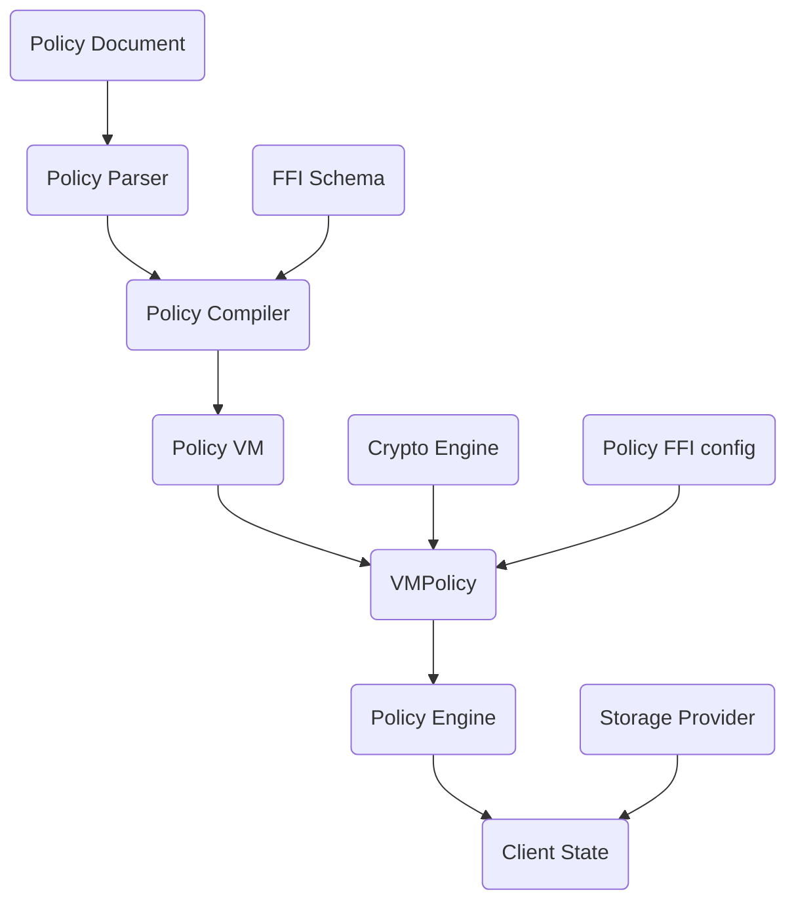
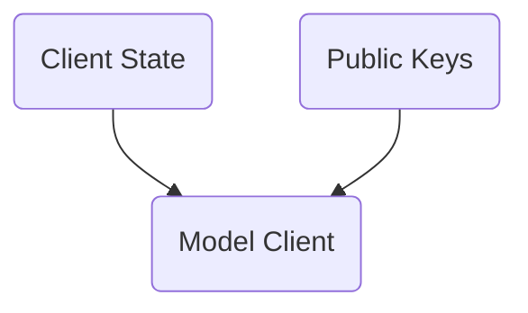
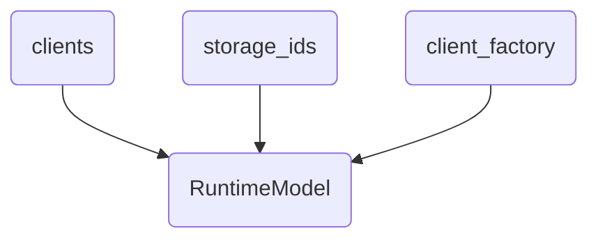

# Aranya Model

## Introduction
When simulating or testing Aranya we need a model that can be used to test the behavior of Aranya under different scenarios. The Aranya Model is the answer to this need.

## Approach
The Aranya Model is a library which provides APIs to construct one or more clients, execute actions on the client(s), and sync between clients. The model can handle both on-graph and off-graph (ephemeral/session) commands.

The APIs use simple user generated segregate Proxy IDs for the public client and graph IDs. The model will then map these Proxy IDs to the proper client or computed `GraphID`. This will aid in declarative testing as computed IDs are not known until after command creation, may be randomized, and are unpredictable. Segregate proxy IDs are simple `u64` values.

## Client State
Each client in the model can be thought of as an instance of Aranya Client State or the state of its graph. To configure an Aranya client, we need to look at its component parts.



By far the biggest portion of the Client State configuration is the VMPolicy. The VMPolicy is made up of the Policy VM, Crypto Engine, and Policy FFI configuration. The Policy VM will take a compiled policy module and convert it into an executable policy which we can evaluate commands against. Let's look at how Aranya takes a raw policy markdown document and processes it into the Policy VM.

### Policy document
To execute actions in the model, we need to write a custom policy see [policy-v1](/docs/policy-v1.md). Policies are markdown files that outline the accepted actions that can be issued and the corresponding commands that will be generated. Successful commands will emit effects and/or write facts to the graph. The database or storage mechanism used by the factDB will be an implementation detail. The following is a basic overview of the parts that make up a policy.

#### Policy vocabulary
*Action*: An action is a user generated function defined in the policy language that can emit commands. Actions create new commands and insert them into the local database. When new commands arrive (from either local creation, or synced from other nodes), the policy for those commands is evaluated, which may produce fact changes and effects. Actions can be thought of as providing a contract (along with effects) to the application which is implemented by the policy. The commands in actions are atomic in nature, only succeeding if all the command policy checks succeed.

*Command*: A command will define both structured data (the `fields` block) and policy decisions for processing data in policy `finish` and `recall` blocks.

*Effect*: An Effect is a struct used in policy `finish` and `recall` blocks to describe the shape of side effects produced from processed commands.

*Fact*: A fact is a schema that describes a key value pair stored in the factDB `fact Foo[key int]=>{value int}`. It should be noted that facts may have multiple fields for their keys and values `TeamAdmin[teamID: int, userID: int]=>{name: string, team: string}`.

*FFI*: <a name="ffi"></a> A foreign function interface (FFI) gives us a way to bring logic and functionality that doesn't exist in the policy language (the language policy documents are written in) into our policy document.

*FFI Module*: <a name="ffi-module"></a> A FFI module is a set of [FFI](#ffi) functions used during the execution of the policy.

### FFI schema
The FFI schema describes the names and function signatures of the [FFI modules](#ffi-module) used within the policy document. It allows the compiler to validate that the correct functions and arguments are called when the policy is evaluated.

### Policy compiler
The policy compiler is responsible for creating an instance of a policy module. The policy module can be thought of as the serializable state of the policy-vm. The policy compiler will take in a parsed policy document and a schema of [FFI modules](#ffi-module) that the policy uses.

### Policy VM
The policy virtual machine is responsible for taking a compiled policy and evaluating commands to perform policy decisions.

### Crypto engine
The cryptography engine implements a set of APIs that are responsible for encryption/decryption and authentication of keys within the model. We use the `DefaultEngine` from the crypto crate in the test examples, but the crypto engine is entirely configurable.

### Policy FFI config
The FFI configuration is a collection of [FFI modules](#ffi-module) that will be used in the policy and their respective configurations.

### VM Policy
The VM Policy takes in the Policy VM, Crypto Engine, and [FFI](#ffi) configuration to create the Policy implementation.

### Policy engine
The `ModelEngine` is our local implementation of the Policy Engine that manages storing and retrieving the Policy.

### Storage provider
The Aranya runtime can use multiple storage implementations, these are known as storage providers. Currently the model tests are configured to use the `MemStorageProvider`. Other storage providers are available within the Aranya library, `LinearStorageProvider` and a configuration of Linear Memory Storage Provider. It should be noted that the graphviz API relies on traits implemented on the `MemStorageProvider`.

### Client state
The client state keeps track of the state of the graph in the runtime client. The policy engine and storage provider are passed into the client state. All the previous parts come together to form the client state.


## Model Client


Once we have the required configurations to build the client state, we can construct a model client. A model client is constructed using the client factory, which holds the client state configuration. When the `add_client` method is called on the model instance, it will create and add a model client to the model `clients` collection.

### Public Keys
When key bundles are created, they are limited in scope to the factory in which they are instantiated. We need to use the public key portion of the bundle to interact with various parts of the policy. Because of this we store them as part of the model client.

## Runtime Model


Once we have the model client established, we have the pieces we need to construct the runtime model. The model consists of a collection of constructed Model Clients, Storage IDs, and our Client Factory function.

### Clients
The `clients` field represents a collection of proxy ids and their corresponding `ModelClient` (client state and public keys).

### Storage IDs
The `storage_ids` field represents a collection of proxy ids to generated graph IDs created by Aranya.

### Client factory
The client factory is responsible for configuring and creating model clients. It lives in the implementation code; a functioning example can be seen in the model tests.

## APIs:

### Errors
```rust
enum ModelError {
    Client(ClientError),
    ClientNotFound,
    GraphNotFound,
    DuplicateClient,
    DuplicateGraph,
    Engine(EngineError),
    Sync(SyncError),
    VmPolicy(VmPolicyError),
    Parse(ParseError),
    Compile(CompileError),
}
```

### IDs
```rust
// Proxy ID for clients
type ProxyClientID = u64;
// Proxy ID for graphs
type ProxyGraphID = u64;
```

### Model Struct
```rust
type ClientStorageIds = BTreeMap<ProxyGraphID, GraphId>;
type Clients<C> = BTreeMap<ProxyClientID, C>;

// The structure of a model instance generic over a client factory.
pub struct RuntimeModel<CF: ClientFactory> {
    // Holds a collection of clients, generic over the client factory.
    pub clients: Clients<ModelClient<CF>>,
    // Holds a collection of `ProxyGraphID`s and `GraphId`s
    pub storage_ids: ClientStorageIds,
    // Holds the client factory used to create model clients
    client_factory: CF,
}
```

### Interface
```rust
trait Model {
    type Effects;
    type Action<'a>;
    type PublicKeys;

    // The `add_client` command creates a new Client with the given ID. This call is required to initialize a client ID before it can be used with other commands.
    fn add_client(&mut self, proxy_id: ProxyClientID) -> Result<(), ModelError>;

    // The `new_graph` command will create a new graph with the given ID on the given client. Operations can not be performed on a graph ID until there has been a call to `new_graph` with the given ID.

    // `new_graph` will return a vector of effects generated from the new graph creation.
    fn new_graph(
        &mut self,
        proxy_id: ProxyGraphID,
        client_proxy_id: ProxyClientID,
        action: Self::Action<'_>,
    ) -> Result<Self::Effect, ModelError>;

    // The `action` command applies the provided action to given client and graph. Both client and graph must be initialized and action must be valid for the policy of the graph.

    // `action` will return a vector of effects generated from the processed commands emitted by the action.
    fn action(
        &mut self,
        client_proxy_id: ProxyClientID,
        graph_proxy_id: ProxyGraphID,
        action: Self::Action<'_>,
    ) -> Result<Self::Effect, ModelError>;

    // The `sync` command causes the client `dest_client_proxy_id` to sync from a second client `source_client_proxy_id` for the given graph. Both clients and the graph must have been previously initialized.
    fn sync(
        &mut self,
        graph_proxy_id: ProxyGraphID,
        source_client_proxy_id: ProxyClientID,
        dest_client_proxy_id: ProxyClientID,
    ) -> Result<(), ModelError>;

    // The `get_public_keys` command will retrieve the public keys for a specific client from the model.
    fn get_public_keys(
        &self,
        client_proxy_id: ProxyClientID,
    ) -> Result<&Self::PublicKeys, ModelError>;

    // Create ephemeral session commands and effects
    fn session_actions<'a>(
        &mut self,
        client_proxy_id: ProxyClientID,
        graph_proxy_id: ProxyGraphID,
        actions: impl IntoIterator<Item = Self::Action<'a>>,
    ) -> Result<SessionData<Self::Effect>>;

    // Process ephemeral session commands
    fn session_receive(
        &mut self,
        client_proxy_id: ProxyClientID,
        graph_proxy_id: ProxyGraphID,
        commands: impl IntoIterator<Item = Box<[u8]>>,
    ) -> Result<Vec<Self::Effect>>;
}
```
