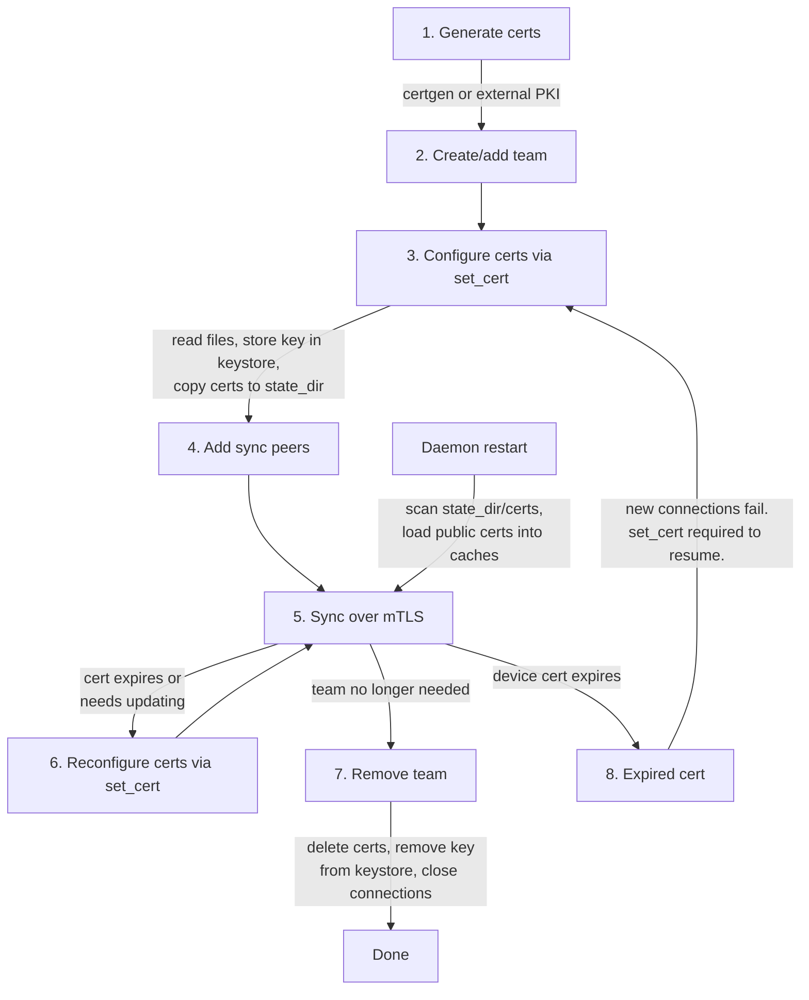

# Aranya mTLS Authentication

This specification uses [RFC 2119](https://www.rfc-editor.org/rfc/rfc2119) keywords (MUST, MUST NOT, SHOULD, SHOULD NOT, MAY) for normative requirements.

## Overview

mTLS is mutual TLS authentication. Traditional TLS only authenticates the server to the client, but not the client to the server. mTLS provides mutual authentication by validating the identities of both peers to each other via their TLS certs before sending data over a secure channel.

mTLS authentication in the Aranya syncer allows users to leverage their existing PKI infrastructure to authenticate nodes to each other before syncing.

Aranya's sync traffic is secured via mTLS over QUIC using the `quinn` library with `rustls` for TLS. This replaces the previous PSK-based authentication. All QUIC connections MUST use TLS 1.3. **[MTLS-001]**

Abbreviations in this document:
- certificate -> cert
- certificates -> certs

## Terminology

| Term | Definition |
|---|---|
| **Device cert** | The leaf X.509 cert identifying a device. Signed by a CA in the team's cert chain. Each device has one device cert per team (though the same cert MAY be reused across teams). |
| **Cert chain** | The set of CA certs (root and/or intermediate) used to validate a device cert. These are loaded into rustls's `RootCertStore` as trust anchors. Configured per-team via the `cert_chain` directory parameter in `set_cert`. rustls does not differentiate between root and intermediate CA certs — all are treated as trust anchors. |
| **Private key** | The private key corresponding to the device cert. Used for TLS authentication. Stored AEAD-encrypted in the daemon's keystore. |

## Certgen CLI Tool

The `aranya-certgen` CLI tool generates X.509 certs for use with Aranya's mTLS implementation. Users MAY use their own PKI infrastructure instead. **[MTLS-016]**

The tool MUST use P-256 ECDSA secret keys. **[MTLS-014]** It MUST be able to generate a root CA cert and key pair **[MTLS-017]** and signed certs along with their key. **[MTLS-018]** The tool currently outputs certs in PEM format with `.crt.pem` and `.key.pem` extensions. DER output support is planned (see [Future Work](#future-work)).

A CN (Common Name) MUST be specifiable for each generated cert **[MTLS-019]** and MUST be automatically added as a SAN, auto-detected as DNS or IP based on format. **[MTLS-020]** Additional SANs MUST be specifiable via `--dns` and `--ip` flags for multiple DNS hostnames and IP addresses beyond the CN. **[MTLS-021]** A validity period in days MUST be specifiable so certs can expire. **[MTLS-022]**

Example usage:
```bash
# Create a root CA (creates ca.crt.pem and ca.key.pem)
aranya-certgen ca --cn "My Company CA" --days 365

# Create a root CA with custom output prefix (creates ./certs/myca.crt.pem and ./certs/myca.key.pem)
aranya-certgen ca --cn "My Company CA" --days 365 -o ./certs/myca -p

# Create a signed certificate
aranya-certgen signed ca --cn server --days 365

# Create a signed certificate with custom output
aranya-certgen signed ./certs/myca --cn server --days 365 -o ./certs/server

# Create a signed certificate with multiple SANs (for NAT/multi-homed deployments)
aranya-certgen signed ca --cn mydevice.example.com --ip 192.168.1.10 --ip 10.0.0.5 --dns mydevice.local --days 365
```

CLI flags:
- `--cn`: Common Name for the certificate (required)
- `--dns`: Additional DNS SAN (can be specified multiple times)
- `--ip`: Additional IP SAN (can be specified multiple times)
- `--days`: Validity period in days (default: 365)
- `-o/--output`: Output path prefix (default: "ca" for CA, "cert" for signed)
- `-p`: Create parent directories if they don't exist
- `-f/--force`: Overwrite existing files

See [Future Work](#future-work) for planned enhancements including DER output format and encrypted private key files.

## Certificate Lifecycle



1. **Generate** — Create device cert, private key, and cert chain using `aranya-certgen` or external PKI.
2. **Create/add team** — Team must exist before certs can be configured.
3. **Configure** — Call `set_cert` (via builder or standalone). Daemon reads files, stores private key in keystore (AEAD-encrypted), copies certs to `state_dir/certs/<team_id>/`. User is responsible for deleting source files.
4. **Add sync peers** — Configure which peers to sync with. Connections will fail TLS handshakes until certs are configured.
5. **Sync** — Outbound and inbound connections use per-team certs and cert chains. Private keys loaded from keystore on-demand per connection.
6. **Reconfigure** — Call `set_cert` again with new files. Reconfigures which cert the device presents (does NOT revoke the old cert). Old connections removed from map and drained. New connections use the new cert.
7. **Remove** — Delete certs from `state_dir`, remove key from keystore, close connections.
8. **Expired cert cleanup** — Detected reactively during TLS handshake failures. New connections fail until `set_cert` is called with a valid cert. Existing connections continue until they drop naturally.

On **daemon restart**, public certs are reloaded from `state_dir/certs/` into the resolver and verifier caches. Private keys remain encrypted in the keystore and are loaded on-demand per handshake.

### Generation

Certs MUST be X.509 TLS certs in a format supported by rustls (PEM or DER). **[MTLS-002]** All certs MUST contain at least one Subject Alternative Name (SAN). **[MTLS-004]** The QUIC transport (via rustls) MUST correctly validate certs containing multiple DNS SANs and multiple IP SANs. When using external PKI, certs SHOULD use keys of at least 256 bits to meet current NIST standards (NIST SP 800-52 Rev. 2). **[MTLS-013]** Certs and private keys MUST NOT be checked into repositories. **[MTLS-012]**

mTLS device certs and cert chain certs can be generated using either:

1. **External PKI** — Users MAY provide certs from their existing PKI infrastructure. **[MTLS-016]**

2. **`aranya-certgen` CLI tool** — Aranya's built-in cert generation tool. Uses P-256 ECDSA keys per **[MTLS-014]**. See [Certgen CLI Tool](#certgen-cli-tool).

Example using `aranya-certgen`:
```bash
# Generate a CA
aranya-certgen ca --cn "My Company CA" --days 365

# Generate a device cert signed by the CA
aranya-certgen signed ca --cn 192.168.1.10 --days 365 -o device
```

### Configuration API

Each team MUST be configured with a device cert, its corresponding private key, and a cert chain via `set_cert`. **[MTLS-005]** The private key MUST be the key that corresponds to the device cert. **[MTLS-089]** The device cert MUST be signed by a CA in the team's cert chain. **[MTLS-006]** A device MAY reuse the same device cert and key pair across multiple teams (each team configured with a cert chain that trusts that device cert), or MAY use entirely different device cert and key pairs per team. **[MTLS-008]**

Certs MUST be configured per-team via the `set_cert` method. **[MTLS-023]** `set_cert` MUST be exposed on both the client API and the daemon API. **[MTLS-024]** The team MUST have been created (`create_team`) or added (`add_team`) before `set_cert` can be called, since `set_cert` requires the team ID to exist in the daemon's storage. **[MTLS-026]** Applications SHOULD configure certs before adding sync peers **[MTLS-025]** — if sync peers are added first, connections will fail TLS handshakes until certs are set up.

Certs can be configured in two ways:

1. **At team creation/addition** — via the optional `set_cert` method on `CreateTeamConfig` / `AddTeamConfig` builders:
```rust
let cfg = CreateTeamConfig::builder()
    .set_cert(cert_chain, device_cert, device_key)
    .build()?;
client.create_team(cfg).await?;
```

2. **After team creation** — via the standalone `set_cert` method on the client:
```
set_cert(team_id, cert_chain, device_cert, device_key)
```

Both paths use the same import flow. The standalone `set_cert` is required for cert reconfiguration since `create_team`/`add_team` cannot be called again for an existing team. **[MTLS-026]**

Parameters:
- `team_id` — the team to configure mTLS certificates for (implicit when called via builder)
- `cert_chain` — directory path containing the cert chain files (root CA and/or intermediate CA certs). **[MTLS-007]** All files in the directory MUST be loaded as trust anchors. **[MTLS-082]** If any file fails to parse as a valid cert, `set_cert` MUST fail. **[MTLS-083]** Note: the daemon does not validate the PKI hierarchy of certs in this directory. It is possible to place a self-signed device cert here, which would effectively bypass cert chain validation for that cert. This is NOT recommended — the `cert_chain` directory SHOULD only contain CA certs from a trusted PKI.
- `device_cert` — file path to the device cert file
- `device_key` — file path to the device private key file

The daemon MUST accept file paths from the client via IPC. **[MTLS-027]** The daemon MUST detect the certificate format (PEM or DER) and convert to DER if necessary, since rustls operates on DER internally. **[MTLS-028]**

`set_cert` MUST be idempotent — calling it again for the same team MUST overwrite the previous cert configuration with no other side effects. **[MTLS-029]**

The SNI hostname for each team MUST be the team ID's base58 string representation. **[MTLS-084]** This is the standard `Display` format for Aranya IDs (alphanumeric, DNS-safe, within the 63-character DNS label limit). The SNI value is never resolved as a DNS hostname — it is used only as a key for the `ResolvesServerCert` cert cache lookup. Team IDs are cryptographically derived (not user-controlled), so an attacker cannot craft a team ID that causes DNS resolution or other unintended behavior during SNI processing.

Recommended call ordering: `create_team` / `add_team` (with optional `set_cert`) → `set_cert` (if not provided earlier) → `add_sync_peer`

### Import Flow

When `set_cert` is called:

1. Read the cert and key files from the provided paths. **[MTLS-027]** The private key bytes MUST be wrapped in `Zeroizing` so they are automatically zeroized when dropped. **[MTLS-035]**
2. Remove all existing connections for this team from the connection map and close them immediately with `CONNECTION_CLOSE`. **[MTLS-085, MTLS-091]** The peer receives the close and removes the connection from its own map, so its next request automatically establishes a new connection using the updated cert. If a sync request is disrupted during the transition, it SHOULD be retried — the retry will use a new connection with the new cert. Note: connection handoff during cert reconfiguration will be seamless once automatic retry logic for failed sync requests is implemented (see [Future Work](#future-work)).
```rust
let conn = connection_map.remove(&(peer, team));
if let Some(conn) = conn {
    conn.close(0u32.into(), b"cert reconfigured");
}
```
3. Copy the `cert_chain` directory to `state_dir/certs/<team_id>/chain/`. **[MTLS-031]**
4. Copy the device cert to `state_dir/certs/<team_id>/device.crt.pem`. **[MTLS-030]**
5. Store the private key in the keystore as a `TlsPrivateKey` (AEAD-encrypted at rest, keyed by team ID). **[MTLS-032]** If a key already exists for this team, replace it per **[MTLS-029]**. The keystore is the sole source of truth for the private key — the plaintext key bytes are never passed to rustls during import. **[MTLS-033]**
6. Update the `ResolvesServerCert` resolver's cached certs for this team (device cert + cert chain only, no private key). **[MTLS-086]**
7. Update the `ClientCertVerifier`'s trust store for this team (cert chain loaded into per-team `RootCertStore`). **[MTLS-087]**

If the keystore write or cert directory copy fails, both MUST be rolled back to their previous state and `set_cert` MUST return an error. **[MTLS-037, MTLS-080]** `set_cert` MUST serialize updates per team to prevent race conditions. **[MTLS-038]**

The daemon MUST NOT delete the source cert or private key files. **[MTLS-036]** The user is responsible for the lifecycle of their cert/key files. API documentation SHOULD strongly recommend deleting the private key file after it has been successfully imported into the daemon. If the user does not delete the source files and the private key is compromised, that is the user's responsibility.

Source cert/key files SHOULD be protected with an encrypted filesystem and restricted file permissions. **[MTLS-015]**

### Private Key Storage

A new `TlsPrivateKey<CS>` type MUST be added to aranya-core's crypto engine for storing TLS private keys in the daemon's keystore. **[MTLS-047]** This follows the existing pattern used by `PskSeed`, signing keys, and encryption keys.

- `TlsPrivateKey<CS>` — unwrapped key type holding the raw private key bytes
- `TlsKeyId` — typed ID for keystore lookup. The team ID MUST be usable directly (cast/reinterpret) as the `TlsKeyId` without derivation. **[MTLS-048]**
- `Ciphertext::Tls` — new variant in the keystore's AEAD wrapping enum **[MTLS-049]**

The private key MUST be AEAD-encrypted at rest in the keystore. **[MTLS-032]** It is decrypted only when needed for TLS handshakes (**[MTLS-050]**) — during `set_cert` import, the key is read from the plaintext source file and does not need decryption. Decrypted key bytes MUST be wrapped in `Zeroizing` so they are automatically zeroized when dropped after constructing the key object. **[MTLS-035]**

Private keys are loaded from the keystore on-demand per handshake. Two copies of the key exist briefly:

1. **Rust-allocated bytes** — the decrypted key bytes from the keystore. These MUST be wrapped in `Zeroizing` per **[MTLS-035]** and are automatically zeroized when dropped after constructing the `CertifiedKey`.
2. **C-allocated key object** — aws-lc-rs parses the bytes and stores the key in its own C-allocated memory (`EVP_PKEY`). rustls borrows this key only for the duration of the handshake (to sign the TLS CertificateVerify message) and does not retain it after the handshake completes — TLS 1.3 session encryption uses ephemeral keys from the DH exchange, not the signing key. The `Arc<CertifiedKey>` returned by `ResolvesServerCert` is dropped when the handshake function returns. aws-lc-rs zeroizes the C-allocated key via `EVP_PKEY_free` when the ref count reaches zero.

Quinn MUST be configured with the `rustls-aws-lc-rs` feature (not the default `rustls-ring`). **[MTLS-051]** ring explicitly does not zeroize key material on drop.

### Startup Flow

When the daemon starts:

1. Scan `state_dir/certs/` for team subdirectories. **[MTLS-039]**
2. For each team: load the device cert and cert chain from `state_dir/certs/<team_id>/`. **[MTLS-040]**
3. Populate the `ResolvesServerCert` resolver's cert cache and the `ClientCertVerifier`'s per-team trust stores with the loaded public certs. **[MTLS-042]** Private keys remain encrypted in the keystore and are loaded on-demand per handshake per **[MTLS-050, MTLS-070]**.

### Cert Reconfiguration

Call `set_cert` again with new file paths per **[MTLS-029]**. This reconfigures which cert the device presents — it does NOT revoke the old cert. Other devices that still have a copy of the old cert can continue using it until it expires. Cert revocation (CRL/OCSP) is required to fully invalidate an old cert (see [Future Work](#future-work)).

The daemon overwrites cert files, replaces the keystore key, and updates the resolver and verifier caches. The same import flow (steps 1-7) is used. Old connections are removed from the map and force-closed after a configurable timeout, allowing in-progress streams to complete. The peer discovers the closed connection and establishes a new one on the next request. If a request fails during the transition, it is retried on a new connection with the new cert. The server's `ResolvesServerCert` and `ClientCertVerifier` caches are updated immediately, so new connections use the new cert.

### Cert Expiry

Cert expiry is detected reactively during TLS handshake failures. This is idiomatic TLS behavior — TLS validates certs only during the handshake, not on established connections. QUIC connections established before cert expiry continue working because TLS session keys are independent of cert validity. TLS 1.3 does not support renegotiation or mid-connection cert re-validation.

When an expired cert is detected during a handshake failure, new connections for that team will fail until `set_cert` is called with a valid cert. Existing connections are not actively closed on expiry detection — they continue until they drop naturally or the cert is reconfigured via `set_cert`.

See [Future Work](#future-work) for planned proactive cert expiry scanning.

### Team Removal

1. Delete the `state_dir/certs/<team_id>/` directory and its contents. **[MTLS-043]**
2. Remove the `TlsPrivateKey` from the keystore. **[MTLS-044]**
3. Remove the team from the resolver and verifier caches. **[MTLS-045]**
4. Remove connections for this team from the connection map and close them with `CONNECTION_CLOSE`, same as cert reconfiguration per **[MTLS-085, MTLS-091, MTLS-092]**. **[MTLS-046]**

## TLS Configuration Architecture

### Outbound Connections

For outbound connections, the daemon builds a `ClientConfig` on-demand (team's device cert + cert chain) using `connect_with()` and MUST set the team ID (base58) as the SNI hostname. **[MTLS-052]** The `ClientConfig` MUST use a custom `ServerCertVerifier` that validates the server's device cert against the team's cert chain and verifies server SANs against the peer's actual address (not the SNI value) per **[MTLS-090]**.

```rust
impl ServerCertVerifier for TeamServerVerifier {
    fn verify_server_cert(
        &self,
        end_entity: &CertificateDer<'_>,
        intermediates: &[CertificateDer<'_>],
        server_name: &ServerName<'_>,  // This is the team ID, NOT used for SAN verification
        // ...
    ) -> Result<ServerCertVerified, Error> {
        // Validate server cert chain against the team's trust anchors
        verify_cert_chain(end_entity, intermediates, &self.team_trust_store)?;

        // Verify server SANs against the peer's actual address, not the SNI value.
        // self.peer_addr is the address we're connecting to.
        verify_server_san(end_entity, self.peer_addr)?;

        Ok(ServerCertVerified::assertion())
    }
}
```

### Inbound Connections

For inbound connections, the daemon uses a shared `ServerConfig`. **[MTLS-054]** The connecting client MUST set the team ID (base58) as the SNI hostname in the TLS ClientHello. **[MTLS-055]**

The `ServerConfig` uses two custom implementations:

1. **`ResolvesServerCert`** — uses the SNI value to select the correct team's device cert from a cached cert map and loads the private key from the keystore on-demand. **[MTLS-056]** If the SNI value does not match any configured team, the handshake MUST fail. **[MTLS-057]** The cert cache is updated by `set_cert` and cleared on team removal or cert expiry. Private keys exist in memory only for the duration of the handshake — Rust bytes zeroized via `Zeroizing` after key construction per **[MTLS-035]**, C-allocated key zeroized via aws-lc-rs when the `Arc<CertifiedKey>` drops per **[MTLS-051]**.

```rust
impl ResolvesServerCert for TeamCertResolver {
    fn resolve(&self, client_hello: ClientHello<'_>) -> Option<Arc<sign::CertifiedKey>> {
        let team_id = client_hello.server_name()?;

        // Look up cached public cert for this team
        let cached = self.cert_cache.read().get(team_id)?.clone();

        // Load private key from keystore on-demand (decrypted, wrapped in Zeroizing)
        let key_bytes: Zeroizing<Vec<u8>> = self.keystore.decrypt_tls_key(team_id).ok()?;

        // Construct CertifiedKey — aws-lc-rs copies key into C-allocated memory.
        // key_bytes (Zeroizing) is dropped and zeroized after this line.
        let certified_key = CertifiedKey::from_der(cached.cert_chain, &key_bytes).ok()?;

        Some(Arc::new(certified_key))
        // Arc<CertifiedKey> lives for the handshake, then drops.
        // aws-lc-rs zeroizes C-allocated key via EVP_PKEY_free.
    }
}
```

2. **`ClientCertVerifier`** — uses the SNI value (from the `ClientHello`) to select the team-specific cert chain and validates the client's device cert against it. **[MTLS-087]** This is cert chain validation only — it verifies that the client's cert is signed by a CA trusted by the team. Client cert SAN verification is NOT performed during the handshake; it is a separate application-layer check performed only on reverse connection reuse (see [Client SAN Verification](#client-san-verification)).

```rust
impl ClientCertVerifier for TeamClientVerifier {
    fn root_hint_subjects(&self) -> &[DistinguishedName] {
        // Return empty — don't hint which CAs we trust
        &[]
    }

    fn verify_client_cert(
        &self,
        end_entity: &CertificateDer<'_>,
        intermediates: &[CertificateDer<'_>],
        // SNI from the ClientHello, used to select team-specific trust store
        server_name: Option<&ServerName<'_>>,
    ) -> Result<ClientCertVerified, Error> {
        let team_id = server_name
            .and_then(|sn| sn.as_str())
            .ok_or(Error::General("missing SNI".into()))?;

        // Select the team-specific RootCertStore
        let trust_store = self.team_trust_stores.read()
            .get(team_id)
            .ok_or(Error::General("unknown team".into()))?
            .clone();

        // Validate client cert chain against team-specific trust anchors
        verify_cert_chain(end_entity, intermediates, &trust_store)?;

        Ok(ClientCertVerified::assertion())
    }
}
```

After the handshake, the connection is bound to the team identified by SNI. Subsequent sync requests on the connection MUST include a team ID that matches the SNI-selected team. **[MTLS-058]** If a sync request's team ID does not match, the request MUST be rejected and the entire QUIC connection closed. **[MTLS-059]** Since each connection is bound to exactly one team via SNI (MTLS-060), a mismatched team ID indicates either a bug or a malicious peer — there is no legitimate reason for a peer to send a different team ID on a team-bound connection.

### Connection Model

QUIC connections MUST be established per (peer, team) pair. **[MTLS-060]** Separate connections per team are required because:
- Each team may use different device certs and cert chains. Sharing a connection across teams would complicate server-side cert selection and risk presenting the wrong device cert.
- TLS 1.3 uses ephemeral key exchange for session encryption, so certs affect authentication only, not confidentiality. However, using the wrong device cert could allow a device authenticated for Team A to sync Team B's graph if the cert chains are cross-trusted.
- If a shared connection is used for multiple teams and one team's cert chain is compromised, a MiTM attacker could intercept sync traffic for all teams on that connection. Per-team connections contain the blast radius to the compromised team.

The TLS handshake MUST validate both peers' device certs against the team's cert chain (mutual certificate validation). **[MTLS-061]** This refers to cert chain validation only — server SANs are verified by the client against the peer's actual address per **[MTLS-090]**, and client SANs are only verified on reverse connection reuse (see [Client SAN Verification](#client-san-verification)).

A peer whose device cert is not trusted by a team's cert chain MUST NOT be able to establish a connection for that team. **[MTLS-062]** QUIC connection attempts MUST fail the TLS handshake if certs have not been configured or signed properly. **[MTLS-009]** QUIC connection attempts with expired certs MUST fail the TLS handshake. **[MTLS-010]** The daemon MUST log rejected connections including the IP address, port, and hostname (if available). **[MTLS-011]**

Connections MUST be reused within a team. **[MTLS-063]** A new connection is only established when the existing one drops, when reverse reuse fails the client SAN check, or when syncing with a new peer. When a connection closes, its entry MUST be removed from the connection map. **[MTLS-064]**

### Reverse Connection Reuse

When a peer connects to us (inbound) for a specific team, the daemon MAY reuse that connection to sync back to them for the same team. **[MTLS-065]** Reverse reuse requires passing client SAN verification (see [Client SAN Verification](#client-san-verification)). If the SAN check fails, the daemon MUST attempt to establish a new outbound connection instead per **[MTLS-066]**.

Each connection MUST track: **[MTLS-067]**
- **Direction**: whether this device initiated the connection (outbound) or the peer initiated it (inbound), set at connection establishment time.
- **Reverse SAN status**: for inbound connections, whether the connection has passed client SAN verification for reverse reuse. Initially `false`, set to `true` after a successful SAN check. Outbound connections do not need this flag since server SANs were already verified during the TLS handshake.

### In-Memory Representation

```rust
/// Shared server config for inbound connections.
/// Cert cache populated by set_cert, private keys loaded on-demand from keystore.
server_config: Arc<ServerConfig>
```

`ClientConfig` for outbound connections SHOULD be created on-demand when a new connection is needed. **[MTLS-068]** `connect_with()` takes ownership of the `ClientConfig`, so the daemon does not retain a copy after initiating the connection. This minimizes the window during which the private key is held in daemon memory. Since connections are long-lived and reused per **[MTLS-063]**, new connections are infrequent and the keystore read cost per connection is negligible. If a high rate of new connections becomes a performance concern, private key caching with a TTL is planned (see [Future Work](#future-work)).

The shared `ServerConfig` MUST remain in memory to accept inbound connections. **[MTLS-069]** The `ResolvesServerCert` caches public certs (device certs + cert chains) but loads private keys from the keystore on-demand per handshake. **[MTLS-070]** This avoids holding private keys in memory between handshakes. The resolver MUST support concurrent handshakes.

### Connection Flow

Outbound:
1. Check the connection map for an existing healthy connection to (peer, team) — if found, reuse it per **[MTLS-063]**
2. Otherwise, build a `ClientConfig` on-demand: load the team's device cert from `state_dir/certs/<team_id>/`, decrypt the `TlsPrivateKey` from the keystore, and load the team's cert chain per **[MTLS-068]**
3. Initiate connection using `connect_with()`, which takes ownership of the `ClientConfig` per **[MTLS-052]**. Set SNI to team ID (base58) per **[MTLS-084]**.
4. TLS handshake completes with mutual cert chain validation per **[MTLS-061]**
5. After the TLS handshake completes, the private key is zeroized. The Rust-allocated key bytes (wrapped in `Zeroizing`) are zeroized after `CertifiedKey` construction per **[MTLS-035]**. The C-allocated key inside aws-lc-rs is zeroized when the `Arc<CertifiedKey>` drops after the handshake per **[MTLS-051]**.
6. Store connection in the connection map keyed by (socket address, team ID)

Inbound:
1. Accept connection using shared `ServerConfig` — SNI in the ClientHello identifies the team per **[MTLS-055]**
2. `ResolvesServerCert` selects the team's device cert from cache and loads the private key from the keystore on-demand per **[MTLS-070]**
3. `ClientCertVerifier` validates the client's device cert against the team's cert chain (selected via SNI) per **[MTLS-087]**
4. TLS handshake completes with mutual cert chain validation per **[MTLS-061]**
5. `Arc<CertifiedKey>` dropped after handshake — aws-lc-rs zeroizes C-allocated key per **[MTLS-051]**. Rust-allocated bytes already zeroized via `Zeroizing` per **[MTLS-035]**.
6. Store the connection in the connection map keyed by (peer address, team ID from SNI)
7. Validate that the team ID in sync requests matches the team ID of the connection in the connection map per **[MTLS-058]**


## SAN Verification

### Server SAN Verification

Server SANs MUST always be verified and MUST NOT be disabled. **[MTLS-053]** Because SNI contains the team ID (not the server's address), a custom `ServerCertVerifier` MUST verify server cert SANs against the **peer's actual IP address or resolved DNS hostname**, not the SNI value. **[MTLS-090]** The server's certificate MUST contain a SAN matching the address the client is connecting to.

For deployments with dynamic server IPs, DNS SANs SHOULD be used that resolve to the server's current IP address. **[MTLS-071]** Update DNS records when the IP changes.

### Client SAN Verification

Client cert SAN verification is a separate application-layer check, NOT part of the `ClientCertVerifier` TLS handshake. It is performed only when reusing an inbound connection in reverse. **[MTLS-072]** The peer's certificate SANs MUST be checked against the IP address they connected from. **[MTLS-073]**

The connection MAY be reused in reverse only if ANY of the following are true: **[MTLS-074]**
- A SAN contains an IP address that exactly matches the peer's connecting IP address (byte-level comparison; IPv4-mapped IPv6 addresses MUST be compared against their IPv4 equivalent) **[MTLS-075]**
- A SAN contains a DNS hostname that, when resolved via DNS lookup, returns an IP address matching the peer's connecting IP

If no SAN matches, the connection MUST NOT be reused in reverse. **[MTLS-076]** The daemon MUST attempt to establish a new outbound connection to the peer. **[MTLS-066]** The inbound connection MUST remain open for the peer to continue syncing to us. **[MTLS-077]**

DNS resolution results SHOULD be cached for efficient lookups. **[MTLS-078]**

### NAT Considerations

When a peer is behind NAT, the connecting IP is the NAT's external IP, not the peer's actual IP. The peer's cert SANs typically won't match, so reverse reuse falls back to a new outbound connection.

Strategies for NAT deployments:
- **Use the NAT's external IP or hostname in cert SANs** — if the NAT IP is stable, include it in the cert via `--ip` or `--dns` flags.
- **Establish redundant outbound connections** — both peers initiate outbound connections. This requires each peer to have a routable address or an existing outbound connection that has opened the NAT firewall.
- **Relay via a peer not behind NAT** — recommended when both peers are behind NAT since direct connectivity is not possible without NAT traversal.

QUIC does not natively provide NAT traversal. Deployments where peers are behind NAT SHOULD ensure at least one peer in the sync topology has a routable address, or use a relay peer. **[MTLS-079]**

### Implementation

Client SAN verification is performed at the application layer after the TLS handshake, when deciding whether to reuse a connection in reverse. The `ClientCertVerifier` trait does not have access to the peer's IP address and is only responsible for cert chain validation during the handshake per **[MTLS-087]**.

```rust
fn verify_client_san(conn: &quinn::Connection) -> Result<(), SanError> {
    let peer_ip = conn.remote_address().ip();
    let certs = conn.peer_identity()
        .and_then(|id| id.downcast::<Vec<CertificateDer>>().ok())?;
    let cert = certs.first()?;

    let (_, parsed) = x509_parser::parse_x509_certificate(cert)?;

    for san in parsed.subject_alternative_name()?.value.general_names.iter() {
        match san {
            GeneralName::IPAddress(ip_bytes) => {
                if ip_from_bytes(ip_bytes) == peer_ip {
                    return Ok(());
                }
            }
            GeneralName::DNSName(hostname) => {
                if dns_resolves_to(hostname, peer_ip) {
                    return Ok(());
                }
            }
            _ => continue,
        }
    }

    Err(SanError::NoMatchingSan)
}
```

## Threat Model

This threat model covers threats at the mTLS transport layer. For sync protocol-level threats (message flooding, stale data replay, oversized messages, DeviceId discovery) see the [sync threat model](sync-threat-model.md).

Note: Aranya does not currently check certificate revocation status (CRL/OCSP). Compromised certs should be reconfigured via `set_cert`. See [Future Work](#future-work).

### Deviations from Standard TLS

This design intentionally deviates from standard TLS/mTLS conventions in several areas. The following table documents each deviation with its rationale and security impact. Rather than auditing from scratch, reviewers can use this as a delta-audit to determine where the security differences are. All deviations are security-neutral or security-positive, with the exception of cert revocation which is not yet implemented (see [Future Work](#future-work)).

| Area | Standard TLS | This Spec | Rationale | Security Impact |
|---|---|---|---|---|
| **SNI usage** | SNI contains the server's hostname for virtual hosting and SAN verification. | SNI contains the team ID (base58) for team-based cert selection. | Functionally equivalent to standard SNI virtual hosting — each team is a "virtual host" with its own certs, and the daemon hosts multiple teams on the same endpoint. The team ID serves the same role as a hostname. The only difference is the string format (base58 ID vs DNS hostname). | Neutral. SNI is cleartext in TLS 1.3 regardless, and team ID is not sensitive. Team existence oracle mitigated by **[MTLS-057]**. |
| **Server SAN verification** | Client verifies server cert SANs match the SNI hostname. | Client uses a custom `ServerCertVerifier` that verifies server cert SANs against the **peer's actual address** (IP or resolved DNS), not the SNI value. **[MTLS-090]** | SNI contains the team ID, not the server's address. Standard SAN verification would fail because no SAN matches a base58 team ID. The peer's actual address is verified instead. | Neutral. Same property verified (server is at the expected address), different input (actual address vs SNI). |
| **Client cert chain validation** | `ClientCertVerifier` validates against a single global trust store. | Custom `ClientCertVerifier` uses SNI from the `ClientHello` to select a **per-team trust store** for validation. **[MTLS-087]** | Different teams may use different CAs. The server must validate the client's cert against the correct team's cert chain, not a combined trust store. | Positive. Prevents a cert trusted by Team A's CA from authenticating for Team B. Stricter than standard TLS. |
| **Client cert SAN verification** | Not performed (TLS does not require it). | Performed at the application layer, but only on reverse connection reuse. **[MTLS-072]** Checks SANs against the peer's connecting IP. | Ensures the inbound peer's address matches their cert before reusing the connection in the reverse direction. Graceful fallback if SANs don't match. | Positive. Additional check not present in standard TLS. Graceful fallback ensures no availability loss. |
| **Cert chain as trust anchors** | Only root CA certs are trust anchors. Intermediate CA certs are sent in the cert chain during the handshake. | Both root and intermediate CA certs are loaded as trust anchors in rustls's `RootCertStore`. Device cert is leaf-only. | Simplifies cert management — one directory of CA certs per team. rustls does not differentiate between root and intermediate CAs in its trust store. Avoids needing to bundle intermediates with the device cert. | Neutral. Same certs are trusted, different storage location. Operational model for intermediate CA changes differs from standard but cert revocation is not yet implemented. |
| **On-demand private key loading** | Private keys are loaded into `ClientConfig`/`ServerConfig` at startup and held in memory. | Private keys loaded from an AEAD-encrypted keystore on-demand per TLS handshake, then zeroized. Public certs cached. **[MTLS-070, MTLS-068]** | Minimizes private key exposure window. Keys are only in daemon memory during handshake setup, not for the daemon's lifetime. | Positive. Reduces private key exposure from process lifetime to handshake duration. |
| **Connection-per-team** | One connection between two peers, multiplexing via QUIC streams. | One connection per (peer, team) pair. **[MTLS-060]** | Each team requires different certs and trust chains. Prevents cross-team cert mismatch, limits blast radius of CA compromise. | Positive. Compromised CA for one team cannot affect other teams' connections. |
| **Cert rotation connection handling** | Existing connections unaffected by cert changes. New certs only used for future handshakes. TLS 1.3 has no mid-connection cert re-validation. | Old connections removed from connection map and closed immediately on cert rotation via `set_cert`. **[MTLS-085, MTLS-091]** Disrupted requests are retried on a new connection with the new cert. | Ensures peers transition to the new cert promptly rather than continuing to use old connections indefinitely. A drain timeout would delay the close without reducing the probability of disrupting an in-progress request, since sync timing is independent of cert rotation timing. | Positive. Stricter than standard TLS — old connections are closed immediately rather than left open. |
| **No cert revocation** | Standard TLS supports CRL and/or OCSP to revoke compromised certs. Peers check revocation status during the TLS handshake. | Cert revocation is not implemented. The only mechanism to stop presenting a compromised cert is `set_cert` with a new cert, which closes old connections immediately per **[MTLS-085, MTLS-091]**. However, the old cert cannot be invalidated across peers — each peer must individually reconfigure, and the old cert remains valid for other peers until it expires. | This is the only accepted security regression. Implementing CRL/OCSP adds significant infrastructure complexity. For the initial mTLS implementation, `set_cert` reconfiguration combined with cert expiry provides a baseline mitigation. | **Negative.** A compromised cert cannot be centrally revoked. Planned for future work. See [Future Work](#future-work). |

### Threats

| Threat | Description | Mitigation | Residual Risk |
|---|---|---|---|
| **Passive eavesdropping** | Attacker observes sync traffic on the network. | TLS 1.3 with ephemeral key exchange encrypts all traffic. **[MTLS-001]** | None — session keys are ephemeral and not derived from certs. |
| **MiTM on outbound connection** | Attacker intercepts connection and presents a fraudulent server cert. | Server SAN verification ensures the server cert matches the expected hostname/IP. **[MTLS-053]** Cert chain validation ensures the cert is signed by a trusted CA. **[MTLS-061]** | None if cert chain and DNS are not compromised. |
| **MiTM on inbound connection** | Attacker connects to daemon pretending to be a legitimate peer. | `ClientCertVerifier` validates the client's device cert against the team's cert chain (selected via SNI). **[MTLS-087]** SNI binds the connection to a specific team. **[MTLS-055, MTLS-056]** | None if the attacker does not hold a device cert trusted by the team's cert chain. |
| **Cross-team auth bypass** | Device authenticated for Team A attempts to sync Team B. | Per-team connections with team-specific certs. **[MTLS-060]** SNI-based cert selection. **[MTLS-056]** Per-SNI `ClientCertVerifier` validates client cert against team-specific cert chain. **[MTLS-087]** Sync request team ID validated against bound team. **[MTLS-058, MTLS-059]** | None if teams use separate cert chains. If cert chains are cross-trusted, the handshake succeeds but sync request validation catches mismatches. |
| **Compromised device cert** | Attacker obtains a device's private key and cert. | Attacker can authenticate as that device until the cert expires or is reconfigured via `set_cert`. **[MTLS-029]** On reconfiguration, old connections are closed immediately per **[MTLS-091]**. All commands are validated by the graph regardless. | Cert revocation is not currently implemented. The attacker can authenticate as the compromised device on new connections until the cert expires. See [Future Work](#future-work). |
| **Compromised CA** | Attacker compromises a CA in the cert chain and issues fraudulent device certs. | Per-team connections limit blast radius — only teams using the compromised cert chain are affected. **[MTLS-060]** | Attacker can authenticate as any device for affected teams until the cert chain is replaced. |
| **Private key exposure on disk** | Source key file read by unauthorized process before or after import. | Daemon does not delete source files — user is responsible per **[MTLS-036]**. Encrypted filesystem recommended. **[MTLS-015]** API docs recommend deleting private key after import. | If user does not delete source files, private key remains on disk. User's responsibility. |
| **Private key exposure in memory** | Key material lingers in daemon memory. | Two copies exist briefly per handshake: (1) Rust bytes wrapped in `Zeroizing`, auto-zeroized after key construction **[MTLS-035]**; (2) aws-lc-rs C-allocated key, zeroized via `EVP_PKEY_free` when `Arc<CertifiedKey>` drops after handshake **[MTLS-051]**. Keys loaded on-demand from keystore per handshake; only public certs cached. **[MTLS-070]** | Key material exists only for the duration of the handshake, not the connection or daemon lifetime. |
| **Private key exposure at rest** | Keystore compromised on disk. | Private key AEAD-encrypted in the keystore. **[MTLS-032]** | Attacker who compromises the keystore encryption key can decrypt all stored private keys. |
| **Expired cert** | Device cert expires, new connections fail. | Detected reactively during TLS handshake failures (idiomatic TLS behavior). New connections fail until `set_cert` is called with a valid cert. Existing connections continue until they drop naturally. | Existing connections established before expiry remain active. Proactive expiry scanning is planned (see [Future Work](#future-work)). |
| **DNS spoofing for SAN verification** | Attacker manipulates DNS to pass SAN checks. | Client SAN verification is only used for reverse connection reuse — failure falls back to new outbound connection, not an error. **[MTLS-076, MTLS-066]** DNS results SHOULD be cached. **[MTLS-078]** | Attacker controlling DNS could pass client SAN check on inbound connection. Impact limited to reverse reuse of a single connection. Server SAN verification is more critical and depends on DNS integrity. |
| **NAT prevents connectivity** | Peers behind NAT cannot establish direct connections. | Multiple strategies: NAT IP in SANs, redundant outbound connections, relay peer. **[MTLS-079]** | QUIC does not provide NAT traversal. At least one peer needs a routable address. |
| **Replay attack** | Attacker replays captured TLS handshake. | TLS 1.3 handshake uses ephemeral keys — replayed handshakes fail. **[MTLS-001]** | None. |
| **Connection exhaustion** | Malicious authorized device opens many connections to exhaust resources. | Per-team connections limit one connection per (peer, team) pair. **[MTLS-060]** SNI must match a valid team. **[MTLS-057]** | Attacker is limited to one connection per configured team. |
| **Sync flooding** | Malicious authorized device sends excessive sync requests over an established connection. | Out of scope for mTLS spec. See sync threat model (DOS-1). | Rate limiting should be applied per certificate identity at the sync protocol layer. |
| **Unauthorized sync participation** | External observer initiates sync without valid credentials. | mTLS handshake rejects peers without a device cert trusted by the team's cert chain. **[MTLS-061, MTLS-062]** | None. |
| **SNI spoofing** | Attacker spoofs the SNI team ID to cause the server to select the wrong team's cert. Also usable as a team existence oracle. | If the attacker doesn't have a cert trusted by the spoofed team, the `ClientCertVerifier` rejects the client cert. **[MTLS-087]** If the attacker does have a trusted cert, syncing with a mismatched team ID causes the connection to close. **[MTLS-058, MTLS-059]** `ResolvesServerCert` SHOULD NOT reveal whether a team exists — unknown SNI and untrusted cert SHOULD produce indistinguishable failures. **[MTLS-057]** | Timing differences between failure modes may leak team existence. |
| **Traffic analysis** | Observer analyzes sync patterns (who syncs with whom, frequency, data volume, timing) to infer network topology. | No mitigation at the mTLS layer. | Leaks network topology (which devices communicate) but not graph contents (roles, permissions, device IDs). |
| **Core dump / swap exposure** | Daemon crash produces a core dump containing private key material from rustls memory. OS may swap key pages to disk. | Deployments SHOULD disable core dumps for the daemon process, use encrypted swap, or use `mlock` to prevent key pages from being swapped. | If not mitigated, private keys may persist on disk in core dumps or swap files. |
| **Index timing on mailbox server** | (Onboarding) Attacker probes server to learn mailbox IDs via timing. | Separate mailbox ID (indexed) from authenticator (non-indexed, constant-time comparison). | See async onboarding spec. |

## Breaking Changes

### Breaking Aranya API Changes

`CreateSeedMode`, `AddSeedMode`, `WrappedSeed`, and related PSK seed types will be removed.

### Breaking Deployment Changes

Existing Aranya deployments using PSKs will not be compatible with newer Aranya software which has migrated to mTLS certs. All Aranya software in a deployment SHOULD be upgraded to a version that supports mTLS certs at the same time.

## Future Work

- **Certgen DER output format** — support generating certs in DER format in addition to PEM.
- **Encrypted private key files** — support encrypting private key files in certgen (e.g., PKCS#8 encrypted format) and decrypting them in the daemon before importing into the keystore. This provides an additional layer of protection for private keys at rest on disk prior to import.
- **Cert revocation** — check certificate revocation status (CRL/OCSP) during TLS handshake validation.
- **System root certs** — allow using the operating system's root certificate store.
- **Cert validation at configuration time** — verify that the device cert is signed by a CA in the cert chain and that the private key corresponds to the device cert when `set_cert` is called, rather than failing later during TLS authentication. Currently, mismatched keys or invalid cert chains are detected reactively during the first TLS handshake.
- **Proactive cert expiry scanning** — periodically scan configured device certs for expiration. Remove expired certs (preventing new connections), close existing connections that used expired certs, purge the team's certs and private key from the keystore, and require `set_cert` to resume. Currently, cert expiry is detected reactively during TLS handshake failures (idiomatic TLS behavior). Proactive scanning would ensure expired certs are not used on long-lived QUIC connections that were established before expiry.
- **Private key caching with TTL** — cache decrypted private keys in memory for a short TTL to amortize keystore reads across burst connections. Key is zeroized when the TTL expires with no new handshakes. Currently, keys are loaded from the keystore on-demand per handshake.
- **Periodic connection re-establishment** — periodically re-establish connections (e.g. once a day) to ensure forward secrecy by rotating TLS session keys. This is independent of cert rotation — it ensures that even long-lived connections periodically refresh their ephemeral key material.
- **Automatic retry on sync failure** — automatically retry failed sync requests with exponential backoff. This would make cert reconfiguration connection handoff seamless — requests that fail during the transition would be retried transparently on a new connection with the new cert, rather than surfacing errors to the caller.
- **mTLS wrapper library** — implement a wrapper around quinn that encapsulates all mTLS complexity (cert caching, on-demand keystore reads, SNI handling, `ResolvesServerCert`, `ClientCertVerifier`, SAN verification, connection tracking). The daemon's sync manager would use a simple API (`connect`, `accept`, `set_cert`, `remove_team`) without knowledge of rustls configs or keystore internals. This would centralize security invariants in a testable, reusable library.
