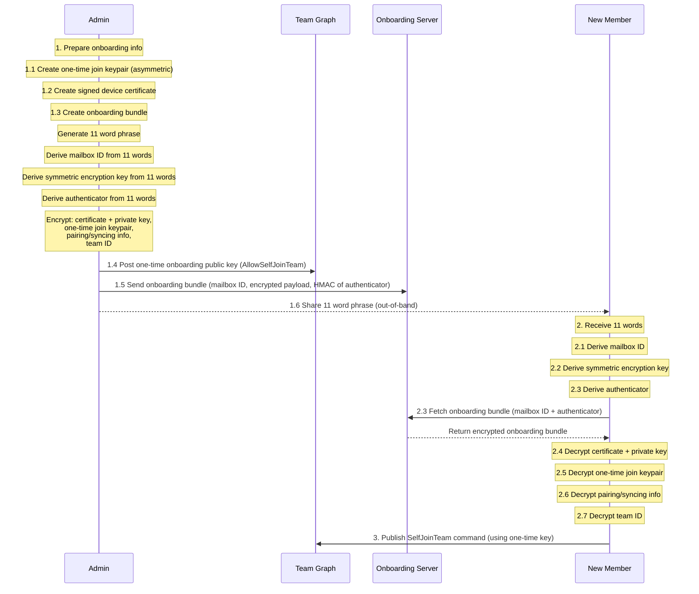

# ONBOARDING

Goal: admin prepares join material beforehand and provides it to the onboarding server. The admin also provides the new device with a secret it can use to retrieve the information from the onboarding server asynchronously and use that information to join the team.

actors:
1. onboarding server
2. admin
3. new member

### Sequence

1. prepare onboarding info
	1. create one time join key (asymmetric)
	2. create signed device certificate
	3. create onboarding bundle
		1. create 11 word phrase
		2. derive mailbox ID (128bits)
		3. derive symmetric encryption key for onboarding bundle
		4. derive authenticator that the new user will use to authenticate to the onboarding server
		5. encrypt certificate + private key
		6. encrypt one time join keypair
		7. encrypt pairing/syncing info
		8. encrypt team ID
	4. post one-time onboarding public key to graph (AllowSelfJoinTeam)
	5. send onboarding bundle to onboarding server, with mailbox ID, encrypted payload, and HMAC of authenticator against mailbox ID
	6. send 11words to new user
2. new user receives 11 words
	1. derive mailbox ID
	2. derive symmetric encryption key for onboarding bundle
	3. fetch encrypted onboarding bundle using mailbox ID and authenticator (sends authenticator and mailbox ID, server computes HMAC(auth, mailbox ID))
	4. decrypt certificate + private key
	5. decrypt one time join keypair
	6. decrypt pairing/syncing info
	7. decrypt team ID
3. new user publishes SelfJoinTeam command

Policy Changes:

- command for adding pub one time key to graph
- command for joining team via one time key

notes: if a AllowSelfJoinTeam key is used by two different accounts, both should be invalid. 

Open questions:
- how do we auth the admin to be able to create credentials? 
	- ANSWER: use PKI. admin needs a signed certificate to talk to the onboarding server and leave a drop. the PKI is only needed for creating a drop. consuming a drop can be based on the secret code.
	- OR: onboarding server is aranya node/role and directly talks to the graph. 

- how does the new device actually publish the self join command? 
	- ANSWER: the drop includes a sync peering point. with a valid certificate + sync peering point + team ID, the new device can sync the graph but cannot participate until they post their SelfJoinTeam command. 

- how do the existing devices receive the SelfJoinTeam command?
	- no idea. they have no way of knowing the address of the new device. does the new member post their sync address in the SelfJoinTeam command?
	- keeping this out of scope ofr the current version

CHANGES:

need to derive from the 11words:
	1. mailbox ID (128bits)
	2. symmetric encryption key for onboarding bundle
	3. authenticator (used to validate the sender actually had the 11words, and didnt just steal the key?)
