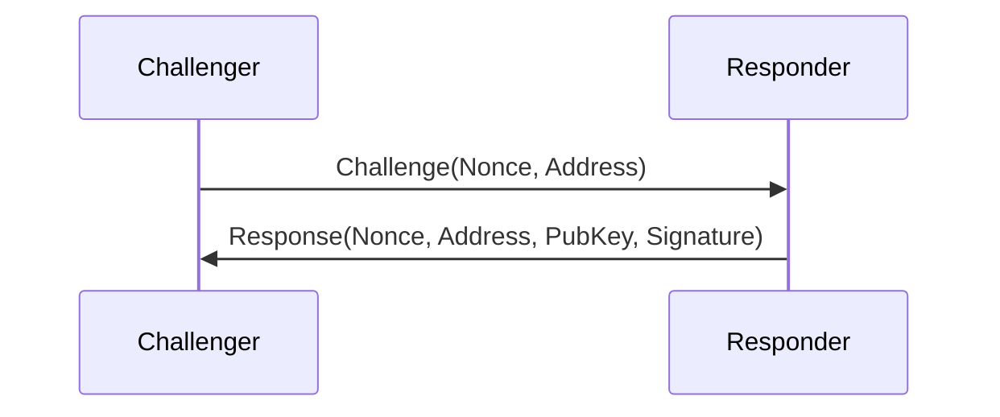
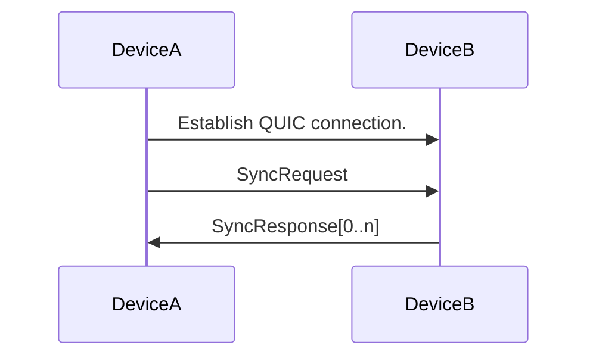
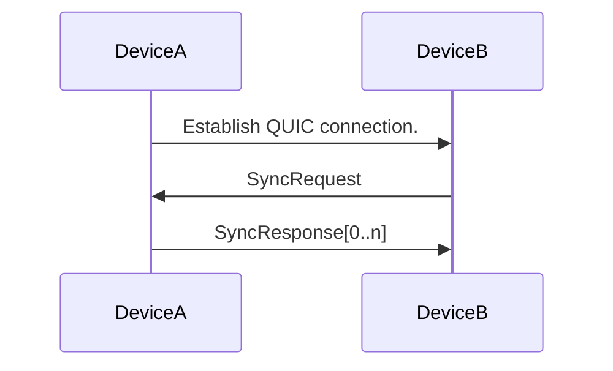
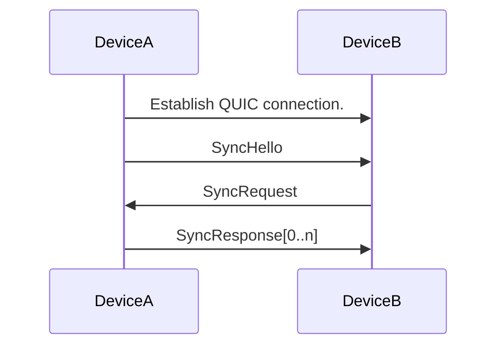
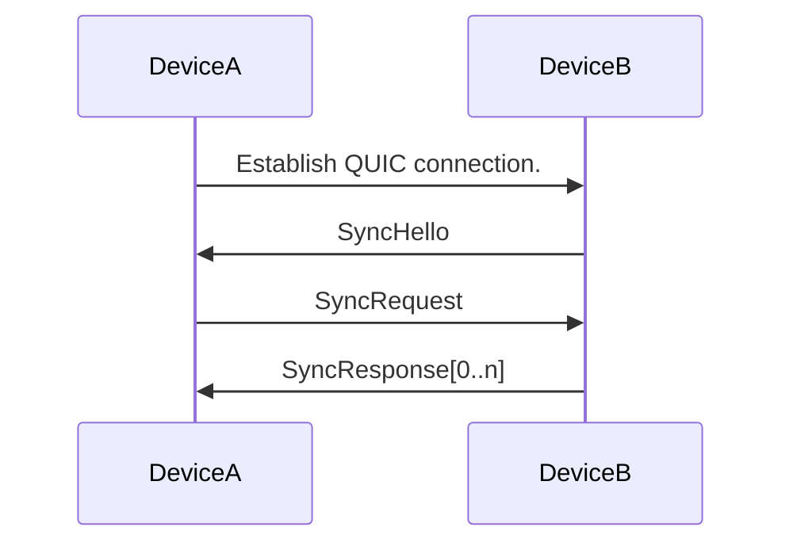
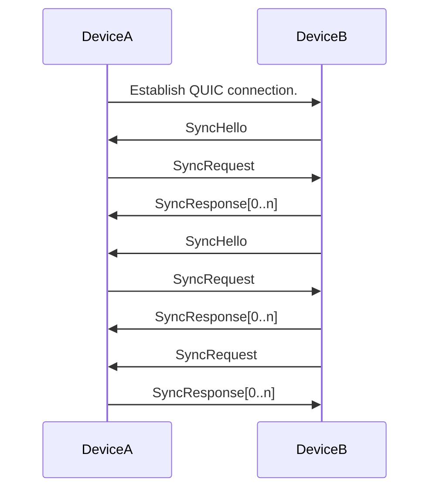

# Sync Threat Model

**Version:** 0.1 — Draft
**Date:** February 27, 2026

## System Overview

Aranya is a decentralized access governance platform built around a cryptographic directed acyclic graph (DAG) of signed commands. Devices running the Aranya daemon form teams and synchronize the graph over a peer-to-peer sync protocol. The graph contains rich metadata — including team membership, access policies, and channel configuration — which must only be available to authorized parties. (Note: channel encryption keys are not stored in the graph; they are derived and stored ephemerally by clients.)

This document defines the threat model for the Aranya sync protocol: the subsystem responsible for replicating graph state between devices.

## Identity and Authorization

The sync protocol operates with two distinct identity layers that serve different purposes:

**DeviceId** is a self-asserted identity. Any device can generate a key pair and derive a DeviceId by hashing its public key. DeviceIds are unique and claimable — a device can prove it holds the corresponding private key via a challenge-response protocol — but they are pre-authorization from the perspective of the sync protocol. The sync layer has no mechanism to determine whether a given DeviceId belongs to a member of the sync group. An attacker can generate as many DeviceIds as they wish at negligible cost.

**Certificates** issued by the Team CA are the authorized identity for syncing. A valid certificate proves that the Team CA has vouched for the device, which is the sync protocol's only basis for determining sync group membership. Certificate identity is verified at the transport layer during the mTLS handshake, before any sync messages are exchanged.

Because DeviceIds are pre-authorization, any sync protocol control that requires authorization or bounded uniqueness — such as rate limiting or connection limiting — must be based on certificate identity, not DeviceId. DeviceId remains important at the graph layer for signing commands and establishing persistent device identity across the DAG, but at the sync transport layer, the certificate is the operative identity.

## Terminology

 - **Graph:** Sometimes called a "Team" or "DAG", a graph is a set of commands in an Aranya protocol. The set of commands is structured as a Directed Acyclic Graph.
 - **Commands:** Nodes in the graph are serialized messages and referred to as commands. Each command that is not a merge command is cryptographically signed by the device that authored it. All edges in the graph are cryptographic hashes of a preceding command referred to as the Parent. Merge commands are unsigned and have exactly two parents. The initial command has no parents. All other commands have exactly one parent. The hash of a command, including the command's signature, is the CommandId for the command.
 - **Device:** A device is an instance of the Aranya daemon with a unique set of device keys.
 - **DeviceId:** The cryptographic hash of a public key used by a device to sign the it's key bundle.
 - **Sync Group:** Two or more devices which are authorized to send and receive the commands associated with a graph. (This does not imply that they can author commands or decrypt any ciphertexts stored in the graph.)
 - **Team CA:** The customer-provided certificate authority used to issue and validate certificates for devices in a sync group. The Team CA serves as the trust root for sync transport authentication.
 - **mTLS:** Mutual TLS. A TLS configuration in which both the client and server present and validate certificates during the handshake, ensuring that both parties are authenticated.
 - **Connection:** A QUIC connection between two devices.

## Assets

The following assets are protected by the sync protocol:

 - **Graph Contents:** The commands, metadata, and structure of the DAG. Disclosure of graph contents to unauthorized parties reveals team membership, policy decisions, and access control state.
 - **Device Identities:** The DeviceIds and their associated cryptographic keys. Compromise or spoofing of device identity undermines all authentication in the system.
 - **Sync Availability:** The ability of authorized devices to propagate and receive graph state in a timely manner. Disruption of sync delays or prevents devices from converging on current state.
 - **Team CA:** Compromise of the Team CA undermines the trust root for all sync authentication, resulting in a loss of graph confidentiality as unauthorized devices can join the sync group and receive graph contents.

## Adversary Model

We consider three classes of adversary:

 1. **External Observer:** A party who is not a member of the sync group and has no valid credentials, but who can observe or inject traffic on the network. This adversary may be passive (eavesdropping) or active (injecting, modifying, or dropping packets).

 2. **Authorized but Malicious Device:** A device that is a legitimate member of the sync group — it holds valid credentials and can participate in the sync protocol — but behaves maliciously. This adversary aims to deny service to other sync group members by abusing the sync protocol. Note: threats from authorized devices *modifying graph contents* (e.g., forging commands, adversarial branching) are out of scope for this document and are addressed by the graph integrity model.

 3. **Compromised CA:** An adversary who has obtained the private key of the customer-provided Team CA, or who can otherwise issue certificates that chain to the Team CA. This adversary can mint credentials for devices not legitimately part of the sync group.

## High-Level Threat Summary

The following table provides an overview of the threat categories, which adversaries are relevant, and where the detailed analysis can be found.

| Threat Category | Relevant Adversaries | Section |
|---|---|---|
| Unauthorized access to graph contents | External Observer, Compromised CA | Graph Confidentiality |
| Device identity spoofing and impersonation | External Observer, Compromised CA | Device Identity and Addressing |
| Denial of service via protocol abuse | Authorized Malicious Device | Denial of Service Mitigations |
| Loss of trust root | Compromised CA | CA Compromise |

---

## Graph Confidentiality

### Overview

The Aranya graph contains rich metadata which should only be available to authorized parties. Peers that initiate sync requests must be authenticated as authorized to receive the graph.

To achieve graph confidentiality in the sync protocol we introduce the concept of a `sync group`. The `sync group` for a graph is the set of devices authorized to send and receive the commands of the graph.

To achieve graph confidentiality we depend on two controls:

 1. Transport layer encryption.
 2. Mutual authentication.

The use of transport layer encryption ensures that third parties cannot learn the contents of the graph by observing network traffic.

Mutual authentication is required as both requests and responses contain information about the graph and therefore should only be seen by authorized parties. This is especially important because QUIC connections are used bidirectionally — either party may initiate a sync over an established connection, so both must be verified as sync group members at connection time, not just the party that established the connection. (See Appendix A for the full set of sync patterns.)

In Aranya we require that the transport be responsible for authentication. This choice is made as the graph cannot be used for sync authentication due to bootstrapping issues. Additionally the use of transport level authentication allows organizations to leverage existing PKI systems they may have deployed.

### Threats

> **Threat GC-1: Passive Eavesdropping.** An external observer intercepts sync traffic on the network and learns the contents of SyncRequest, SyncResponse, or SyncHello messages, revealing graph metadata, team membership, and policy state.

> **Threat GC-2: Unauthorized Sync Participation.** An external observer initiates or responds to sync protocol exchanges without being a member of the sync group, obtaining graph commands they are not authorized to receive.

### Requirements

#### Sync-001

All sync transports MUST ensure that third parties cannot observe unencrypted `SyncRequest`, `SyncResponse`, or `SyncHello` messages.

*Mitigates: GC-1*

#### Sync-002

The sync transport MUST ensure that both sync requesters and sync responders are mutually authenticated as part of the appropriate `sync group` before any `SyncRequest`, `SyncResponse`, or `SyncHello` messages are exchanged.

*Mitigates: GC-2*

> **Claim GC-C1:** If Sync-001 and Sync-002 are satisfied, only members of the sync group can observe graph contents exchanged via the sync protocol. Transport encryption (Sync-001) prevents external observers from reading traffic, and mutual authentication (Sync-002) prevents unauthorized parties from participating in sync exchanges.

### QUIC Sync Protocol

For IP-based networks we use the QUIC protocol with TLS for syncing. We specifically use QUIC with an mTLS configuration which provides for mutual authentication.

#### QUIC-001

Before sending any `SyncRequest`, `SyncResponse`, or `SyncHello` messages for a given team the sending party MUST have validated that the receiving party's certificate was signed by the Team CA.

*Mitigates: GC-2*

#### QUIC-002

The QUIC transport MUST use TLS encryption for all sync protocol traffic. All `SyncRequest`, `SyncResponse`, and `SyncHello` messages MUST be sent over a TLS-encrypted connection.

*Mitigates: GC-1*

---

## Device Identity and Addressing

### Overview

Syncs are performed between devices based on DeviceIds. We use these IDs as network-agnostic names which are stable even if the network address changes. In IP networks, efficient and low-latency syncing depends on the topology of which nodes sync from which other nodes. Aranya depends on the ability to reliably address specific devices.

If an adversary were able to confuse a device about which other device or devices it was communicating with, this could cause the propagation of state in the network to be delayed or blocked.

### Threats

The primary threats to device identity and addressing involve an adversary attempting to forge or misrepresent a DeviceId, with the goal of disrupting the association between addresses and identities.

> **Threat DA-1: DeviceId Spoofing.** An adversary claims to control a DeviceId for which they do not hold the private keys, causing a legitimate device to believe it is syncing with a specific peer when it is not.

> **Threat DA-2: Man-in-the-Middle on Discovery.** During DeviceId discovery (when a device knows an address but not the DeviceId), an attacker intercepts the challenge-response protocol and forwards the challenge to a different address, attempting to bind their address to another device's identity.

> **Threat DA-3: DeviceId discovery.** If DeviceID discovery is not encrypted and authenticated and advisory can observe or preform oracle attacks to discover the identities of the devices in the team.

### DeviceId Discovery

In some cases we may know the address of a device but not its DeviceId. This case currently occurs during demos and tests where containers are configured prior to the devices generating their keys and DeviceIds It may also be useful in operational environments where devices are deployed before their identities are known. In this case we use a challenge-response protocol to establish the DeviceId associated with an address:

The Challenger generates a random Nonce and sends it along with the Responder's Address. The Responder verifies that the Address matches its own, then signs the complete response (Nonce, Address, and PubKey) with its device key. The Challenger verifies the signature using the included PubKey, then derives the DeviceId by hashing the PubKey.

The inclusion of Address is to avoid MitM attacks where the attacker just forwards the Challenge to a different address. The inclusion of Nonce prevents replay attacks where an attacker reuses a previously observed valid response to claim an identity.

> **Claim DA-C1:** If the responder only responds to challenges matching their address, only the holder of the private key associated with a DeviceId can successfully produce a valid response for an address. *Mitigates: DA-1, DA-2*

 If discovery runs in the clear, an eavesdropper can learn which DeviceIds map to which network addresses. This is not graph content, but it is metadata that could aid targeted denial of service or traffic analysis. To mitigate this DeviceId discovery must be run over QUIC connections using mTLS and sync group certs.

### Requirements

#### ADDR-001

Devices MUST only accept DeviceId discovery responses where the Address in the response matches the address to which the challenge was sent.

*Mitigates: DA-2*

#### ADDR-002

Devices MUST verify the cryptographic signature on DeviceId discovery responses using the public key included in the response, and MUST derive the DeviceId by hashing that public key.

*Mitigates: DA-1*

#### ADDR-003

DeviceId discovery must only be preformed over connections that are encrypted and authenticated, ensuring that both parties are members of the sync group.

*Mitigates: DA-3*

---

## Denial of Service Mitigations

### Overview

In addition to authenticated access, we must design our system so that a single misbehaving or malicious, but authorized, device cannot abuse the protocol to deny access to one or more other devices in the sync group.

This section addresses denial of service attacks that operate *within* the sync and addressing protocols. Network-level DoS (e.g., flooding a device's IP address with traffic) is out of scope. See Appendix A for the sync message flows that an attacker could abuse.

### Sync Rate Limiting

> **Threat DOS-1: Sync Flooding.** A malicious authorized device sends an excessive number of SyncRequest or SyncHello messages, consuming processing resources on the target device and preventing it from servicing legitimate sync requests. Because QUIC connections are bidirectional, the attacker does not need to establish new connections to flood a peer — it can send unsolicited sync messages over any existing connection.

To mitigate sync flooding, rate limiting must be applied per certificate rather than per connection, address, or host. Since mTLS authenticates the peer's certificate at connection time, the certificate identity is available before any sync messages are processed. Combined with DOS-007 (one connection per certificate), this ensures that each authenticated peer has exactly one connection and a bounded rate of sync messages.

#### DOS-001

Implementations SHOULD enforce per-certificate rate limits on incoming SyncRequest and SyncHello messages. Devices which exceed the rate limit SHOULD have their messages dropped without further processing.

*Mitigates: DOS-1*

> **Claim DOS-C1:** Because mTLS authenticates the peer's certificate before any sync messages are exchanged, rate limits can be bound to verified certificate identities at the transport layer. An external observer without a valid certificate cannot send sync messages at all, and an authorized peer's message rate is bounded by its single permitted connection.

### Message Size and Deserialization

> **Threat DOS-2: Oversized or Malformed Responses.** A malicious authorized device responds to SyncRequests with extremely large or malformed SyncResponse payloads designed to exhaust memory or processing capacity on the receiving device.

To prevent a malicious device from exhausting resources through oversized or malformed messages, all sync protocol messages must have a well-known maximum size. Messages exceeding this limit must be dropped during deserialization before any further processing occurs. Additionally, the deserialization layer itself must be hardened against malformed or malicious input to prevent vulnerabilities such as excessive memory allocation, or invalid field values from being exploited.

#### DOS-002

All sync protocol messages (SyncRequest, SyncResponse, and SyncHello) MUST have a defined maximum message size. Deserialization MUST drop messages which exceed this limit.

*Mitigates: DOS-2*

#### DOS-003

Deserialization of sync protocol messages MUST be hardened against malformed or malicious input.

*Mitigates: DOS-2*

### Stale Response Detection

> **Threat DOS-3: Stale Data Replay.** A malicious authorized device repeatedly sends outdated or already-seen commands in SyncResponses, forcing the receiver to expend resources re-validating data it has already processed, without making progress.

The sync protocol reduces synchronization to a single round trip by having the requester send a sample of commands from its copy of the DAG. The responder uses that sample to reason about which commands the requester must already have — specifically, all commands in the sample as well as any commands that are ancestors of commands in the sample. While this is an imprecise approach and may lead to the responder legitimately sending some commands the requester already has, a well-behaved responder should never send commands that are in the sample or are ancestors of commands in the sample.

If a responder does send commands that were excluded by the sample, the requester can detect this and treat it as an indication of misbehavior.

#### Out-of-Order Commands

Another form of malformed sync response is for a responder to send a command before its parent. Since a command cannot be added to the graph without its parent already being present, such commands must be discarded. A well-behaved responder must send commands in topological order so that parents are always received before their children.

Both stale responses and out-of-order commands indicate a misbehaving responder. To mitigate repeated abuse of either kind, the requester should apply a backoff strategy — reducing the frequency of SyncRequests to the offending device with increasing delays on repeated violations. This allows for the possibility that a single violation is a bug while protecting against sustained malicious behavior.

This backoff applies only to SyncRequests sent to the misbehaving device. SyncHello processing is not affected.

#### DOS-004

A responder MUST NOT send commands in a SyncResponse that are present in the requester's sample or that are ancestors of commands in the sample.

*Correctness requirement for well-behaved responders.*

#### DOS-005

A responder MUST send commands in topological order such that a command's parents are always sent before the command itself.

*Correctness requirement for well-behaved responders.*

#### DOS-006

A requester SHOULD apply a backoff strategy to SyncRequests sent to a device that has sent commands excluded by the sample or commands out of topological order. Repeated violations SHOULD result in increasing delays before further SyncRequests are sent to that device.

*Mitigates: DOS-3 (DOS-004 and DOS-005 define correct responder behavior, but a malicious responder will violate them; this requirement is the actual defense on the requester side.)*

### Connection Limiting

> **Threat DOS-4: Connection Exhaustion.** A malicious authorized device opens many QUIC connections (or holds connections open indefinitely) to exhaust connection-tracking state or file descriptor limits on the target device.

To prevent connection exhaustion, devices should limit QUIC connections to one per certificate. Since mTLS provides the certificate identity at connection time, this can be enforced before any sync messages are processed.

When a device already has an established connection from a given certificate and receives a new connection attempt from the same certificate, it should drop the existing connection and accept the new one. This handles the case where the peer has restarted or otherwise lost the key material associated with the existing connection and is legitimately reconnecting.

#### DOS-007

A device MUST allow at most one QUIC connection per certificate. When a new connection is received from a certificate that already has an established connection, the existing connection MUST be closed and the new connection accepted.

*Mitigates: DOS-4*

> **Claim DOS-C2:** If DOS-007 is satisfied, the transport-layer resources (connection state, file descriptors) that any single authenticated peer can consume are bounded to a single QUIC connection, regardless of how many connection attempts that peer makes.

Note: DOS-007 limits connections per certificate, not per certificate subject or hostname. This means that during certificate rotation, a device with both an old and new valid certificate could briefly hold two connections. This is benign. However, under CA compromise, an attacker can issue themselves many unique certificates and open a connection for each — DOS-007 does not bound the total number of connections from a compromised CA. See the CA Compromise section for further analysis.

---

## CA Compromise

### Overview

The sync protocol's authentication depends entirely on the customer-provided Team CA. If the CA private key is compromised, an adversary can issue certificates for devices they control and join the sync group as a fully authenticated peer. This section considers what happens when the trust root is lost.

### Threats

> **Threat CA-1: Unauthorized Sync Group Membership.** An adversary with the CA private key issues a certificate for a device they control, allowing it to pass mTLS authentication and join the sync group. The adversary can then read all graph contents exchanged via sync.

> **Threat CA-2: Impersonation of Existing Devices.** An adversary with the CA private key issues a certificate with a subject matching an existing legitimate device, potentially allowing the adversary to impersonate that device in sync exchanges.

> **Threat CA-3: Persistent Access After Revocation.** Even after the CA compromise is detected and the CA key is rotated, the adversary may have already issued certificates that remain valid until they expire or are revoked. If the system does not support certificate revocation checking, the adversary retains access.

### Impersonation vs. Unauthorized Membership

CA-1 and CA-2 both result in a loss of graph confidentiality.

In CA-1, the attacker simply joins the sync group as a new, unknown peer. They generate a fresh TLS key pair, issue themselves a certificate signed by the compromised CA, and connect to a legitimate device. The mTLS handshake succeeds and the attacker can read graph contents. The damage is limited to confidentiality.

In CA-2, the attacker issues a certificate with a subject matching an existing device's hostname. Because connection limiting is per certificate (DOS-007), the attacker's connection does not displace the real device's connection — both coexist. The attacker can read graph contents (same as CA-1) and can inject stale or malicious sync data over their own connection, but the real device remains connected and continues to sync normally. The practical impact of CA-2 beyond CA-1 is therefore limited.

However, because connection limiting is per certificate rather than per subject, an attacker with a compromised CA can issue themselves many unique certificates and open a connection for each. This allows the attacker to bypass the connection limiting intended by DOS-007 and potentially exhaust connection resources on the target device. This is an inherent limitation of per-certificate connection limiting under CA compromise.

Importantly, because graph identity (DeviceId and signing keys) is independent of the sync transport identity, the attacker still cannot author commands as any legitimate device.

> **Claim CA-C1:** A compromise of the Team CA can result in loss of graph confidentiality and potential connection exhaustion, but cannot compromise graph integrity. Because graph identity (DeviceId and signing keys) is independent of the sync transport identity (mTLS certificates), an attacker with a compromised CA cannot author commands as any legitimate device — they do not hold the device's private signing keys.

### Requirements

#### CA-001

Implementations SHOULD check the graph for revocation status of certificates so that certificates issued by a compromised CA can be invalidated.

*Mitigates: CA-1 CA-2 CA-3*

Note: CA-001 uses SHOULD rather than MUST because revocation checking may not be feasible in all deployment environments. Implementations that do not perform revocation checking have no mitigation for CA-1, CA-2, or CA-3: an attacker who has issued certificates from a compromised CA will retain access until those certificates expire naturally. Deployments in high-security environments should treat this as a MUST and ensure that certificate lifetimes are short enough to limit the window of exposure.

---

## Appendix A: Sync Patterns

QUIC connections in Aranya are used bidirectionally. When Device A establishes a QUIC connection to Device B, either device may initiate a sync over that connection — in either direction or both. The connection establisher is not necessarily the sync requester. This means a single connection can carry multiple sync exchanges in any combination of directions over its lifetime.

There are four basic sync patterns that differ in the direction of the QUIC connection establishment and whether the SyncHello protocol or simple polling is used.

All four patterns can be broken down into a connection phase and a sync phase.

The connection phase is transport-dependent and in Aranya is responsible for authenticating the team or teams for which the parties are a member of the `sync group`.

### Simple Poll Request

### Reverse Poll Request

### Sync Hello

### Reverse Sync Hello

All of these patterns can be combined and iterated. As an example we could have a sequence of reverse `SyncHello` messages with a reverse poll.

### Mixed Use Case

