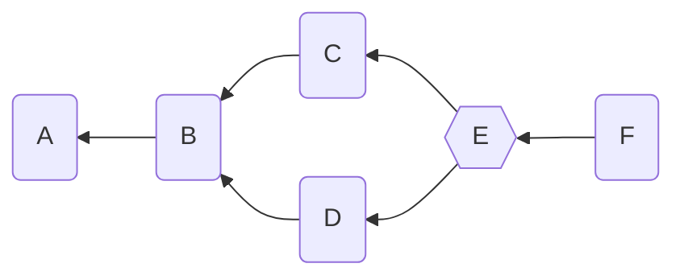
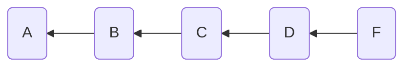
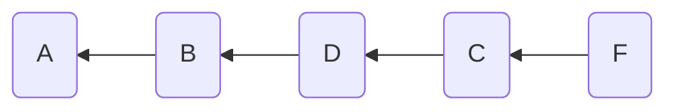

# Commands and the Graph

The core functional unit of the Aranya Policy Language is the Command. A
command defines a set of data and the rules for processing that data in
order to add it to the Graph.

## Commands

Let's consider this command:

```
command AddBalance {
    fields {
        user id,
        amount int,
    }

    policy {
        check amount > 0
        let account = check_unwrap query Account[id: this.user]=>{balance: ?}
        let current_balance = account.balance
        let new_balance = current_balance + this.amount

        finish {
            update Account[id: this.user] to {balance: new_balance}
        }
    }

    ...
}
```

There are some more required parts here (see [the
reference](../reference/top-level/commands.md)), but we'll omit them for
brevity. First, the command has `fields`, which define the data stored
in the command. And next it has `policy`, which is run both when the
command is created in the local graph and when it is added to other
devices' graphs. It checks the validity of the data, then finally
updates the state of the system.

A sequence of these commands will progressively update an account
balance. We'll dive into this state mechanism later in
[Facts](facts.md).

## The Graph

The Graph is a directed acyclic graph of commands, where each command
points toward its ancestor(s). Here is a simple graph with six commands.



A is the root, or the "init" command. B points to A, and both C and D
point to B. Command E is a "merge command", which rejoins divergent
graph segments. F points to E.

## The Weave

The graph above is an unordered view of the system, but Aranya needs to
have a total ordering of the commands to determine the state of the
system. It creates this ordering with the "[weave
function](/graph-auth/#weave)", which deterministically flattens the
graph so that it can determine the state of the system.

But how does this ordering happen? Which comes first, `C` or `D`?
Without any more information, the weave function just makes an arbitrary
decision[^weave-decision]. Let's say for the sake of demonstration that
this decision is "alphabetical order" so `B` comes first. Then this
looks like:



But it could just as easily have ordered them via another metric to get:



[^weave-decision]: It actually orders them based on their command ID,
    which is a hash derived from their serialized contents.

The order of commands can be influenced by adding a priority value to
the command's `attributes` block.

```policy
command C {
    attributes {
        priority: 10,
    }
    ...
}
```

This higher priority would tell the weave function to always order `C`
before `B`.

We'll talk a bit more about how this ordering affects state later in
[Facts](facts.md).