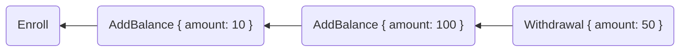
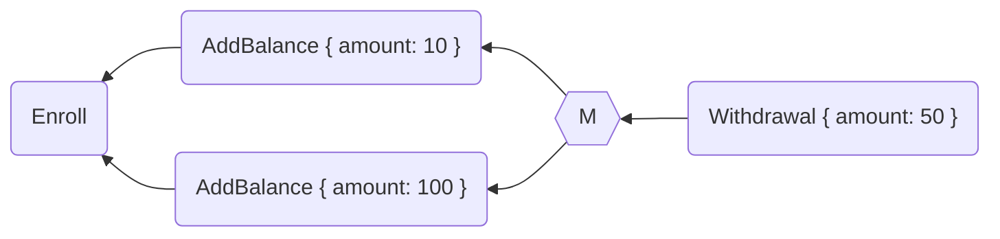
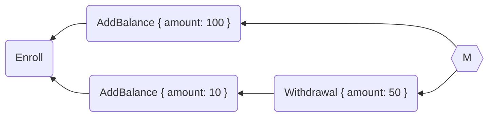

# Facts

Facts are a kind of database embedded in the Aranya runtime. They keep
track of a fairly standard key/value store, but they are modified as a
consequence of running policy commands. And because the graph can
branch, the value of a fact depends on what commands currently exist in
your graph.

Let's expand on our [account balance
example](commands-graph.md#commands) from earlier. Here is a fact that
keeps track of an account balance value per user.

```policy
fact Account[user id]=>{balance int}
```

The fields on the left of `=>` between square brackets are the **key**,
and they are used to look up facts in the database. The fields to the
right in curly brackets are the **value**, which just hold the data
associated with the key.

Now let's write some commands that manipulate these facts. First, we
need to initialize the fact to something.

```policy
command Enroll {
    fields {
        user id,
    }

    policy {
        check !exists Account[user: this.user]

        finish {
            create Account[user: this.user]=>{balance: 0}
        }
    }
}
```

This command first [`check`](../reference/statements/check.md)s that no
fact exists using
[`exists`](../reference/expressions/functions/queries.md#exists).
`exists` returns a boolean for whether the fact exists in the fact
database. Since we're creating a new fact, we want to ensure that it
doesn't exist yet. Then in the `finish` block we use
[`create`](../reference/statements/create.md) to create the fact with
the `user` value coming from the `user` field in the command, and an
initial balance of zero.

To change this balance, we'll use the command we created earlier.

```policy
command AddBalance {
    fields {
        user id,
        amount int,
    }

    policy {
        check amount > 0
        let account = check_unwrap query Account[id: this.user]=>{balance: ?}
        let current_balance = account.balance
        let new_balance = current_balance + this.amount

        finish {
            update Account[id: this.user] to {balance: new_balance}
        }
    }

    ...
}
```

We first check that the amount being added is greater than zero. Then we
fetch the current balance using
[`query`](../reference/expressions/functions/queries.md#query). Note the
use of the bind marker `?` in the value side of the fact
description[^query-value-side]. This tells `query` that you don't care
what that value is. And indeed, that's the value we're looking for when
we fetch this fact.

[^query-value-side]: If all of the value fields are bound, you can
    shortcut this and omit the value side entirely: `query Counter[user:
    this.user]`.

We use
[`check_unwrap`](../reference/expressions/operators.md#optional-operators)
to unwrap the optional given to us by the query. If the optional is
`None`, `check_unwrap` exits with a [check
failure](../reference/errors.md#check-failures). `check` and
`check_unwrap` should always be used to check the preconditions of a
command. Next we update the balance, and finally in the `finish` block
we use [`update`](../reference/statements/update.md) to change the value
in the fact database.

And finally, let's write a command that does something with this.

```policy
effect WithdrawalResult {
    completed bool,
    remaining_balance int,
}

command Withdrawal {
    fields {
        user id,
        amount int,
    }

    policy {
        let account = check_unwrap query Account[user: this.user]
        let completed = account.balance >= this.amount

        if completed {
            let new_balance = account.balance - amount_withdrawn
            finish {
                update Account[user: this.user] to {balance: new_balance}
                emit WithdrawalResult {
                    completed: true,
                    remaining_balance: new_balance,
                }
            }
        } else {
            finish {
                emit WithdrawalResult {
                    completed: false,
                    remaining_balance: account.balance
                }
            }
        }
    }
}
```

This command uses the balance stored in the fact database and checks
whether it is at least as much as the amount requested. If it is, it
updates the balance and reports a `WithdrawalResult` effect to the
application with `completed: true` and the new balance.

If there isn't enough money in the account, no account update happens
and a `WithdrawalResult` is emitted that explains this result.

## Exploring Alternate Realities

Now that we have our commands, let's see what happens if we issue a
series of them. I'll omit the `user` field in these commands for the
sake of brevity.



This is a linear sequence of commands. We start with enrolling, then we
add a balance twice, then we withdraw 50, which according to our rules
should succeed and emit `WithdrawalResult { completed: true,
remaining_balance: 60 }`.

Let's suppose that instead the graph looks like this:



Where `AddBalance { amount: 10 }` and `AddBalance { amount: 100 }` were
created in parallel branches. Here `M` is the "merge command" we learned
about in [Commands and the Graph](commands-graph.md#the-graph). And
Aranya then uses the [braid function](commands-graph.md#the-braid) to
turn this into a linear sequence of commands so we can calculate the
 final facts in `D`. Here it doesn't matter which `AddBalance` comes
first. We'll always have a sufficient balance to satisfy the
`Withdrawal` after the merge.

But sometimes order does matter. Suppose we had this instead.



Now which branch comes first determines whether the `Withdrawal` command
succeeds or fails. Because if we order it the top branch before the
bottom one, it's like before. But if it's the other way around, we only
have one `AddBalance` before the `Withdrawal` and it will produce
`WithdrawalResult { completed: false, remaining_balance: 10
}`[^braid-order].

[^braid-order]: Braid order isn't actually a branch-to-branch choice.
    The resulting order could have interleaved `AddBalance { amount: 100
    }` between `AddBalance { amount: 10 }` and `Withdrawal { amount: 50
    }`.

As we discussed earlier in [The Braid](commands-graph.md#the-braid), we
could add a priority value to make this less ambiguous. If we gave
`AddBalance` a higher priority than `Withdrawal` we would have an
optimistic solution that orders both `AddBalance`s before `Withdrawal`.
If we gave `Withdrawal` a higher priority, we'd have a pessimistic
solution that would order `AddBalance { amount: 100 }` after the
`Withdrawal`. You probably want the optimistic solution here, but there
is generally no one correct solution for ordering commands and how you
set priorities depends on your application.

## Using Keys and Bind Markers

The query engine in the fact database can match on partial keys using
the bind marker, but it has an important constraints. First is that any
bound key fields must be strictly to the right of any concretely
specified key fields (see [Bind
Marker](../reference/expressions/functions/queries.md#bind-marker)). The
second is that it will always query by [sorted key
order](../reference/queries-and-iteration.md). The fact returned by
`query` is the first ordered fact matching the key fields. Likewise, the
order of facts iterated by [`map`](../reference/statements/map.md) is
the key sort order.

It is tempting to think that because you can use bind markers on the
value side that they offer the same kind of lookup functionality. For
example, take this very ordinary fact definition for a set of users:

```policy
fact Users[user id]=>{level enum AuthorizationLevel}
```

You can, of course, find the authorization level of a particular user.

```policy
query Users[user: this.user]=>{level: ?}
```

But trying to do the opposite &ndash; finding a user with the given
authorization level &ndash; won't work as you expect.

```policy
query Users[user: ?]=>{level: AuthorizationLevel::Admin}
```

Why not? Anything on the value side of a query is only matched against
the first fact that the key side finds. This query means "find the first
user with any user ID, and if that user's level is admin, return it." It
does not mean "find the first user whose level is admin". To do the
latter query, you will have to create a fact with both fields as keys
and no values.

```policy
fact UsersByAuthorization[level enum AuthorizationLevel, user id]=>{}
```

Now you can query on the `level` field and find the first user at that level.

```policy
query UsersByAuthorization[level: AuthorizationLevel::Admin, user: ?]
```

This generally means that if you want to query on multiple fields, you
will have to create and maintain multiple facts as different indexes to
retrieve that data.